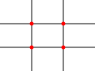

## Briefing & Concept

Iedereen maakt vandaag dagelijks tientallen foto's met een smartphone. Maar wat maakt een foto werkelijk krachtig, indrukwekkend en professioneel? Het verschil tussen een snelle, toevallige snapshot en een doordacht fotografisch beeld schuilt in één cruciaal element: **compositie**.

Als fotograaf en crossmediaal ontwerper registreer je de werkelijkheid niet passief, je bouwt visuele ervaringen. Je kiest wat je toont, wat je bewust buiten beeld laat en hoe je het oog van de toeschouwer dwingt om een bepaald pad door het kader te volgen.

In deze eerste opdracht voor **Beeld** train je jouw actieve fotografische blik. Je onderzoekt fundamentele compositieregels en trekt met een camera op verkenning door de schoolomgeving. Vervolgens selecteer je jouw sterkste opnames in **Adobe Bridge**, optimaliseer je ze in **Adobe Photoshop** en presenteer je jouw werk in een strak, professioneel **drieluik**.




Met behulp van beeldaspecten geef je een plat tweedimensionaal vlak diepte, betekenis en spanning mee. Door bewust te experimenteren met camerastandpunt, kadrering, kijklijnen en gelaagdheid bepaal je direct welk gevoel jouw beeld oproept.



Bekijk voor extra theoretische achtergrond en inspirerende voorbeelden de [Cursus Fotografie: Beeldaspecten](/cursus/fotografie/#de-tien-fotografische-beeldaspecten).

### Concept & thema

Bedenk voor jouw fotoserie één overkoepelend thema. Dit zorgt ervoor dat jouw beelden, ondanks de verschillende compositietechnieken, visueel en inhoudelijk een samenhangende familie vormen:

1. **Architectuur & geometrie:** Lijnen, trappenhuizen, beton, glasreflecties, patronen en structuren in en rond het schoolgebouw.
2. **Mens & interactie:** Spontane portretten, expressieve blikken, lichaamshoudingen of silhouetten van medeleerlingen in hun schoolbiotoop.
3. **Detail & textuur:** Verborgen micro-verhalen, materialen, sterke licht-donker contrasten en abstracte uitsnedes van alledaagse voorwerpen.
4. ...

## Fundamentele compositieregels

Tijdens jouw opnames ga je gericht op zoek naar onderstaande beeldprincipes of compositieregels.

### Regel van derden

Plaats je onderwerp niet pal in het midden. Verdeel het beeldvlak met twee horizontale en twee verticale lijnen in negen gelijke vlakken. De **vier snijpunten** vormen de natuurlijke ankerpunten van het frame.

* Plaats je hoofdonderwerp (bv. een gezicht, een detail of een persoon) op een van deze snijpunten.
* Laat de horizonlijn samenvallen met de bovenste derdenlijn (nadruk op de voorgrond) of de onderste derdenlijn (nadruk op de lucht of hoogte).

### Lagen & dieptewerking

Een foto is plat, maar de werkelijkheid is driedimensionaal. Om diepte en ruimtelijkheid te suggereren, bouw je jouw compositie op in drie overlappende vlakken:

* **Voorgrond:** Een object vlak voor de lens (een muurtje, een tak, een deurpost of een vage schouder) trekt de kijker direct het beeld in.
* **Middenplan:** Hier bevindt zich meestal het hoofdonderwerp.
* **Achtergrond:** Biedt context, sfeer en ruimtelijk perspectief zonder het hoofdonderwerp te overstemmen.


### Standpunten & perspectief

De hoogte en hoek van waaruit je fotografeert, beïnvloeden rechtstreeks de psychologische beleving van de toeschouwer:

* **Ooghoogte:** Neutraal, documentair en gelijkwaardig. Je kijkt het onderwerp recht in de ogen.
* **Kikkerperspectief (laag standpunt):** Je zakt door je knieën of legt de camera vlak bij de grond. Het onderwerp torent boven de kijker uit en oogt imposant, machtig, dominant of dramatisch.
* **Vogelperspectief (hoog standpunt):** Je fotografeert van bovenaf (vanaf een trap, balustrade of stoel). Het onderwerp oogt kleiner, kwetsbaarder en overzichtelijker, waarbij vloerpatronen en grafische structuren geaccentueerd worden.


### Lijnenwerk & kijklijnen

Lijnen zijn de snelwegen voor het menselijk oog. Ze gidsen de blik door het beeld en roepen een uitgesproken sfeer op:

* **Horizontale lijnen:** Brengen rust, stabiliteit, weidsheid en sereniteit.
* **Verticale lijnen:** Suggereren kracht, hoogte, monumentaliteit en autoriteit (bv. pilaren, bomen, deurstijlen).
* **Diagonale lijnen:** Creëren actie, snelheid, spanning en dynamiek. Ze zuigen het oog vanuit de hoeken naar het verdwijnpunt.


## Technische specificaties

| Eigenschap | Specificatie | Toelichting |
| :--- | :--- | :--- |
| **Opnameapparatuur** | **Camera van de school (DSLR / DSLM)** | Gebruik bij voorkeur een spiegelreflex- of systeemcamera van de school. |
| **Beeldverhouding foto's** | **Oorspronkelijke verhouding (3:2)** | Behoud de originele verhouding van de camera tijdens het uitsnijden. |
| **Aantal opnames** | **12 afzonderlijke beelden (3 per regel)** | 3× Regel van derden, 3× Diepte, 3× Standpunt, 3× Lijnen. |
| **Formaat drieluik** | **A4 liggend (297 × 210 mm)** | Drieluik waarin 3 geselecteerde beelden rond 1 overkoepelend thema samenkomen. |
| **Bestandstypes** | **.XMP** (sidecar), **.PSD** (drieluik) & **.JPG** (export) | Niet-destructieve bewerkingen in Camera Raw, PSD enkel voor het samengestelde drieluik. |

### Mappenstructuur

Voor een professionele workflow beheer je jouw bestanden nauwkeurig. Maak op je computer een hoofdmap aan met de afgesproken benaming. Aangezien Camera Raw alle aanpassingen bewaart in `.xmp`-sidecarbestanden, heb je voor de 12 afzonderlijke beelden géén zware Photoshop-werkbestanden nodig. Enkel voor het drieluik bewaar je een `.psd` in de hoofdmap:

```text
VoornaamA_Kijkkader/
└─ 01_assets/          <- Ruwe opnames van de camera (incl. bijhorende .xmp sidecars)
└─ 02_exports/         <- Definitieve JPG-exports (12 foto's + drieluik)
   └─ VoornaamA_Kijkkader-Regelvandrie-1.jpg (... t.e.m. -3.jpg)
   └─ VoornaamA_Kijkkader-Diepte-1.jpg (... t.e.m. -3.jpg)
   └─ VoornaamA_Kijkkader-Standpunt-1.jpg (... t.e.m. -3.jpg)
   └─ VoornaamA_Kijkkader-Lijnen-1.jpg (... t.e.m. -3.jpg)
   └─ VoornaamA_Kijkkader-Drieluik.jpg
└─ VoornaamA_Kijkkader-Drieluik.psd
```

## Stappenplan

Je gaat met je camera op zoek naar **vier fundamentele compositieregels** (regel van derden, diepte, standpunten en lijnen).

Na de shoots selecteer je de beste beelden in Adobe Bridge en bewerk je ze rechtstreeks via Camera Raw (`Ctrl + R`). Je corrigeert waar nodig en snijdt eventueel bij met de Crop Tool.

Je levert **12 sterke beelden** af (drie kwalitatieve foto's per compositieregel) als geëxporteerde `.jpg`:
* `VoornaamA_Kijkkader-Regelvandrie-1.jpg` tot `-3.jpg`
* `VoornaamA_Kijkkader-Diepte-1.jpg` tot `-3.jpg`
* `VoornaamA_Kijkkader-Standpunt-1.jpg` tot `-3.jpg`
* `VoornaamA_Kijkkader-Lijnen-1.jpg` tot `-3.jpg`

Tussen de verschillende compositieregels kies je de drie allersterkste beelden die een krachtige combinatie vormen rond **één duidelijk thema of concept**. Je bundelt deze drie foto's in één drieluik op een liggende A4 in Adobe Photoshop (`VoornaamA_Kijkkader-Drieluik.psd` en `.jpg`).

### Shoots op de schoolcampus

Trek met een camera op verkenning in en rond het schoolgebouw.

* Maak voor elk van de vier compositieregels minimaal **drie verschillende** opnames met wisselende hoeken en kadreringen.
* Zorg voor een stabiele houding om bewegingsonscherpte te vermijden. Druk de ontspanknop gecontroleerd in.
* Let op de lichtinval: zoek natuurlijk licht bij ramen, schaduwen onder trappen of reflecties op glas en metaal.
* Stel doelgericht scherp op je hoofdonderwerp.

> **Hulpraster inschakelen**  
> Activeer het 3×3 raster (*Grid*) in de zoeker of op het liveview-scherm van de camera. Zo lijn je horizonlijnen en sterke punten tijdens het fotograferen al uit.

### Beeldselectie in Adobe Bridge

Koppel de SD-kaart van de camera aan je computer en plaats al je afbeeldingen (RAW-bestanden en JPG's) op de computer.

Start **Adobe Bridge**, het centrale programma om meerdere beelden snel te bekijken en te organiseren.

1. Kopieer al je ruwe fotobestanden naar de map `01_assets/` binnen je projectmap `VoornaamA_Kijkkader/`.
2. Navigeer in Adobe Bridge naar deze map en bekijk de miniaturen in de *Essentials*-weergave.
3. Gebruik de **spatiebalk** om een geselecteerde foto direct schermvullend te inspecteren op scherpte, focus en belichting. Druk nogmaals op de spatiebalk om terug te keren.
4. Ken ratings toe met sneltoetsen:
   * **Sterrenbeoordeling:** Druk op `Ctrl + 1` t.e.m. `Ctrl + 5` om je foto's 1 tot 5 sterren te geven (`Ctrl + 0` wist de sterren).
   * **Kleurlabels:** Druk op `Ctrl + 6` t.e.m. `Ctrl + 9` om beelden te markeren met een kleur (bv. groen voor definitieve selectie).
5. Inspecteer in het paneel *Metadata* de technische opnamegegevens (sluitertijd, diafragmawaarde en ISO-gevoeligheid).
6. Selecteer jouw **12 allersterkste opnames** (exact 3 per compositieregel) voor digitale bewerking in Camera Raw.

### Bewerking in Camera Raw

Selecteer jouw geselecteerde opnames in Adobe Bridge en open ze rechtstreeks in Camera Raw met de sneltoets `Ctrl + R` (of klik met de rechtermuisknop en kies **Openen in Camera Raw...**). Je hoeft voor deze beelden Photoshop eigenlijk niet te openen.

#### Non-destructief sidecar-bestand (XMP)

Wanneer je een RAW-opname bewerkt in Camera Raw, gebeurt dat altijd **non-destructief**. Het originele fotobestand wordt nooit overschreven of aangepast. Het `.xmp`-sidecarbestand schrijft elke aanpassing (zoals uitsnijding, belichting, schaduwen of witbalans) weg naar een klein bestand met dezelfde naam en de extensie `.xmp` in dezelfde map (bv. `_MG_0142.CR2` en `_MG_0142.xmp`).

Omdat alle bewerkingen opgeslagen zijn in deze lichte metadata-bestanden, is het niet nodig om voor de 12 afzonderlijke foto's zware `.psd`-werkbestanden te bewaren. Dit bespaart veel schijfruimte en houdt je workflow flexibel.

#### Kadreren en uitsnijden met de Crop Tool

* Activeer binnen Camera Raw de **Crop Tool** met de sneltoets `C`.
* Kies bij de beeldverhouding voor **Oorspronkelijk (*Original*)** om de 3:2-verhouding van de camera te respecteren.
* Klik op het overlay-icoontje en activeer het hulpraster **Regel van derden (*Rule of Thirds*)**.
* Verschuif en schaal het kader om jouw onderwerp op een van de sterke lijnen of snijpunten te plaatsen. In Camera Raw is een crop altijd omkeerbaar: je kunt het kader later op elk moment opnieuw verplaatsen of herstellen.

#### Belichting, contrast en kleur perfectioneren

Verfijn in het deelvenster **Basis (*Basic*)** de technische kwaliteit van elke foto:

* **Witbalans (*White Balance*):** Neutraliseer ongewenste kleurzwemen of stem de kleurtemperatuur (*Temp*) en kleurtint (*Tint*) af op de beoogde sfeer.
* **Belichting & Hooglichten (*Exposure & Highlights*):** Breng overbelichte luchten of reflecties terug in balans zonder de algemene helderheid te verliezen.
* **Schaduwen (*Shadows*):** Trek donkere partijen open om textuur en doortekening zichtbaar te maken.
* **Helderheid & Nevel verwijderen (*Clarity & Dehaze*):** Versterk het contrast voor duidelijkere diepte.

#### Batch-export naar JPEG

Zodra alle 12 beelden geoptimaliseerd zijn, exporteer je ze als hoogwaardige JPEG-bestanden naar de map `02_exports/`. Dat kan via een van volgende methodes:

* **Rechtstreeks via Camera Raw (aanbevolen):**
  1. Druk in de filmstrip links op `Ctrl + A` om alle geopende beelden gelijktijdig te selecteren.
  2. Klik rechtsboven op het pictogram **Afbeeldingen opslaan / exporteren** (of druk op `Ctrl + S`).
  3. Kies bij **Doel (*Destination*)** voor de submap `VoornaamA_Kijkkader/02_exports/`.
  4. Stel bij **Bestandsbenaming** de naamconventie per compositieregel in (bv. `VoornaamA_Kijkkader-Regelvandrie-1`, enz.).
  5. Selecteer bij **Bestandsindeling** `JPEG` met maximale kwaliteit (kwaliteit 10-12 of 100%).
  6. Klik op **Opslaan (*Save*)**.

Klik ten slotte in Camera Raw op de knop **Gereed (*Done*)**. Al je bewerkingen worden veilig weggeschreven in de `.xmp`-sidecarbestanden en je keert terug naar Adobe Bridge.

#### Indienen

Dien je twaalf correct benoemde en bewerkte bestanden in via de Smartschool Uploadzone.

* `VoornaamA_Kijkkader-Regelvandrie-1.jpg` tot `-3.jpg`
* `VoornaamA_Kijkkader-Diepte-1.jpg` tot `-3.jpg`
* `VoornaamA_Kijkkader-Standpunt-1.jpg` tot `-3.jpg`
* `VoornaamA_Kijkkader-Lijnen-1.jpg` tot `-3.jpg`

### Drieluik samenstellen op A4

Breng over de compositieregels heen jouw drie sterkste beelden samen in één harmonieus drieluik op A4-formaat rond jouw gekozen concept of thema. Voor dit overzichtsdocument maak je wél gebruik van Adobe Photoshop.

1. Maak een nieuw document aan in Photoshop (`Ctrl + N`):
   * Ga naar het tabblad **Afdrukken (*Print*)** en kies de voorinstelling **A4**.
   * Stel de afdrukstand in op **Liggend (*Landscape*, 297 × 210 mm)**.
   * **Naam:** `VoornaamA_Kijkkader-Drieluik`
   * **Achtergrondinhoud:** Wit, afhankelijk van de sfeer van je serie.
2. Maak een strak hulplijnenraster aan via **Weergave > Nieuwe hulplijnlay-out... (*View > New Guide Layout...*)**:
   * **Kolommen:** Aantal: `3`, Tussenruimte (*Gutter*): `10 mm`, Marges (*Margins*): rondom `15 mm`.
3. Sleep jouw drie gekozen foto's (de geëxporteerde JPEG's uit `02_exports/` of rechtstreeks vanuit je projectmap) in het document. Schaal ze proportioneel binnen de kolomgrenzen met Vrije transformatie (`Ctrl + T`).
4. Selecteer het **Tekstgereedschap (*Horizontal Type Tool*, sneltoets `T`)** en voeg onder elk paneel een subtiele typografische duiding toe in een verzorgde schreefloze letter (zoals *Aptos*, *Inter* of *Helvetica*):
   * Naam van de toegepaste compositieregel (bv. *Regel van derden*, *Dieptelagen*, *Kikkerperspectief*).
   * Technische opnameparameters (bv. *50mm • f/2.8 • 1/250s • ISO 200*).
5. Sla het gelaagde werkbestand op als `VoornaamA_Kijkkader-Drieluik.psd` in de hoofdmap `VoornaamA_Kijkkader/`.
6. Exporteer een JPEG via **Bestand > Exporteren > Opslaan voor web (verouderd)...** (`Ctrl + Alt + Shift + S`) of **Opslaan als een kopie...**:
   * **Formaat:** `JPEG`
   * **Kwaliteit:** Hoog
   * **Bestandsnaam:** `02_exports/VoornaamA_Kijkkader-Drieluik.jpg`

#### Indienen

Dien je drieluik in als psd en jpg via de Smartschool Uploadzone.

`VoornaamA_Kijkkader-Drieluik.psd` en `.jpg`

## Oplevering

Lever jouw gecomprimeerde projectmap tijdig in via de Smartschool-uploadzone:

```text
VoornaamA_Kijkkader.zip
└─ 01_assets/
   └─ [ruwe opnames van de camera + bijhorende .xmp sidecars]
└─ 02_exports/
   └─ VoornaamA_Kijkkader-Regelvandrie-1.jpg (2, 3)
   └─ VoornaamA_Kijkkader-Diepte-1.jpg (2, 3)
   └─ VoornaamA_Kijkkader-Standpunt-1.jpg (2, 3)
   └─ VoornaamA_Kijkkader-Lijnen-1.jpg (2, 3)
   └─ VoornaamA_Kijkkader-Drieluik.jpg
└─ VoornaamA_Kijkkader-Drieluik.psd
```

### Checklist

Controleer jouw werk grondig aan de hand van deze checklist vóór je definitief inlevert.

#### Bestanden & mappen
- De hoofdmap volgt `VoornaamA_Kijkkader`.
- De map `01_assets/` bevat alle ruwe opnames van de camera én de bijhorende `.xmp`-sidecarbestanden.
- De hoofdmap bevat het Photoshop-werkbestand voor het drieluik (`VoornaamA_Kijkkader-Drieluik.psd`). Voor de 12 afzonderlijke beelden zijn géén PSD's nodig dankzij de Camera Raw-sidecars.
- De map `02_exports/` bevat alle 13 geëxporteerde JPEG's (12 individuele `.jpg`-bestanden en `VoornaamA_Kijkkader-Drieluik.jpg`).

#### Technische kwaliteit
- Alle bewerkingen aan de 12 beelden zijn zuiver non-destructief uitgevoerd in Camera Raw en bewaard in sidecar-XMP-bestanden.
- De uitsnedes bewaren de originele 3:2-beeldverhouding en tonen de compositieregels zuiver.
- De belichting is gebalanceerd: doortekening in lichte partijen hersteld en geen dichtgelopen schaduwen.
- De geëxporteerde beelden zijn scherp, tonen geen storende ruis en het drieluik staat netjes op A4 liggend.

#### Vormgeving & compositie
- De 12 beelden tonen de 4 compositieregels duidelijk en herkenbaar (exact 3 per regel).
- Het drieluik brengt 3 beelden over de regels heen harmonieus samen rond één duidelijk gekozen concept of thema.

