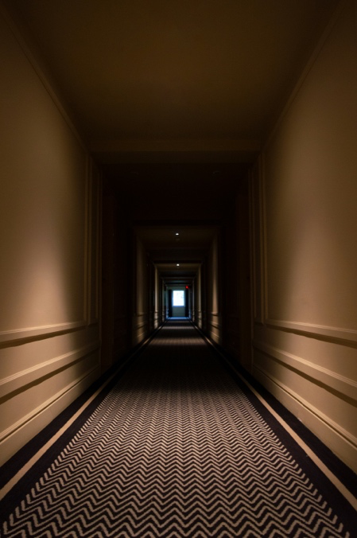
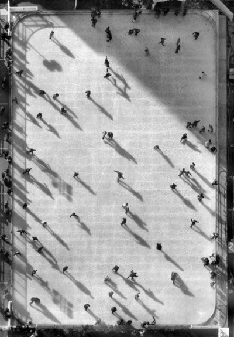

## Briefing & concept

Iedereen maakt vandaag dagelijks tientallen foto's met een smartphone. Maar wat maakt een foto werkelijk krachtig, indrukwekkend en professioneel? Het verschil tussen een snelle, toevallige snapshot en een doordacht fotografisch beeld schuilt in één cruciaal element: **compositie**.

Als fotograaf en crossmediaal ontwerper registreer je de werkelijkheid niet passief, je bouwt visuele ervaringen. Je kiest wat je toont, wat je bewust buiten beeld laat en hoe je het oog van de toeschouwer dwingt om een bepaald pad door het kader te volgen.

In deze eerste opdracht voor **Beeld** train je jouw actieve fotografische blik. Je onderzoekt fundamentele compositieregels en trekt met een camera op verkenning door de schoolomgeving. Vervolgens selecteer je jouw sterkste opnames in **Adobe Bridge**, optimaliseer je ze in **Adobe Photoshop** en presenteer je jouw werk in een strak, professioneel **drieluik**.


Met behulp van beeldaspecten geef je een plat tweedimensionaal vlak diepte, betekenis en spanning mee. Door bewust te experimenteren met camerastandpunt, kadrering, kijklijnen en gelaagdheid bepaal je direct welk gevoel jouw beeld oproept.



Bekijk voor extra theoretische achtergrond en inspirerende voorbeelden de [Cursus Fotografie: Beeldaspecten](/cursus/fotografie/#de-tien-fotografische-beeldaspecten).

### Concept & thema

Bedenk voor jouw fotoserie één overkoepelend thema. Dit zorgt ervoor dat jouw beelden, ondanks de verschillende compositietechnieken, visueel en inhoudelijk een samenhangende familie vormen:

1. **Architectuur & geometrie:** Lijnen, trappenhuizen, beton, glasreflecties, patronen en structuren in en rond het schoolgebouw.
2. **Mens & interactie:** Spontane portretten, expressieve blikken, lichaamshoudingen of silhouetten van medeleerlingen in hun schoolbiotoop.
3. **Detail & textuur:** Verborgen micro-verhalen, materialen, sterke licht-donker contrasten en abstracte uitsnedes van alledaagse voorwerpen.
4. ...

## Fundamentele compositieregels

Tijdens jouw opnames ga je gericht op zoek naar onderstaande beeldprincipes.

### Regel van derden

Plaats je onderwerp niet pal in het midden. Verdeel het beeldvlak met twee horizontale en twee verticale lijnen in negen gelijke vlakken. De **vier snijpunten** vormen de natuurlijke ankerpunten van het frame.

* Plaats je hoofdonderwerp (bv. een gezicht, een detail of een persoon) op een van deze snijpunten.
* Laat de horizonlijn samenvallen met de bovenste derdenlijn (nadruk op de voorgrond) of de onderste derdenlijn (nadruk op de lucht of hoogte).

### Lagen & dieptewerking

Een foto is plat, maar de werkelijkheid is driedimensionaal. Om diepte en ruimtelijkheid te suggereren, bouw je jouw compositie op in drie overlappende vlakken:

* **Voorgrond (*Foreground*):** Een object vlak voor de lens (een muurtje, een tak, een deurpost of een vage schouder) trekt de kijker direct het beeld in.
* **Middenplan (*Midground*):** Hier bevindt zich meestal het hoofdonderwerp.
* **Achtergrond (*Background*):** Biedt context, sfeer en ruimtelijk perspectief zonder het hoofdonderwerp te overstemmen.




### Standpunten & perspectief

De hoogte en hoek van waaruit je fotografeert, beïnvloeden rechtstreeks de psychologische beleving van de toeschouwer:

* **Ooghoogte:** Neutraal, documentair en gelijkwaardig. Je kijkt het onderwerp recht in de ogen.
* **Kikkerperspectief (laag standpunt):** Je zakt door je knieën of legt de camera vlak bij de grond. Het onderwerp torent boven de kijker uit en oogt imposant, machtig, dominant of dramatisch.
* **Vogelperspectief (hoog standpunt):** Je fotografeert van bovenaf (vanaf een trap, balustrade of stoel). Het onderwerp oogt kleiner, kwetsbaarder en overzichtelijker, waarbij vloerpatronen en grafische structuren geaccentueerd worden.




### Lijnenwerk & kijklijnen

Lijnen zijn de snelwegen voor het menselijk oog. Ze gidsen de blik door het beeld en roepen een uitgesproken sfeer op:

* **Horizontale lijnen:** Brengen rust, stabiliteit, weidsheid en sereniteit.
* **Verticale lijnen:** Suggereren kracht, hoogte, monumentaliteit en autoriteit (bv. pilaren, bomen, deurstijlen).
* **Diagonale lijnen:** Creëren actie, snelheid, spanning en dynamiek. Ze zuigen het oog vanuit de hoeken naar het verdwijnpunt.


## Technische specificaties

| Eigenschap | Specificatie | Toelichting |
| :--- | :--- | :--- |
| **Opnameapparatuur** | **Camera van de school (DSLR / DSLM)** | Gebruik bij voorkeur een spiegelreflex- of systeemcamera van de school. |
| **Beeldverhouding foto's** | **Oorspronkelijke verhouding (*Original Ratio*)** | Behoud de originele verhouding van de camera tijdens het uitsnijden. |
| **Formaat drieluik** | **A4 liggend (297 × 210 mm)** | Drieluik-presentatie waarin drie geselecteerde beelden naast elkaar worden gepresenteerd. |
| **Optioneel Motion-beeld** | **1:1 vierkant (1080 × 1080 px)** | Achtergrondbeeld voor After Effects in *5CRM Motion (Vormen - Compositie 4)*. |
| **Bestandstypes** | **.PSD** (werkbestand) & **.JPG** (export) | Behoud van niet-destructieve slimme objecten en aanpassingslagen. |

### Mappenstructuur

Voor een professionele workflow beheer je jouw bestanden nauwkeurig. Maak op je computer een hoofdmap aan met de officiële naamconventie. De Photoshop-werkbestanden bewaar je rechtstreeks in deze hoofdmap:

```text
VoornaamA_Kijkkader/
├── 01_assets/       <- Ruwe opnames
├── 02_exports/      <- Definitieve JPG-exports
├── VoornaamA_Kijkkader-Drieluik.psd
├── VoornaamA_Kijkkader_01.psd
├── VoornaamA_Kijkkader_02.psd
└── VoornaamA_Kijkkader_03.psd
```

## Stappenplan

### Praktijkshoot op de schoolcampus

Trek met een camera van de school (of uitzonderlijk je smartphone) op verkenning in en rond het schoolgebouw.

* Maak voor elk van de vier compositieregels minstens drie verschillende opnames met wisselende hoeken en kadreringen (schiet in totaal minimaal 20 foto's).
* Zorg voor een stabiele houding om bewegingsonscherpte te vermijden. Druk de ontspanknop gecontroleerd in.
* Let op de lichtinval: zoek natuurlijk licht bij ramen, schaduwen onder trappen of grafische reflecties op glas en metaal.
* Stel doelgericht scherp op je hoofdonderwerp. Gebruik de autofocuspunten of handmatige focus.

> **Hulpraster inschakelen**  
> Activeer het 3×3 raster (*Grid*) in de zoeker of op het liveview-scherm van de camera. Zo lijn je horizonlijnen en sterke punten tijdens het fotograferen al kaarsrecht uit!

### Beeldselectie in Adobe Bridge

Koppel de SD-kaart van de camera aan je computer en start **Adobe Bridge** op. Bridge is het centrale zenuwstelsel voor fotografen om duizenden beelden snel te inspecteren, taggen en sorteren.

1. Kopieer al je ruwe fotobestanden naar de map `01_assets/`.
2. Navigeer in Adobe Bridge naar jouw projectmap en bekijk de miniaturen in de *Essentials*-weergave.
3. Druk op de **spatiebalk** om een geselecteerde foto direct schermvullend te inspecteren op scherpte, focus en belichting. Druk nogmaals op de spatiebalk om terug te keren.
4. Ken ratings toe met sneltoetsen:
   * **Sterrenbeoordeling:** Druk op `Ctrl + 1` t.e.m. `Ctrl + 5` om je foto's 1 tot 5 sterren te geven (`Ctrl + 0` wist de sterren).
   * **Kleurlabels:** Druk op `Ctrl + 6` t.e.m. `Ctrl + 9` om beelden te markeren met een kleur (bv. groen voor definitieve selectie).
5. Inspecteer in het paneel *Metadata* de technische opnamegegevens (sluitertijd, diafragmawaarde en ISO-gevoeligheid).
6. Selecteer jouw **drie allersterkste opnames** die samen de diversiteit van jouw compositieonderzoek aantonen.

### Digitale bewerking in Photoshop

Open jouw drie geselecteerde opnames vanuit Adobe Bridge in **Adobe Photoshop** (`Ctrl + R` of dubbelklikken).

#### Kadreren en uitsnijden met de Crop Tool
* Activeer het **Uitsnijdgereedschap (*Crop Tool*)** met de sneltoets `C`.
* Vink in de optiebalk bovenaan de optie **Verwijderde pixels verwijderen (*Delete Cropped Pixels*) UIT**. Zo kun je het kader achteraf altijd nog verschuiven of vergroten.
* Kies in het dropdownmenu van de optiebalk voor **Oorspronkelijke verhouding (*Original Ratio*)** om de verhouding van de camera te behouden.
* Klik op het rastericoon in de bovenbalk en selecteer *Regel van derden* (*Rule of Thirds*) als hulplijnenoverlay.
* Verplaats en schaal het kader totdat de compositie perfect in balans is en druk op `Enter`.

#### Belichting en contrast perfectioneren met Camera Raw
* Kies in het menu **Filter > Camera Raw-filter...** (`Ctrl + Shift + A`).
* Pas de basisparameters verfijnd aan:
  * **Witbalans (*White Balance*):** Corrigeer onnatuurlijke kleurzwemen van tl-verlichting naar een neutrale kleurtemperatuur.
  * **Belichting & Hooglichten (*Exposure & Highlights*):** Breng doortekening terug in lichte partijen zonder de witten uit te bleken.
  * **Schaduwen (*Shadows*):** Open te donkere zones zodat details in schaduwen zichtbaar blijven.
  * **Helderheid & Nevel verwijderen (*Clarity & Dehaze*):** Verhoog het lokale contrast voor extra diepte, tastbaarheid en textuur.
* Klik op **OK**. Het Camera Raw-filter verschijnt nu als een bewerkbaar *Smart Filter* onder jouw fotolaag.

#### Afwerking met aanpassingslagen
* Voeg via het ronde icoontje onderaan het Lagen-paneel een aanpassingslaag **Curven (*Curves*)** toe.
* Trek een lichte S-curve om het globale contrast subtiel aan te scherpen.
* Gebruik eventueel een lege retoucheerlaag met het **Verwijderen-gereedschap (*Remove Tool*, sneltoets `J`)** om kleine storende vlekjes of stofdeeltjes weg te poetsen.
* Sla elk beeld afzonderlijk op in de hoofdmap als `VoornaamA_Kijkkader_01.psd`, `_02.psd` en `_03.psd`.

### Drieluik samenstellen op A4

Breng jouw drie geoptimaliseerde beelden samen in één harmonieus drieluik (*triptych*) op A4-formaat.

1. Maak een nieuw document aan in Photoshop (`Ctrl + N`):
   * Ga naar het tabblad **Afdrukken (*Print*)** en kies de voorinstelling **A4**.
   * Stel de afdrukstand in op **Liggend (*Landscape*, 297 × 210 mm)**.
   * **Naam:** `VoornaamA_Kijkkader-Drieluik`
   * **Achtergrondinhoud:** Wit, afhankelijk van de sfeer van je serie.
2. Maak een strak hulplijnenraster aan via **Weergave > Nieuwe hulplijnlay-out... (*View > New Guide Layout...*)**:
   * **Kolommen:** Aantal: `3`, Tussenruimte (*Gutter*): `10 mm`, Marges (*Margins*): rondom `15 mm`.
3. Sleep jouw drie bewerkte Photoshop-bestanden in het document. Schaal ze proportioneel binnen de kolomgrenzen met Vrije transformatie (`Ctrl + T`).
4. Selecteer het **Tekstgereedschap (*Horizontal Type Tool*, sneltoets `T`)** en voeg onder elk paneel een subtiele typografische duiding toe in een verzorgde schreefloze letter (zoals *Aptos*, *Inter* of *Helvetica*):
   * Naam van de toegepaste compositieregel (bv. *Regel van derden*, *Dieptelagen*, *Kikkerperspectief*).
   * Technische opnameparameters (bv. *50mm • f/2.8 • 1/250s • ISO 200*).
5. Sla het gelaagde werkbestand op als `VoornaamA_Kijkkader-Drieluik.psd` in de hoofdmap.
6. Exporteer een JPEG via **Bestand > Exporteren > Opslaan voor web (verouderd)...** (`Ctrl + Alt + Shift + S`) of **Opslaan als een kopie...**:
   * **Formaat:** `JPEG`
   * **Kwaliteit:** Hoog
   * **Bestandsnaam:** `02_exports/VoornaamA_Kijkkader-Drieluik.jpg`

### Optionele integratie met 5CRM Motion

In het vak **Motion** werk je tijdens de introductieopdracht *Vormen* aan vier dynamische After Effects-composities. Voor **Compositie 4** (`VoornaamA_Vormen-Comp_4`, 1080 × 1080 px, 1:1 vierkant) heb je een contrastrijke achtergrondfoto nodig waarop geometrische vormen bewegen en reageren.

In plaats van een anonieme stockfoto te downloaden van Pexels of Unsplash, kun je nu direct uitpakken met jouw **eigen originele opname** uit deze opdracht:

1. Kies uit jouw beeldreeks een foto met krachtige architecturale lijnen, dieptewerking of een dramatisch perspectief.
2. Open het beeld in Photoshop en kies met de Crop Tool (`C`) de vaste verhouding **1:1 (Vierkant)**.
3. Kadrer het meest dynamische deel van de compositie en druk op `Enter`.
4. Exporteer het beeld als:
   * **Bestandsnaam:** `VoornaamA_Motion-Achtergrond.jpg`
   * **Afmetingen:** exact `1080 × 1080 px`
   * **Map:** bewaar in `02_exports/`
5. Kopieer dit bestand vervolgens naar de map `01_assets/` van jouw Motion-project *VoornaamA_Vormen*. Zo vormt jouw eigen fotografische beeldtaal de basis voor jouw motion design!

## Zelfevaluatie & kwaliteitscontrole

Controleer jouw werk grondig aan de hand van deze checklist vóór je definitief inlevert:

### Bestanden & mappen
- De hoofdmap heet exact `VoornaamA_Kijkkader`.
- De map `01_assets/` bevat al je ruwe opnames van de camera of smartphone.
- De map `02_exports/` bevat het geëxporteerde drieluik (`VoornaamA_Kijkkader-Drieluik.jpg`), de individuele JPEG's en eventueel de optionele vierkante achtergrondfoto voor Motion (`VoornaamA_Motion-Achtergrond.jpg`).
- De Photoshop-werkbestanden (`VoornaamA_Kijkkader-Drieluik.psd` en de individuele `.psd`-bestanden) staan rechtstreeks in de hoofdmap.

### Technische kwaliteit
- Alle Photoshop-bewerkingen zijn zuiver non-destructief uitgevoerd met slimme objecten en aanpassingslagen.
- De uitsnedes zijn gemaakt zonder originele pixels te verwijderen (*Delete Cropped Pixels* uitgevinkt).
- De belichting is gebalanceerd: geen dichtgelopen schaduwen zonder detail en geen uitgebleekte witten.
- De geëxporteerde beelden zijn scherp, tonen geen storende ruis en het drieluik staat netjes op A4 liggend.

### Vormgeving & compositie
- Het drieluik toont drie duidelijk verschillende en herkenbare compositieregels (bv. regel van derden, dieptelagen en kikkerperspectief).
- De drie beelden vormen samen een harmonieus trio qua licht, kleurtoon en thematiek.
- De typografie op het drieluik is strak uitgelijnd, uniform qua korpsgrootte en bevat geen spelfouten.

## Oplevering

Lever jouw gecomprimeerde projectmap tijdig in via de Smartschool-uploadzone:

> **Opleveringsformaat:** Gezipte hoofdmap `VoornaamA_Kijkkader.zip`  
> **Inhoud zip:** De hoofdmap met `01_assets/`, `02_exports/` en de `.psd`-werkbestanden.  
> **Uploadzone:** *Vak 5CRM Beeld → Uploadzone → 2026-2027 → September → Kijkkader*  
> **Deadline:** Einde van de voorziene module.
