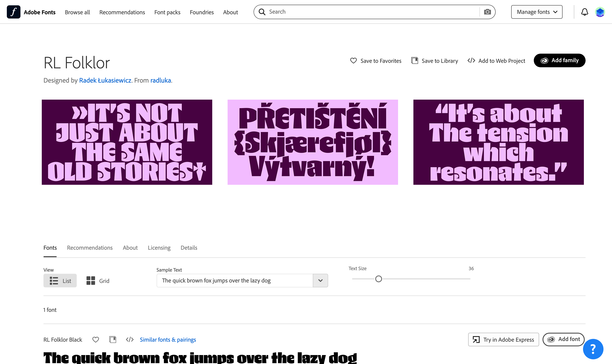
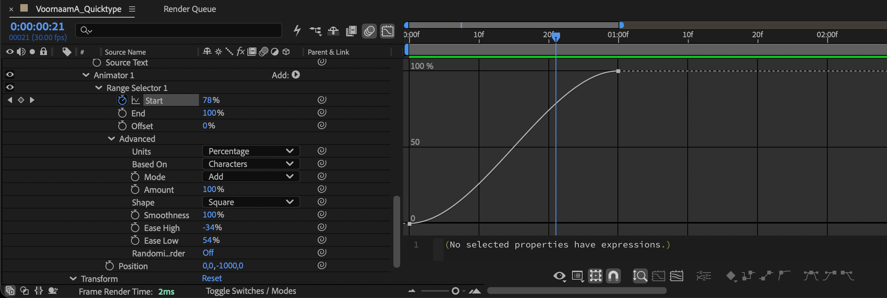
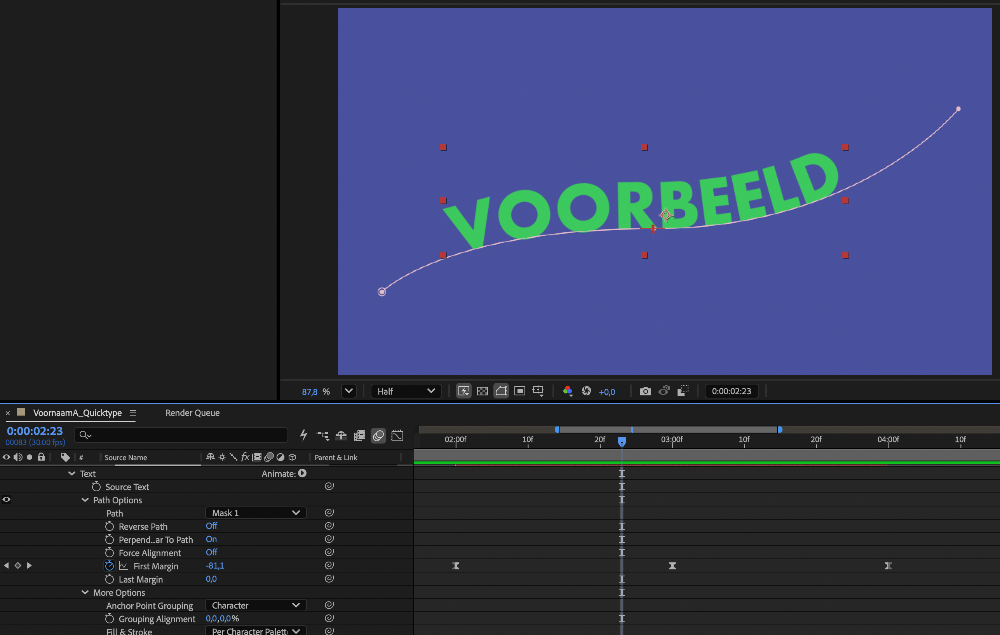
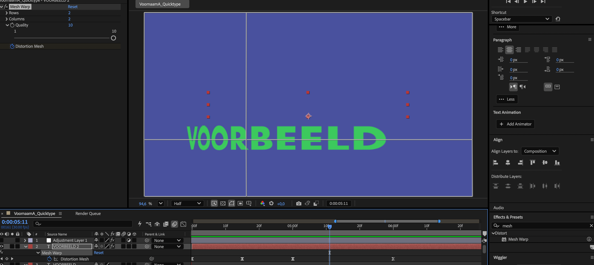
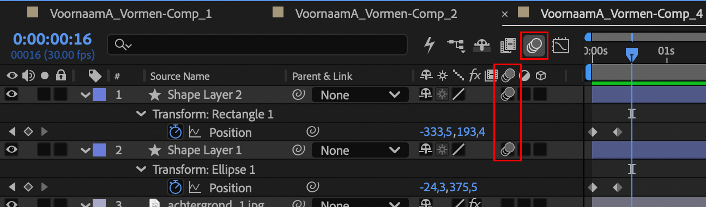

## Briefing & Concept

Typografie hoeft niet altijd stil te staan op een pagina. In kinetische typografie (*kinetic typography*) worden letters, woorden en zinnen dynamisch: ze versnellen, buigen, vliegen rond en transformeren op ritme en energie.

In deze opdracht ontwerp en animeer je **Quicktype**: een flitsende, kinetische typografie-video van **ongeveer 10 seconden**. Je bouwt **één doorlopende, energieke sequentie** waarin vier typografische animatietechnieken elkaar opvolgen.

Elke techniek krijgt enkele seconden de schijnwerpers. Door middel van strakke cuts, dynamische schaalovergangen en *easing* vloeit elk scherm naadloos over in de volgende.



### Vier animatietechnieken

Je video brengt vier uiteenlopende animatietechnieken samen in één vloeiend geheel:

| Techniek | Gereedschap in After Effects | Effect |
| :--- | :--- | :--- |
| **Range selector** | Tekst-animator (`Animate > Position / Scale / Tracking`) | Letters of woorden die ritmisch binnenvallen, afremmen of over elkaar schuiven. |
| **Path options** | Maskerpad (`Pen Tool` / `G`) gekoppeld aan `Path Options` | Tekst die met snelheid over dynamische curven, diagonalen of golven gaat. |
| **Mesh warp** | Vervormingseffect (`Effect > Distort > Mesh Warp` of `Bezier Warp`) | Elastische typografie die vloeibaar uitrekt, buigt of kinetisch comprimeert. |
| **Eigen keuze** | Zelfgekozen effect via online tutorial of inspiratiebron | Een innovatieve typografische animatietechniek naar eigen creatieve keuze. |

### Typografie & Adobe Fonts

Ga op zoek naar karaktervolle fonts met sterke proporties: denk aan knappe schreeflozen (*ultra bold* of *black sans*), opvallende display-lettertypes of geometrische lettervormen.

Maak gebruik van **[Adobe Fonts](https://fonts.adobe.com/)**:
* Blader door duizenden professionele lettertypes via de website van Adobe Fonts.
* Activeer een lettertype met één klik op de knop **Add family** of **Activate**.
* Het lettertype wordt automatisch en direct gesynchroniseerd binnen al je Adobe-programma's (After Effects, Illustrator, Photoshop). Je hoeft geen losse bestanden te installeren.

Kies je toch voor een lettertype van een extern platform (zoals [Google Fonts](https://fonts.google.com/) of [DaFont](https://www.dafont.com/))? Bewaar de installatiebestanden (`.otf` of `.ttf`) dan zorgvuldig in je map `01_assets/`.



### Kleurcontrast & energie

Zorg voor een krachtig, contrasterend kleurenpalet. Kinetische typografie werkt het best wanneer de tekst maximaal van het scherm knalt, bijvoorbeeld:
* **Donkere achtergrond met neon-accenten:** Diepzwart gecombineerd met fel limoengroen.
* **Lichte achtergrond met diepe contrasten:** Gebroken wit gecombineerd met kobaltblauw.

**Beperk je palet:** Gebruik maximaal twee tot drie contrasterende kleuren zodat de beweging en typografie de hoofdrol behouden.

## Tekst & inhoud

Je animeert vier verschillende zinnen of regels, waarbij elke regel enkele seconden te zien is. Laat je inspireren door onderstaande voorbeelden:

* `Vorm volgt beweging`
* `Ritme doorbreekt stilstand`
* `Vervorming creëert spanning`
* `Break the grid`
* `Distort space`
* `Pure energy`

## Stappenplan

### Voorbereiding & pinboard

Vóór je in After Effects aan de slag gaat, leg je de basis vast in een beknopt document:

1. **Tekstkeuze:** Kies of bedenk de vier zinnen of regels die je na elkaar gaat animeren. Zorg voor krachtige woorden die passen bij het ritme van je video.
2. **Lettertypekeuze:** Bepaal vooraf welk lettertype of welke lettertypes je gaat inzetten (zoek via [Adobe Fonts](https://fonts.adobe.com/) of downloadbare fonts). Noteer de namen van je gekozen fonts en waarom ze passen bij de stijl en energie van je animatie.
3. **Pinboard:** Maak op [Pinterest](https://www.pinterest.com/) een nieuw bord aan (*Motion: Quicktype*). Verzamel minimaal **vijf inspirerende voorbeelden** van kinetische typografie, expressieve lettervormen en dynamische overgangen.
4. **Document opstellen:** Noteer je vier regels, je gekozen lettertype(s) en de openbare deellink naar je Pinterest-bord in een overzichtelijk document en bewaar dit als `VoornaamA_Quicktype-Voorbereiding.odt` (of `.pdf`) in je hoofdmap.

### Compositie & projectopzet

1. Start **Adobe After Effects**.
2. Maak een nieuwe compositie aan (**Composition > New Composition...** of `Ctrl + N`):
   * **Composition Name:** `VoornaamA_Quicktype`
   * **Preset / Grootte:** `1920 × 1080 px` (Full HD, 16:9)
   * **Frame Rate:** `30 fps`
   * **Duration:** `0:00:10:00` (**ongeveer 10 seconden**)
3. Sla het project direct op als `VoornaamA_Quicktype/VoornaamA_Quicktype.aep`.

### Range selector & animators

In de eerste fase animeer je de eerste tekstregel met behulp van de geavanceerde **Tekst-animators** van After Effects. De animator stuurt afzonderlijke letters of woorden aan via een instelbaar bereik.

1. Activeer het tekstgereedschap (`Ctrl + T`) en typ je eerste zin in het midden van de compositie.
2. Klap de tekstlaag open in de tijdlijn en klik rechts naast `Text` op het menu **Animate: ▷**.
3. Kies een eigenschap, bijvoorbeeld **Position**, **Scale** of **Tracking**:
   * After Effects voegt `Animator 1` toe met daaronder een `Range Selector 1` en de gekozen eigenschap.
4. Stel de afwijkende rustwaarde in onder `Animator 1 > Position` (bijvoorbeeld `[0, 800]` zodat letters van onder het scherm komen).
5. Klap `Range Selector 1` open:
   * Zet een keyframe op **Offset** op `-100%` aan het begin van de zin.
   * Verplaats de tijdindicator naar voren (ongeveer 1 seconde verder) en verander **Offset** naar `100%`.
6. Klap **Advanced** open onder de Range Selector:
   * Wijzig **Shape** van *Square* naar **Ramp Up** of **Smooth** voor een vloeiende, elastische golfbeweging.
   * Pas eventueel **Ease High** en **Ease Low** aan om de letters explosief te laten binnenschieten.



### Path options & padanimatie

In de tweede fase beweegt de tweede zin met snelheid over een getekend traject.

1. Selecteer de tekstlaag van de tweede zin.
2. Neem het **Pen-gereedschap / Pen Tool (`G`)** en teken een dynamisch Bézier-pad rechtstreeks over het canvas (bijvoorbeeld een vloeiende S-curve, een diagonale lus of een scherpe golf).
   * Omdat de tekstlaag geselecteerd was, herkent After Effects dit automatisch als een masker (`Mask 1`).
3. Klap de tekstlaag open naar `Text > Path Options`:
   * Kies bij **Path** voor **Mask 1**. De letters hechten zich direct vast aan de getekende lijn!
4. Experimenteer met de instellingen:
   * **Reverse Path:** Draait de leesrichting om.
   * **Perpendicular to Path:** Bepaalt of letters loodrecht op de kromming meedraaien of horizontaal blijven staan.
   * **Force Alignment:** Verdeelt de letters gelijkmatig over de totale lengte van het pad.
5. Animeer de eigenschap **First Margin** of **Last Margin**:
   * Plaats een begin-keyframe zodat de tekst buiten beeld start.
   * Laat de tekst met snelheid over het pad gaan en even stilhouden of versnellen.



### Mesh warp & vervorming

In de derde fase ondergaat de derde zin een organische, elastische vervorming. Hierdoor lijkt de typografie te reageren op fysieke krachten zoals druk of spanning.

1. Typ de derde tekstregel in een extra vet displayfont.
2. Selecteer de tekstlaag en kies in het bovenmenu **Effect > Distort > Mesh Warp** (of gebruik als alternatief **Bezier Warp** of **CC Bender**).
3. In het paneel *Effect Controls* stel je het aantal rijen en kolommen in (bijvoorbeeld `Rows: 3`, `Columns: 3` voor gecontroleerde vervorming).
4. Klik op de stopwatch naast **Mesh** om het beginframe vast te leggen.
5. Versleep in het compositievenster de kruispunten en Bézier-stuurpunten van het raster:
   * Trek de letters in het midden dramatisch uit elkaar of pers ze samen alsof ze tegen een onzichtbare wand botsen.
6. Bouw een dynamische beweging: begin neutraal, trek de tekst extreem krom op het moment van piekspanning, en laat hem terugveren met een elastische *snap*.



### Eigen effect

In de vierde fase neem je zelf de touwtjes in handen. Je onderzoekt zelfstandig een online tutorial of inspiratiebron en past een vierde, onderscheidend typografisch effect toe.

Mogelijke richtingen ter inspiratie:
* **Echo / Repeater trail (`Effect > Time > Echo`):** Creëer een cascade van nalichtende typografische schaduwen die de beweging van letters visualiseren.
* **Displacement glitch (`Effect > Distort > Displacement Map`):** Laat de tekst digitaal kraken en verspringen op basis van een contrastrijke ruis- of vormlaag.
* **Wave Warp / Turbulent Displace (`Effect > Distort > Wave Warp`):** Laat letters pulseren als vloeibare energiegolven.
* **Explosieve fragmentatie (`Effect > Simulation > CC Pixel Polly` of `Shatter`):** Laat de tekst aan het einde van de video in microscopische deeltjes uiteenspatten.
* **Kinetic stretch loop:** Werk met strakke scale-stretches (`Scale` ontkoppelen en over één as naar 500% trekken).

Verwerk de techniek zodanig dat hij de apotheose vormt van je 10-seconden video.

### Exporteren naar MP4

Wanneer je video klaar is, exporteer je het resultaat via **Adobe Media Encoder**:
1. Selecteer de compositie `VoornaamA_Quicktype` in het *Project-paneel*.
2. Kies **Composition > Add to Adobe Media Encoder Queue...** (`Ctrl + Alt + M`).
3. Stel het formaat in op **H.264** met de voorinstelling **Match Source - High Bitrate**.
4. Klik op de blauwe bestandsnaam onder *Output File* en bewaar de video in je map `02_exports/` als `VoornaamA_Quicktype.mp4`.
5. Klik op de groene **Play-knop** (`Enter`) om de render te starten.

## Overgangen & dynamiek

### Snelle overgangen

Omdat de vier fasen elkaar binnen tien seconden opvolgen, zijn trage cross-fades niet geschikt. Kies voor energieke, dynamische overgangstechnieken:
* **Match cut:** Laat een vorm of lettergreep uit de vorige fase direct van schaal of positie veranderen naar het startpunt van de volgende fase.
* **Whip pan / Fast wipe:** Een snelle beweging over de X-as waarbij de oude tekst wegschiet naar links terwijl de nieuwe tegelijk binnenkomt vanaf rechts.
* **Scale punch:** Laat een woord plotseling naar 400% inzoomen voorbij de camera, waarna de nieuwe tekst direct in het centrum zichtbaar is.
* **Kleurwissel:** Wissel exact op de overgang tussen twee fasen de achtergrond- en voorgrondkleur om voor een flitsende visuele puls.

### Easy Ease & Graph Editor

Elke beweging en overgang moet een voelbare dynamiek hebben, dit kan je bereiken door bijvoorbeeld gebruik te maken van:
1. Selecteer je keyframes en druk op **`F9` (Easy Ease)**.
2. Open de **Graph Editor** (`Shift + F3`).
3. Schakel over naar de **Edit Speed Graph**.
4. Selecteer de keyframes en sleep de gele Bézier-handvatten naar elkaar toe:
   * Creëer een steile piek: de beweging accelereert razendsnel en remt pas op het allerlaatste moment strak af. Dit geeft de typografie een professionele, snappy kinetische feel.


### Bewegingsonscherpte (Motion Blur)

Schakel voor alle bewegende tekstlagen de **Motion Blur**-schakelaar in (drie overlappende cirkels in de tijdlijn). Zorg dat ook het overkoepelende Motion Blur-icoon boven de tijdlijn geactiveerd is. Hierdoor krijgen snelle bewegingen een realistische, filmische veeg.



## Extra uitdaging

Wil je je video naar een nog hoger niveau tillen? **Animeer op muziek of geluidseffecten**:
1. Zoek een energieke beat, elektronische track of punchy geluidseffecten (zoals *whooshes*, *hits* en *glitches*) via rechtenvrije bibliotheken zoals [Freesound](https://freesound.org/).
2. Importeer het audiobestand in After Effects en sleep het onderaan in je compositietijdlijn.
3. Selecteer de audiolaag en druk tweemaal snel op de toets `L` (**`LL`**):
   * De geluidsgolf (*Audio Waveform*) wordt nu zichtbaar op de tijdlijn.
4. Lijn de keyframes van je cuts, overgangen en tekstversnellingen exact uit op de pieken van de beat (kicks, snares of drops) voor een overdonderende audiovisuele impact.

## Oplevering

Lever je volledige projectmap gecomprimeerd in via de Smartschool Uploadzone:

```text
VoornaamA_Quicktype.zip
└─ 01_assets/          <- Losse lettertypebestanden (niet vereist bij Adobe Fonts), audio
└─ 02_exports/
   └─ VoornaamA_Quicktype.mp4
└─ VoornaamA_Quicktype.aep
└─ VoornaamA_Quicktype-Voorbereiding.docx (of .pdf)
```

### Checklist

Controleer je werk grondig aan de hand van onderstaande kwaliteitscontrole vóór je het zip-bestand indient.

#### Bestanden & mappen
- De zip-file en hoofdmap heten exact `VoornaamA_Quicktype`.
- Het voorbereidingsdocument met de vier gekozen regels, je lettertypekeuze en de link naar je Pinterest-bord (minimaal 5 voorbeelden) staat in de hoofdmap.
- Het projectbestand `VoornaamA_Quicktype.aep` staat netjes in de hoofdmap.
- De map `02_exports` bevat de geëxporteerde `VoornaamA_Quicktype.mp4`.
- Indien je losse gedownloade lettertypes hebt gebruikt (geen Adobe Fonts), zitten de `.otf` of `.ttf` bestanden in `01_assets/`.
- Eventueel gebruikte audiobestanden zijn bewaard in `01_assets/`.

#### Technische specificaties
- De compositie staat ingesteld op **1920 × 1080 px (16:9 Full HD)**.
- De framerate is exact **30 fps**.
- De totale duur van de sequentie is **ongeveer 10 seconden** (circa 300 frames).
- De MP4-export is gerenderd in de **H.264**-codec en speelt vloeiend af zonder haperingen.

#### De vier typografische technieken
- **Range selector:** Toegepast via een tekst-animator met beïnvloeding van Start, End of Offset en een dynamische Shape (Ramp Up / Smooth).
- **Path options:** Tekst beweegt strak en leesbaar over een getekend Bézier-maskerpad.
- **Mesh warp:** Tekst ondergaat een elastische, organische vervorming met behulp van Mesh Warp, Bezier Warp of een vergelijkbaar vervormingseffect.
- **Eigen effect:** Een vierde, zelfstandig onderzochte techniek is herkenbaar en creatief toegepast.

#### Vormgeving & bewegingsdynamiek
- Alle teksten gebruiken karaktervolle, expressieve fonts (via Adobe Fonts of zorgvuldig geselecteerde downloadbare fonts; geen standaard lettertypes).
- Het kleurenpalet is contrastrijk en ondersteunt de leesbaarheid en kinetische energie.
- Overgangen tussen de vier fasen verlopen naadloos en flitsend (geen trage, saaie pauzes).
- Er zijn geen stijve lineaire keyframes: alle bewegingen maken gebruik van **Easy Ease (`F9`)** en dynamische curves in de **Graph Editor**.
- **Motion Blur** is ingeschakeld op alle snelle lagen en op compositieniveau.
