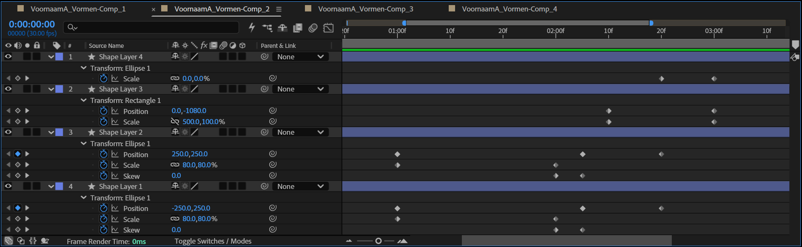
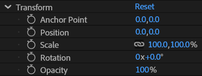
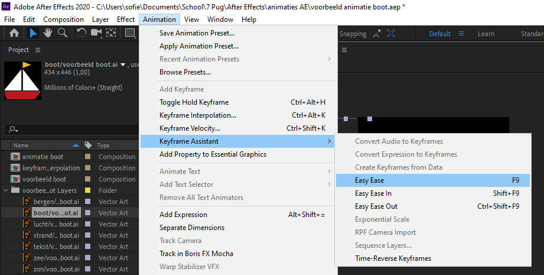
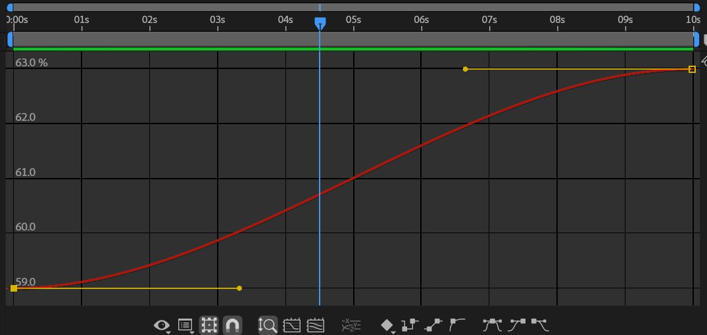
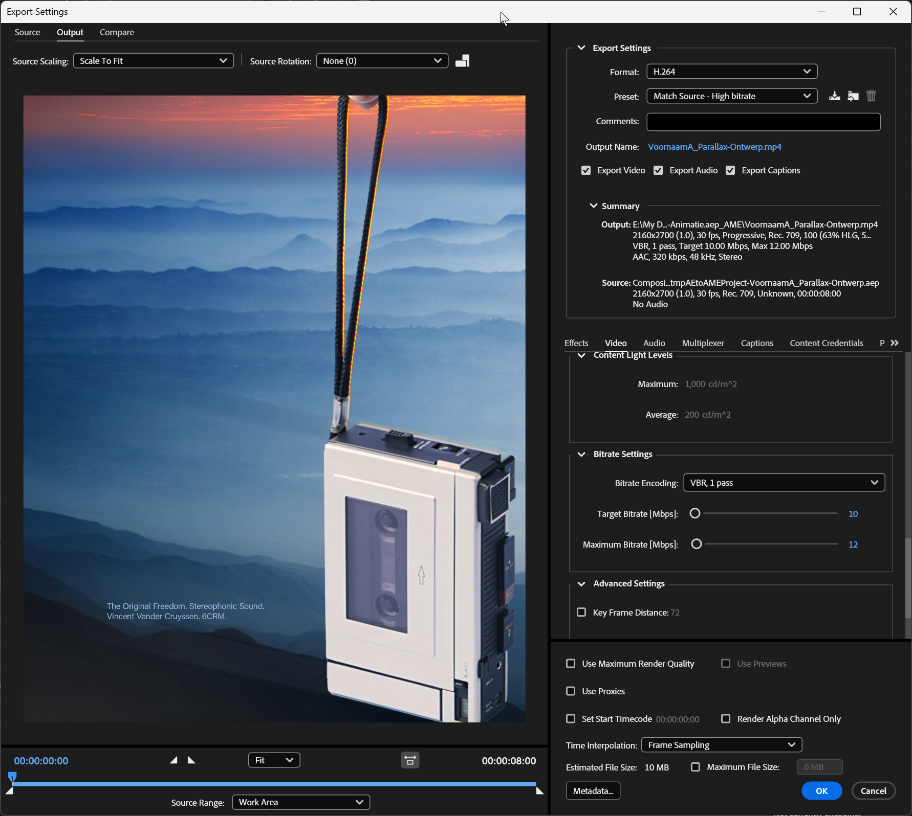

## Briefing & Concept

In deze inleidende opdracht zet je je allereerste stappen in **Adobe After Effects**. Je leert hoe je statische geometrische vormen, typografische elementen en beeldmateriaal tot leven wekt en laat transformeren door middel van beweging, ritme en timing.

Goede animatie draait niet altijd om ingewikkelde effecten, maar om controle van de basis: hoe beweegt een object, versnelt of vertraagt het, welk gevoel roept die beweging op?



### Wat is Keyframing?

Elke animatie in **After Effects** rust op het principe van **keyframes** (hoofd- of sleutelbeelden op de tijdlijn). Een keyframe legt de exacte waarde van een eigenschap (zoals de positie of schaal van een vorm) vast op een specifiek tijdstip.

Door een **beginwaarde** (bv. links op het scherm) en een **eindwaarde** (bv. rechts op het scherm) vast te leggen, berekent After Effects automatisch alle tussenliggende frames. Dit automatische rekenproces noemen we **inbetweening** of **interpolatie**.



### De vijf basistransformaties

Elk visueel element in After Effects beschikt over **vijf fundamentele transformatie-eigenschappen**:

| Eigenschap | Omschrijving |
| :--- | :--- |
| **Oriëntatiepunt (Anchor Point)** | Scharnierpunt waaromheen transformaties plaatsvinden. |
| **Positie (Position)** | Coördinaten over de X-as (horizontaal) en Y-as (verticaal). |
| **Schaal (Scale)** | Afmeting in procenten (`100%` = origineel, `-100%` = gespiegeld). |
| **Rotatie (Rotation)** | Draaihoek in volledige omwentelingen en graden (`0x + 0,0°`). |
| **Dekking (Opacity)** | Zichtbaarheid van 0% (onzichtbaar) tot 100% (dekkend). |



### Vormlaag-animatie vs. Laagtransformatie

Bij het animeren van vormen in After Effects is het belangrijk om te begrijpen hoe een **Shape Layer (Vormlaag)** is opgebouwd:

1. **Inhoud van de vorm (`Contents`):**  
   Wanneer je een vorm tekent, bevindt deze zich binnen de map `Contents` (bv. *Rectangle 1* of *Polystar 1*). Hierin kun je rechtstreeks de **vormparameters** animeren (zoals de *Size*, *Roundness*, *Radius* of *Points*) én beschikt elke afzonderlijke vorm over zijn eigen interne **Transform-groep** (*Position*, *Scale*, *Rotation*).
2. **Overkoepelende laagtransformatie (`Transform`):**  
   Onderaan de vormlaag vind je de algemene transformaties die de volledige laag als één geheel verplaatsen of schalen.

> **Animeer binnen de vorm!**  
> Klap in de tijdlijn het driehoekje (▷) naast de vormlaag open naar `Contents > [Vormnaam]`. Door de eigenschappen van de vorm zelf te animeren, behoud je maximale controle wanneer je later meerdere vormen op één laag combineert of specifieke vormeigenschappen (zoals afronding of straal) wilt vervormen.


### Lineair vs. Easy Ease (`F9`) & Graph Editor

Standaard genereert After Effects **lineaire keyframes** (ruitjes ◆). Dit betekent dat een beweging plots start met constante snelheid en abrupt stilvalt. In de echte fysieke wereld werkt beweging haast nooit lineair: een vallende bal of wegrijdende auto moet **versnellen** (*Ease Out*) en **vertragen** (*Ease In*).

* **Easy Ease (`F9`):** Zet starre lineaire keyframes om in vloeiende zandlopers (⧗), waardoor objecten zacht vertrekken en afremmen.
* **Graph Editor:** In de Graph Editor pas je met Bézier-handvatten de dynamiek aan voor een krachtige 'pop' of 'snap' in je beweging.




### Bewegingsbegrippen & Inspiratie

Je visualiseert abstracte bewegingsconcepten via korte transformaties. Laat je inspireren door de enkele bewegingsprincipes:

1. **Splitsen & vermenigvuldigen:** Eén compacte vorm splitst zich op in meerdere elementen en verspreidt zich dynamisch over het scherm.
2. **Rotatie & metamorfose:** Een geometrische vorm draait om zijn as terwijl hoeken, afrondingen of schalen transformeren in een nieuwe gedaante.
3. **Pulsatie & ritmiek:** Een pulserende schaal- en dekkingsbeweging die synchroon loopt met een denkbare beat of hartslag.
4. **Spiegeling & symmetrie:** Elementen bewegen synchroon naar buiten en vormen samen een hypnotiserend patroon.

### Jouw vier composities

Binnen één overkoepelend After Effects-project (`VoornaamA_Vormen.aep`) maak je **vier afzonderlijke composities**, elk met een specifieke beeldverhouding, een doordachte animatieduur en een eigen focus:

1. **Compositie 1: Eenvoudige vormbeweging:**  
   `VoornaamA_Vormen-Comp_1` (Full HD, **1920 × 1080 px**, **minimaal 5 seconden**). Eén geometrische basisvorm (cirkel, rechthoek of ruit) verplaatst zich vloeiend over het scherm. Experimenteer met een gebogen animatiepad en subtiele versnelling.
2. **Compositie 2: Meerdere vormen transformeren:**  
   `VoornaamA_Vormen-Comp_2` (Portret, **1080 × 1350 px**, **minimaal 5 seconden**). Meerdere vormen bewegen, roteren en schalen tegelijkertijd. Maak gebruik van vormduplicatie (`Ctrl + D`) en de *Pen Tool* of *Shape Tool* (`Q`).
3. **Compositie 3: Kinetische typografie:**  
   `VoornaamA_Vormen-Comp_3` (Ultrawide, **2520 × 1080 px**, **minimaal 5 seconden**). Eén krachtig woord of een korte quote komt tot leven door beweging, schaal en dekking. Zorg voor ritme, typografische hiërarchie en strakke timing.
4. **Compositie 4: Vierkant formaat met achtergrondafbeelding (1:1):**  
   `VoornaamA_Vormen-Comp_4` (Vierkant, **1080 × 1080 px**, **minimaal 10 seconden**). Een compositie waarin een contrasterende achtergrondfoto (van Unsplash of Pexels) gecombineerd wordt met gelaagde, geanimeerde vectorvormen en bewegingsonscherpte (*Motion Blur*).

## Technische specificaties

| Compositienaam | Formaat & verhouding | Minimale duur | Toelichting |
| :--- | :--- | :---: | :--- |
| **`VoornaamA_Vormen-Comp_1`** | **1920 × 1080 px (16:9)** | **5 sec of meer** | Full HD widescreen (horizontaal formaat). |
| **`VoornaamA_Vormen-Comp_2`** | **1080 × 1350 px (4:5)** | **5 sec of meer** | Portretformaat (optimaal voor Instagram feeds). |
| **`VoornaamA_Vormen-Comp_3`** | **2520 × 1080 px (21:9)** | **5 sec of meer** | Ultrawide cinematic bannerformaat voor typografie. |
| **`VoornaamA_Vormen-Comp_4`** | **1080 × 1080 px (1:1)** | **10 sec of meer** | Vierkant formaat met achtergrondafbeelding. |

Stel voor alle composities een **framerate van 30 fps** in voor een vloeiende weergave op het scherm.

Kies een **contrastrijke achtergrondkleur** (donker of licht) zodat de vectorvormen maximaal naar voren komen.

Alle composities worden uiteindelijk geëxporteerd naar het universele **H.264 MP4-formaat**.

### Mappenstructuur

Zet vooraf een ordelijke mappenstructuur op in je OneDrive onder het vak **Motion**:

```text
VoornaamA_Vormen/
├── 01_assets/        <- Achtergrondfoto
├── 02_exports/       <- Vier gerenderde videobestanden (.mp4)
├── VoornaamA_Vormen.aep
└── VoornaamA_Vormen-Storyboard.jpg (of .pdf)
```

## Stappenplan

### Inspiratie & Pinboard aanleggen

Voor je software opent, onderzoek je professionele motion graphics en leg je een digitaal **[Pinboard](https://www.pinterest.com/)** aan.

1. Maak een nieuw bord aan met de naam **Motion: Vormen**.
2. Zoek naar korte loops, GIF's en motion reels met gerichte zoektermen:
   * `2D motion design`
   * `shape animation`
   * `kinetic typography`
   * `geometric loop`
   * `abstract motion graphics`
   * `ease and snap animation`
   * `minimalist vector motion`
3. Pin minimaal **zes tot acht inspirerende voorbeelden** vast (bewegende vormen, typografie en kleurcontrasten).
4. Deel de link samen met je storyboard schetsen in de uploadzone van Smartschool.

### Storyboard schetsen in je schetsboek

Door je ideeën en bewegingen vooraf op papier uit te tekenen, krijg je meteen vat op de compositie, timing en transformaties vóór je in After Effects aan de slag gaat. Door eerst goed na te denken waar je heen wilt met een animatie, win je achteraf kostbare tijd.

Teken voor **elk van de vier composities** een klein storyboard in je schetsboek.

1. Teken enkele kadertjes per compositie die het verloop van de beweging over de tijd tonen (houd rekening met de juiste beeldverhoudingen: Full HD, Portret, Ultrawide en Vierkant).
2. Geef met **bewegingspijlen** aan hoe een vorm binnenkomt, draait, vergroot of splitst.
3. Noteer onder elk kader welke eigenschap verandert (bv. *Positie*, *Schaal*, *Rotatie*, *Dekking* of *Grootte*) en op welke seconde de actie plaatsvindt.

### Projectopzet & Compositie 1

In deze eerste compositie focus je op het gebruik van de **Positie** & **Schaal** eigenschappen.

1. Start **Adobe After Effects**.
2. Sla het lege project direct op in je hoofdmap als `VoornaamA_Vormen/VoornaamA_Vormen.aep`.
3. Maak een nieuwe compositie aan (**Composition > New Composition...** of `Ctrl + N`):
   * **Composition Name:** `VoornaamA_Vormen-Comp_1`
   * **Preset / Grootte:** `1920 × 1080 px` (Full HD, 16:9)
   * **Frame Rate:** `30 fps`
   * **Duration:** `0:00:05:00` (**minimaal 5 seconden**)
4. Selecteer het **Vormgereedschap / Shape Tool (`Q`)** (bv. de *Ellipse Tool* of *Rectangle Tool*) en teken een vorm in het canvas.
5. Centreer het ankerpunt in het midden van je vorm via **Layer > Transform > Center Anchor Point in Layer Content** (`Ctrl + Alt + Home`).
6. Klap de vormlaag in de tijdlijn open met het pijltje (▷) en open de gewenste **Position / Positie** eigenschap.
7. Plaats de tijdindicator (CTI) op seconde `00:00` en klik op het **Stopwatch-icoon** ⏱️ om je eerste keyframe te plaatsen.
8. Verplaats de CTI naar seconde `02:00`, versleep de vorm naar een nieuwe positie op het scherm: After Effects maakt automatisch een nieuw keyframe aan!
9. Laat de vorm via drie tot vier tussenposities een dynamisch traject afleggen. Selecteer alle keyframes en druk op `F9` (*Easy Ease*).

### Compositie 2

In de tweede compositie ga je aan de slag met **meerdere vormen**, **schalen** en **roteren**. 

1. Maak een nieuwe compositie aan (`Ctrl + N`):  
   * **Composition Name:** `VoornaamA_Vormen-Comp_2`
   * **Grootte:** `1080 × 1350 px` (Portret, 4:5)
   * **Frame Rate:** `30 fps`
   * **Duration:** `0:00:05:00` (**minimaal 5 seconden**)
2. Teken een geometrische basisvorm (bv. een ruit, ster of veelhoek via de *Polystar Tool*).
3. Klap de vorm open via `Contents > Polystar 1` en open de interne **Transform: Polystar 1** eigenschappen voor **Scale** en **Rotation**.
4. Animeer de vorm: laat hem vanuit het niets openschalen (van `0%` naar `100%`) terwijl hij gelijktijdig 180° of 360° om zijn as roteert.
5. Dupliceer de laag of vorm met **Dupliceren (`Ctrl + D`)**.
6. Verschuif de gedupliceerde elementen in tijd (bv. 5 tot 10 frames later) en pas de kleuren, schaal of rotatierichting aan voor een canon- of cascade-effect.
7. Open de **Graph Editor** (`Shift + F3`), selecteer de snelheidscurve (*Speed Graph*) en trek aan de Bézier-handvatten voor een elastische acceleratie.


### Compositie 3

In deze compositie richt je je op het gebruik van tekst.

1. Maak een nieuwe compositie aan (`Ctrl + N`):  
   * **Composition Name:** `VoornaamA_Vormen-Comp_3`
   * **Grootte:** `2520 × 1080 px` (Ultrawide, 21:9)
   * **Frame Rate:** `30 fps`
   * **Duration:** `0:00:05:00` (**minimaal 5 seconden**)
2. Kies een krachtige tekst (Nederlands- of Engelstalig):
   * **Nederlandstalige actiewoorden:** *BEWEEG*, *RITME*, *VERSNEL*, *VERVORM*, *TRANSFORMEER*, *KRACHT*, *PULS*, *GROEI*, *ONTWERP*, *FOCUS*, *IMPACT*.
   * **Engelstalige actiewoorden:** *BOUNCE*, *ACCELERATE*, *FLOW*, *TRANSFORM*, *CREATE*, *PULSE*, *SHIFT*.
   * **Nederlandstalige slagzinnen & quotes:** *Vorm volgt beweging*, *Stilstand is achteruitgang*, *Typografie in actie*, *Denken in beweging*, *Lijnen, vlakken en ritme*.
   * **Engelstalige slagzinnen & quotes:** *Design is thinking made visual*, *Form follows motion*, *Keep things moving*.
3. Activeer het **Tekstgereedschap / Horizontal Type Tool (`Ctrl + T`)** en typ je woord of zin.
4. Stel in het **Character-paneel** een expressief, schreefloos of geometrisch lettertype in (bv. *Aptos Black*, *Futura Bold*, *Montserrat*).
5. Centreer het ankerpunt (`Ctrl + Alt + Home`) en lijn de tekst uit in het midden van de compositie via het **Align-paneel**.
6. Animeer de tekst: laat letters of lettergrepen binnenvliegen (Positie), openschalen (Schaal), invallen met rotatie (Rotatie) of zacht infaden (Dekking).
7. Zorg voor strakke ritmiek en pas `F9` (*Easy Ease*) toe op alle keyframes.


### Compositie 4

In de vierde compositie werk je met een vierkant formaat en breng je bewegende elementen voor een foto tot leven.

1. Maak een nieuwe compositie aan (`Ctrl + N`):  
   * **Composition Name:** `VoornaamA_Vormen-Comp_4`
   * **Grootte:** `1080 × 1080 px` (Vierkant, 1:1)
   * **Frame Rate:** `30 fps`
   * **Duration:** `0:00:10:00` (**minimaal 10 seconden**)
2. Zoek een sfeervolle, contrastrijke achtergrondfoto op [Pexels](https://www.pexels.com/) of [Unsplash](https://unsplash.com/) en sla deze op in `01_assets/`.
3. Importeer de foto in After Effects (`Ctrl + I`) en sleep hem onderaan in de tijdlijn.
4. Schaal de foto passend en zet eventueel een subtiele schaal-animatie op de foto (bv. een langzame zoom van `100%` naar `108%` over 10 seconden).
5. Teken contrasterende vectorvormen bovenop de foto (kaders, lijnen, cirkels of typografische accenten).
6. Animeer de vectorvormen zodat ze reageren op of interageren met de achtergrond.
7. Activeer **Bewegingsonscherpte (Motion Blur)**:
   * Klik op het Motion Blur-schakelaartje (drie overlappende cirkels) op de vormlagen.
   * Zorg dat de algemene Motion Blur-knop boven de tijdlijn ingeschakeld staat.

> [!TIP]
> **Contrast is koning!**  
> Is je achtergrondfoto te druk of te helder waardoor je vectorvormen wegvallen? Voeg een donkere *Solid* (`Ctrl + Y`) toe tussen de foto en de vormen en verlaag de dekking (*Opacity*) naar 30–50% als zachte overlay.

### Exporteren naar MP4

Wanneer al je vier composities klaar zijn, render je ze naar MP4 aan de hand van **Adobe Media Encoder**.

1. Selecteer de vier composities in het *Project-paneel*:
   * `VoornaamA_Vormen-Comp_1`
   * `VoornaamA_Vormen-Comp_2`
   * `VoornaamA_Vormen-Comp_3`
   * `VoornaamA_Vormen-Comp_4`
2. Kies in het menu **File > Export > Add to Adobe Media Encoder Queue...** (`Ctrl + Alt + M`).
3. Stel in Adobe Media Encoder de renderinstellingen in:
   * **Formaat:** `H.264`
   * **Preset:** `Match Source - High Bitrate`
4. Klik op de blauwe bestandsnaam onder *Output File* en bewaar de video's in je map `02_exports/`:
   * `VoornaamA_Vormen-Comp_1.mp4`
   * `VoornaamA_Vormen-Comp_2.mp4`
   * `VoornaamA_Vormen-Comp_3.mp4`
   * `VoornaamA_Vormen-Comp_4.mp4`
5. Druk op de groene **Play-knop** (Enter) in Media Encoder om de batch-render te starten.




### Extra uitdagingen

Ben je sneller klaar of wil je je animaties naar een hoger niveau tillen? Experimenteer met deze technieken:

* **Naadloze loop (Seamless Loop):** Zorg dat het exacte beginframe identiek is aan het eindframe van je animatie, zodat de video oneindig herhaald kan worden zonder zichtbare hapering.
* **Wiggle Expression:** Houd `Alt` ingedrukt en klik op de stopwatch van *Position* of *Rotation*. Typ de expressie: `wiggle(3, 15);` voor een organische, levendige trilling.
* **Kleurmorfose & Trim Paths:** Voeg aan een vormlaag de optie *Trim Paths* toe (via het knopje *Add: ▷* in de inhoud van de vormlaag) om lijnen dynamisch te laten tekenen en wissen.

## Zelfevaluatie & Kwaliteitscontrole

Controleer je werk grondig aan de hand van deze checklist vóór je definitief inlevert:

### Bestanden & mappen
- De hoofdmap heet exact `VoornaamA_Vormen`.
- De map `01_assets` bevat je achtergrondfoto en `02_exports` bevat de vier videobestanden.
- Het projectbestand `VoornaamA_Vormen.aep` en je storyboard-bestand (`VoornaamA_Vormen-Storyboard.jpg` of `.pdf`) staan netjes in de hoofdmap.

### Technische kwaliteit
- Alle vier de composities zijn ingesteld op exact **30 fps**.
- **Duur per compositie:**
  - `VoornaamA_Vormen-Comp_1`: **minimaal 5 seconden**
  - `VoornaamA_Vormen-Comp_2`: **minimaal 5 seconden**
  - `VoornaamA_Vormen-Comp_3`: **minimaal 5 seconden**
  - `VoornaamA_Vormen-Comp_4`: **minimaal 10 seconden**
- De resoluties kloppen exact:
  - `VoornaamA_Vormen-Comp_1`: **1920 × 1080 px** (Full HD)
  - `VoornaamA_Vormen-Comp_2`: **1080 × 1350 px** (Portret)
  - `VoornaamA_Vormen-Comp_3`: **2520 × 1080 px** (Ultrawide)
  - `VoornaamA_Vormen-Comp_4`: **1080 × 1080 px** (Vierkant)
- Alle keyframes hebben doordachte **Easy Ease (`F9`)** of Graph Editor curves (geen starre lineaire bewegingen).
- Motion Blur is correct ingeschakeld waar snelle bewegingen plaatsvinden.

### Vormgeving & Storyboard
- De getekende storyboardschetsen met bewegingspijlen en eigenschapaanduidingen zijn digitaal ingeleverd (`VoornaamA_Vormen-Storyboard.jpg` of `.pdf`).
- De Pinterest Pinboard-link is gedeeld in de Smartschool-uploadzone.
- De typografie in compositie 3 is strak uitgelijnd, leesbaar en ritmisch geanimeerd.

## Oplevering

Lever de volledige projectmap gecomprimeerd in via de Smartschool Uploadzone:

> **Opleveringsformaat:** Gezipte hoofdmap `VoornaamA_Vormen.zip` (bevat `01_assets/`, `02_exports/*.mp4`, `VoornaamA_Vormen.aep` en `VoornaamA_Vormen-Storyboard.jpg` of `.pdf`).  
> **Uploadzone:** *Vak CRM → Uploadzone → 2026-2027 → September → Motion → Vormen*  