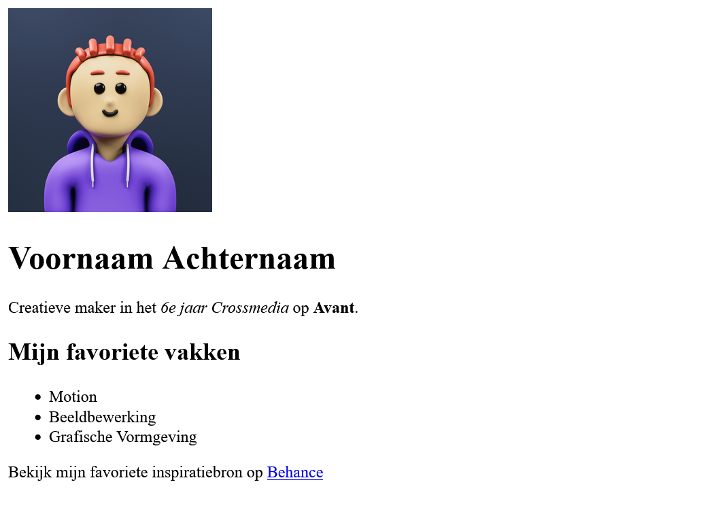

## Briefing & Concept

Je weet vast hoe een aantrekkelijke lay-out (UI) eruitziet en hoe een bezoeker door een website of applicatie navigeert (UX). Prachtige schermen ontwerpen, knoppen vormgeven en visuele lay-outs samenstellen is je niet vreemd.

Maar hoe zet een webbrowser (zoals Chrome, Firefox, Safari of Edge) jouw visuele ontwerpen eigenlijk om tot een echte, werkende website?

In deze introductieopdracht trek je de motorkap van het wereldwijde web open. Je start als een echte detective met het inspectiegereedschap van je browser en zoekt naar de bouwstenen achter een webpagina. Vervolgens transformeer je jouw onderzoeksresultaten naar je allereerste eigen codeerproject: een strakke, persoonlijke profielpagina waarin je een klasgenoot aan de rest van de school voorstelt!

De klas telt **12 leerlingen**. Jullie worden willekeurig in **duo's** verdeeld. Elk duo interviewt elkaar en bouwt een eigen webpagina om de partner in de schijnwerpers te zetten.


### Inhoud en vormgeving

In webdesign worden inhoud en vormgeving strikt gescheiden door twee codeertalen:

* **HTML (HyperText Markup Language):** Dit is de inhoud en skeletbouw van je website. Het bepaalt *wat* er op de pagina staat (titels, tekstblokken, foto's, lijstjes, knoppen).
* **CSS (Cascading Style Sheets):** Dit is de vormgeving van je website. Het bepaalt *hoe* alles eruitziet (kleuren, typografie, afmetingen, marges, achtergronden, afgeronde hoeken).




*Voor en na het toevoegen van CSS.*

## Afspraken

Hou bij het opzetten en bouwen van je webpagina's rekening met enkele technische basisafspraken:

### Bestandsstructuur
* Het bestand `index.html` is universeel de standaard homepage die elke webserver als eerste zoekt.
* Het bestand `style.css` bevat alle code voor de styling en vormgeving van de website.
* Afbeeldingen verzamel je overzichtelijk in de submap `img/`.

### Naamgeving
Schrijf bestandsnamen altijd in **kleine letters** en zonder spaties of vreemde leestekens. Webservers maken immers strikt onderscheid tussen hoofd- en kleine letters. Hou benamingen van afbeeldingen kort en duidelijk (bijvoorbeeld `foto.jpg`).

### Code-editor
Gebruik bij voorkeur [Visual Studio Code](https://code.visualstudio.com/), de industriestandaard die overzichtelijke syntaxkleuren, automatische tag-sluiting en handige extensies biedt.


### Browser
Gebruik voor het testen en live inspecteren van je webpagina een actuele browser zoals **Google Chrome**, **Firefox**, **Safari** of **Edge** die beschikt over ingebouwde ontwikkelaarstools (*Developer Tools*).

### Mappenstructuur

Voor je start met coderen, zet je telkens een overzichtelijke mappenstructuur op in je OneDrive onder het vak **Web**:

```text
VoornaamA_Profiel/
├── img/
│   └── foto.jpg           <- Foto van je partner of diens interesse
├── index.html             <- Jouw HTML-pagina (de inhoud)
└── style.css              <- Jouw CSS-stijlbestand (de vormgeving)
```

> **Belangrijk:** Plaats je HTML-bestand en je CSS-bestand rechtstreeks in de hoofdmap van de opdracht (hier `VoornaamA_Profiel`). Afbeeldingen plaats je netjes in de submap `img/`.

## Stappenplan

### Interview: Het duo-interview

Jullie zijn in duo's verdeeld. Neem 10 minuten de tijd om elkaar te interviewen en de nodige informatie te noteren:

1. **Wie is je partner?** (Volledige voornaam en achternaam, bijnaam, creatieve rol of studierichting)
2. **Korte biografie / introductie:** Schrijf een korte, vlotte voorstelling (2 à 3 zinnen) over wie je partner is en wat diegene typeert.
3. **Interesses, hobby's & vaardigheden:** Noteer minstens 3 favoriete bezigheden, creatieve talenten of tools.
4. **Persoonlijke Top:** Vraag naar een top 3 of top 5 van iets specifieks (bijvoorbeeld: *Top 3 favoriete films/series*, *Top 3 favoriete games*, *Top 3 muzieknummers/artiesten*, *Top 3 favoriete snacks/eten*, of *Top 3 droombestemmingen*).
5. **Inspiratielink:** Wat is zijn/haar favoriete website, YouTube-kanaal, portfolio of online inspiratiebron?
6. **Beeldmateriaal:** Maak een toffe foto van je partner of vraag een representatieve afbeelding van zijn/haar grootste passie of interesse.

#### Indienen

Dien in als document of pdf (`VoornaamA_Profiel-Interview.pdf`).

### Onderzoek: Inspectie op Wikipedia

Elke webpagina op het internet is openbaar te inspecteren via de browser. Voor je zelf start met coderen, analyseer je eerst hoe een bestaande webpagina is opgebouwd en welke HTML-tags de basisstructuur vormen.

#### Hoe open je de inspectietool?
1. Open Google Chrome, Firefox of Safari.
2. Surf naar [nl.wikipedia.org](https://nl.wikipedia.org).
3. Typ in de zoekbalk van Wikipedia **je eigen voornaam** in en druk op `Enter`.
4. Kies uit de zoekresultaten **één pagina naar keuze** (bijvoorbeeld een bekende naamgenoot, een historische figuur, een plaatsnaam of de overzichtspagina van je voornaam).
5. Klik met de **rechtermuisknop** op een willekeurig onderdeel van de pagina en kies **Inspecteren** (of druk op `F12` / `Ctrl + Shift + C` / `Cmd + Option + I`).
6. Kijk naar het tabblad **Elements** (Elementen). Welkom in de broncode van het internet!

#### Opsporingsmissie

Voer de volgende zes opdrachten uit op jouw gekozen Wikipedia-pagina. Noteer je antwoorden en bevindingen in je notities:

##### Koppen (Headings)

Klik met de rechtermuisknop op de hoofdtitel van het artikel bovenaan de pagina en kies *Inspecteren*.

* **Let op:** Op Wikipedia zitten de woorden zelf vaak nog eens verpakt in een `<span>`-tag. Kijk naar de **tag die daarboven/errond** zit!
* Welke tag staat er rond deze grote hoofdtitel? 
* Zoek ook naar een kleinere tussentitel verderop in de tekst. Welke tag zie je daar?
* Wat valt je op aan de nummering van de tags?

##### Tekst (Alinea's)

Inspecteer een gewone doorlopende leesalinea met tekst onder een titel.

* Welke korte tag staat er telkens aan het begin en einde van een alinea tekst?
* Waar staat deze letter volgens jou voor in het Engels?

##### Hacken?

Dubbelklik in het *Elements*-paneel van je DevTools rechtstreeks op de tekst van de hoofdtitel of een alinea. Pas de tekst aan naar jouw eigen naam of verzin een grappige alternatieve introductie en druk op `Enter`.

* De live website toont nu jouw aangepaste tekst!
* **Neem een screenshot** van je gehackte pagina.
* **Omschrijf in je notities** wat je precies hebt aangepast.
* *Vraag:* Is de website nu écht gewijzigd voor iedereen op de wereld, of enkel lokaal in het geheugen van jouw browser? Wat gebeurt er als je op `F5` (verversen) drukt?

##### Afbeeldingen (Images)

Klik met de rechtermuisknop op een foto in het artikel en kies *Inspecteren*.

* Welke tag wordt gebruikt om een afbeelding te tonen?
* Welk woordje (*attribuut*) zie je staan voor de link naar het afbeeldingsbestand?
* **Belangrijk:** Heeft jouw gekozen Wikipedia-pagina geen foto? Inspecteer dan het **Wikipedia-logo** (de wereldbol met puzzelstukjes) linksboven en kijk welke tag daar gebruikt wordt!

##### Links (Hyperlinks)

Inspecteer een blauwe klikbare link in de lopende tekst.

* Welke tag herkent de browser als een hyperlink?
* Welk attribuut bepaalt naar welk webadres je surft als je op de link klikt?

##### Lijstjes (Opsommingen & Menu)

Inspecteer het menu aan de linkerkant van de pagina (of een inhoudsopgave).

* Het linkermenu bestaat uit klikbare linkjes (`<a>`), maar welke tags worden gebruikt om het geheel als een nette opsomming of menu te structureren?
* Welke twee tags werken hier als een hecht duo samen?

#### Indienen

Dien in als document of pdf (`VoornaamA_Profiel-Onderzoek.pdf`).

### HTML: Pagina bouwen

Je gaat nu zelf aan de slag met zuivere HTML-code om een profielpagina te bouwen voor jouw klasgenoot.

#### Wireframe, schets op papier

Maak eerst een snelle **analytische schets** van de pagina op papier:

1. Teken een rechthoek (het beeldscherm).
2. Teken de vakken voor de onderdelen van het profiel:
   * Waar komt de naam van je partner?
   * Waar komt de foto?
   * Waar komt de introductietekst?
   * Waar komt het lijstje met hobby's/interesses?
   * Waar komt de persoonlijke top?
   * Waar komt de favoriete link?
3. **Schrijf bij elk getekend vak de exacte HTML-tag** die je gaat gebruiken (bijvoorbeeld: `<h1>`, `<h2>`, `<p>`, ``, `<ul> > <li>`, `<ol> > <li>`, `<a>`).

#### HTML-basis in VS Code

1. Start **Visual Studio Code**.
2. Kies **File → Open Folder...** en open jouw projectmap `VoornaamA_Profiel`.
3. Maak een nieuw bestand aan met de naam `index.html`.
4. Typ het uitroepteken `!` en druk op `Tab` of `Enter` om het HTML5-skelet te genereren:

```html
<!DOCTYPE html>
<html lang="nl">
<head>
    <meta charset="UTF-8">
    <meta name="viewport" content="width=device-width, initial-scale=1.0">
    <title>Profiel - Voornaam Klasgenoot</title>
</head>
<body>

    <!-- Hier komt alle zichtbare inhoud van de profielpagina! -->

</body>
</html>
```

> * `<head>`: Het "brein" van de webpagina met instellingen, koppelingen en de paginatitel in het browsertabblad (onzichtbaar op de pagina zelf).  
> * `<body>`: Het "lichaam" van de webpagina. Alles wat hierbinnen staat, is zichtbaar voor de bezoeker.

#### Inhoud van de profielpagina

Plaats tussen de tags `<body>` en `</body>` de volgende onderdelen:

##### Hoofdtitel (`<h1>`)
Plaats de volledige naam van je partner als belangrijkste hoofdtitel:
```html
<h1>Voornaam Achternaam</h1>
```

##### Subtitel & korte introductie (`<h2>` en `<p>`)
Voeg een tussentitel toe (bijvoorbeeld de rol of omschrijving) en een alinea waarin je jouw partner voorstelt:
```html
<h2>Creatieve Maker & Gamer</h2>
<p>Dit is het profiel van <strong>Voornaam</strong>, student in 5CRM aan Avant. In de vrije tijd gepassioneerd door <em>digitale illustratie</em> en animatie.</p>
```
*(Zorg dat je minstens één woord in `<strong>` (vet) en minstens één woord in `<em>` (cursief) plaatst!)*

##### Foto (``)
1. Sla de foto van je partner (of diens interesse) op in je map `img/` als `foto.jpg`.
2. Voeg de afbeeldingscode toe:
```html

```

> **Let op het pad:** Omdat de foto in het submapje `img` zit, schrijf je `src="img/foto.jpg"`. Als je enkel `foto.jpg` typt, kan de browser de foto niet terugvinden.

##### Interesses en hobby's (`<ul>` en `<li>`)
Maak een **ongeordende lijst** (*Unordered List*) met minstens 3 hobby's, interesses of vaardigheden van je partner:
```html
<h2>Interesses & Hobby's</h2>
<ul>
    <li>Digitale fotografie en nabewerking</li>
    <li>Gamen en level design</li>
    <li>Muziek luisteren en ontdekken</li>
</ul>
```

##### Persoonlijke top (`<ol>` en `<li>`)
Waar een `<ul>` willekeurige bolletjes toont, gebruik je een `<ol>` (*Ordered List*) wanneer de rangschikking of volgorde telt. Maak een genummerde top 3 van films, games, snacks of favoriete artiesten van je partner:
```html
<h2>Top 3 Favoriete Films</h2>
<ol>
    <li>Spider-Man: Into the Spider-Verse</li>
    <li>Interstellar</li>
    <li>Spirited Away</li>
</ol>
```

##### Favoriete inspiratiebron (`<a>`)
Plaats een klikbare link naar de favoriete website, inspiratiebron of het portfolio van je partner:
```html
<p>Bekijk de favoriete inspiratiebron van Voornaam op <a href="https://www.artstation.com" target="_blank">ArtStation</a>.</p>
```
*(Het attribuut `target="_blank"` zorgt ervoor dat de link netjes in een nieuw tabblad opent!)*

#### Bekijk je tussentijds resultaat!

Dubbelklik op `index.html` of gebruik de VS Code-extensie **Live Preview**. Je ziet nu jouw pagina in haar puurste vorm: zwarte tekst op een witte achtergrond, een grote foto en standaard blauwe links. Tijd voor stijl!

### CSS: Vormgeving

Nu tover je met CSS het kale HTML-document om tot een sfeervolle, persoonlijke profielpagina! Je hebt hierin **volledige creatieve vrijheid**: je kiest zelf een passend kleurenpalet, lettertype en lay-outaccenten die goed passen bij de persoonlijkheid en interesses van je partner.

#### Hoe werkt CSS?
In CSS selecteer je eerst een HTML-element (de **selector**), en geef je tussen accolades `{ }` aan wat je wil aanpassen (de **eigenschap** en de **waarde**):

```css
selector {
    eigenschap: waarde;
}
```

#### Maak het CSS-bestand aan en koppel het

1. Maak in VS Code een nieuw bestand aan in je hoofdmap met de exacte naam `style.css`.
2. Open opnieuw `index.html`.
3. Voeg in het `<head>`-gedeelte (vlak onder `<title>`) de koppelingsregel toe (Emmet-shortcut: `link:css`):

```html
<head>
    <meta charset="UTF-8">
    <meta name="viewport" content="width=device-width, initial-scale=1.0">
    <title>Profiel - Voornaam Klasgenoot</title>
    
    <!-- Hier koppel je het CSS-stijlbestand! -->
    <link rel="stylesheet" href="style.css">
</head>
```

#### Stapsgewijze stijlen toevoegen

Open `style.css` en bouw jouw eigen ontwerp stap voor stap op:

##### Achtergrondkleur, tekstkleur en lettertype (`body`)
Kies een sfeervolle achtergrondkleur voor de hele pagina, een goed leesbare tekstkleur en een strak lettertype. Zorg altijd voor een **hoog contrast** tussen je achtergrond en je tekst zodat alles vlot leesbaar blijft:

```css
body {
    background-color: #1d1d2b;
    color: #f2ede1;
    font-family: Arial, Helvetica, sans-serif;
}
```

> **Kleuren kiezen:** Je mag kleuren noteren als hex-code (zoals `#1d1d2b` of `#ff6b81`), als RGB-waarde (zoals `rgb(180, 32, 60)`) of als kleurnaam. Experimenteer gerust met een online color picker of een eigen kleurenpalet!

##### Hoofdtitel accentueren (`h1`)
Geef de hoofdtitel met de naam van je partner een opvallende accentkleur of een gekleurde achtergrondbalk, en begrens eventueel de breedte:

```css
h1 {
    background-color: rgb(180, 32, 60);
    width: 50%;
}
```

> * `background-color`: Geeft het titelblok een gekleurde achtergrondvlak.  
> * `width: 50%`: Zorgt dat het titelblok bijvoorbeeld precies de helft van de paginabreedte inneemt.

##### Foto schalen en afronden (`img`)
Standaard toont de browser afbeeldingen op hun originele pixelgrootte. Schaal de foto naar een handig formaat en rond de hoeken af:

```css
img {
    width: 200px;
    border-radius: 10px;
}
```

> * `width`: Bepaalt de breedte van de foto (de hoogte schaalt automatisch proportioneel mee).  
> * `border-radius`: Geeft de afbeelding afgeronde hoeken.

##### Hyperlinks een frisse kleur geven (`a`)
Zorg dat klikbare links goed opvallen ten opzichte van je achtergrondkleur door ze een herkenbare accentkleur te geven:

```css
a {
    color: #ff6b81;
}
```

#### Extra uitdagingen

Heb je de basis af en wil je jouw pagina nóg verfijnder maken? Probeer deze extra eigenschappen uit in je `style.css`:

* **Hover-effect op links:**
  ```css
  a:hover {
      color: #ffffff;
      text-decoration: underline;
  }
  ```
* **Binnenruimte bij de titel (`padding`):**
  Voeg `padding: 10px;` toe aan `h1` zodat de tekst niet tegen de rand van het gekleurde vlak plakt.
* **Afbeelding als ronde cirkel:**
  Probeer `border-radius: 50%;` en een vaste `height: 200px; object-fit: cover;` om van de foto een perfect ronde avatar te maken!

## Zelfevaluatie & Kwaliteitscontrole

Controleer jouw werk grondig aan de hand van deze checklist voor je het project inlevert:

### Bestanden & mappen
- De hoofdmap heet exact `VoornaamA_Profiel` (jouw eigen voornaam + eerste letter achternaam).
- In de hoofdmap staan `index.html` en `style.css` (allebei in kleine letters).
- De foto staat in de submap `img/` (bijvoorbeeld `img/foto.jpg`).

### HTML (Inhoud & structuur)
- De basisstructuur (`<!DOCTYPE html>`, `<html>`, `<head>`, `<body>`) is foutloos aanwezig.
- Er is exact één hoofdtitel (`<h1>`) met de naam van je partner.
- Er is minstens één tussentitel (`<h2>`) en een introductieparagraaf (`<p>`).
- Er is minstens één woord voorzien van `<strong>` (vet) en één van `<em>` (cursief).
- De afbeelding (``) laadt correct met het relatieve pad `img/foto.jpg` en een zinvolle `alt`-beschrijving.
- Er is een ongeordende lijst (`<ul>`) met minstens 3 interesses/hobby's.
- Er is een geordende lijst (`<ol>`) met een genummerde persoonlijke top.
- De hyperlink (`<a>`) werkt en opent via `target="_blank"` in een nieuw tabblad.

### CSS (Vormgeving & styling)
- Het bestand `style.css` is gekoppeld via `<link rel="stylesheet" href="style.css">` in de `<head>`.
- `body` heeft een zelfgekozen achtergrondkleur, goed leesbare tekstkleur (voldoende contrast) en een schreefloos lettertype.
- `h1` is visueel geaccentueerd met een eigen kleur of achtergrondbalk en eventueel een begrensde breedte.
- `img` is netjes geschaald (bv. `width: 200px`) en voorzien van afgeronde hoeken (`border-radius`).
- `a` heeft een zelfgekozen, opvallende accentkleur.
- De code is netjes ingesprongen en overzichtelijk gestructureerd.

## Oplevering

Comprimeer (zip) jouw volledige projectmap `VoornaamA_Profiel` en upload het ZIP-bestand op de voorziene uploadzone:

> **Opleveringsformaat:** `VoornaamA_Profiel.zip`  
> **Uploadzone:** *Vak 5CRM → Uploadzone → 2026-2027 → Introductie → Web → Profiel*  
> **Deadline:** Einde van de voorziene lesblokken.
