## Briefing & Concept

In deze opdracht combineer je geavanceerde **beeldmanipulatie**, **typografie** en **motion design** tot een visueel overtuigende video voor sociale media (Instagram). Je leert hoe je met dieptewerking, typografische animatie en een professionele workflow tussen Photoshop en After Effects een statisch beeld omtovert tot een dynamische eyecatcher.

### Wat is het Parallax-effect?

Het **parallax-effect** ontstaat wanneer verschillende lagen met een verschillende snelheid ten opzichte van elkaar bewegen. Denk aan het kijken uit het raam van een rijdende trein: elementen vlakbij het spoor razen voorbij, terwijl heuvels of bergen in de verre achtergrond traag lijken voorbij te gaan. Door voorgrond, achtergrond en typografie op verschillende Z-afstanden (dieptes) in een 3D-ruimte te plaatsen en een camera te laten bewegen, wek je een realistische driedimensionale diepte op.

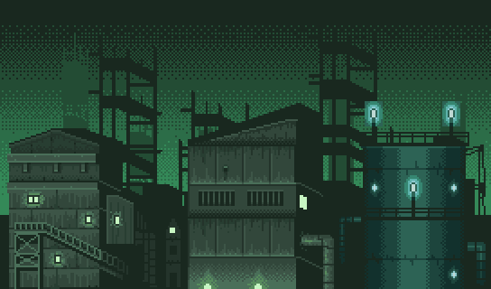
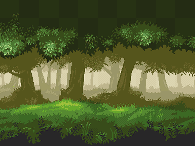
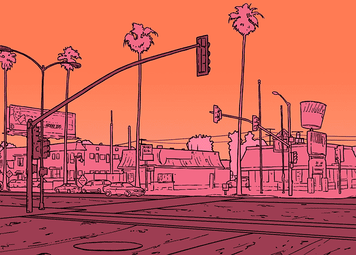

### Je concept

Je ontwerpt en animeert een video van **8 seconden** in het verticale **4:5-formaat**. Je kiest uit één van de volgende drie concepten:

1. **Zelfportret:** Een expressieve foto van jezelf gecombineerd met een persoonlijke quote, levensmotto of een korte, krachtige roepkreet die jou typeert.
2. **Rolmodel of alter ego:** Een inspirerende figuur, artiest of alter ego met een typerende quote of statement.
3. **Betekenisvol object:** Een object dat jouw passie of identiteit weerspiegelt (bijvoorbeeld een muziekinstrument of sportattribuut), gecombineerd met een korte slagzin die de essentie van het voorwerp vangt.

### Visuele lagen

De compositie en animatie is opgebouwd uit drie lagen:

* **Achtergrond:** Een sfeervol beeld (eigen fotografie of kwalitatieve rechtenvrije stockfoto) dat diepte, schaal en context biedt.
* **Voorgrond:** Het personage of hoofdonderwerp, haarfijn en niet-destructief vrijgemaakt van zijn oorspronkelijke achtergrond.
* **Typografie:** Eén krachtig kernwoord en een korte slagzin/citaat, geplaatst in de 3D-ruimte (bijvoorbeeld tussen voorgrond en achtergrond) en expressief geanimeerd.

## Technische specificaties

| Instelling | Aanbevolen waarde | Toelichting |
| :--- | :--- | :--- |
| **Resolutie (Export)** | **1080 × 1350 px** | Verticale **4:5-beeldverhouding** (0,80) voor maximale verticale schermhoogte in de Instagram-feed. |
| **Masterresolutie (PSD)** | **2160 × 2700 px** | Exact 2× de exportresolutie: biedt extra scherpte en schaalruimte bij camerazoom in After Effects. |
| **Framerate** | **30 fps** | Afgestemd op de videoverwerking en de 60 Hz beeldschermen van smartphones. |
| **Duur** | **8 seconden** (`0:00:08:00`) | Ideale lengte voor een vloeiende camerabeweging. |
| **Codec & Container** | **H.264 in MP4** | Universele compatibiliteit voor web en mobiel. |
| **Bestandsgrootte** | **3 MB à 5 MB** (max. 6 MB) | Voorkomt hercompressie en kwaliteitsverlies door Instagram. |

## Stappenplan

### Brainstorm

* Bepaal je thema, onderwerp en centrale boodschap.
* Kies je tekst: houd het beknopt en krachtig. Let op typografische hiërarchie, ritme en leesbaarheid.
* Verzamel hoogwaardig beeldmateriaal via eigen fotografie of kwalitatieve stockplatformen (zoals Pexels of Unsplash).

#### Voorbeeld

In dit voorbeeld werken we met een vintage walkman als voorgrondobject en een mistig berglandschap als sfeervolle achtergrond.

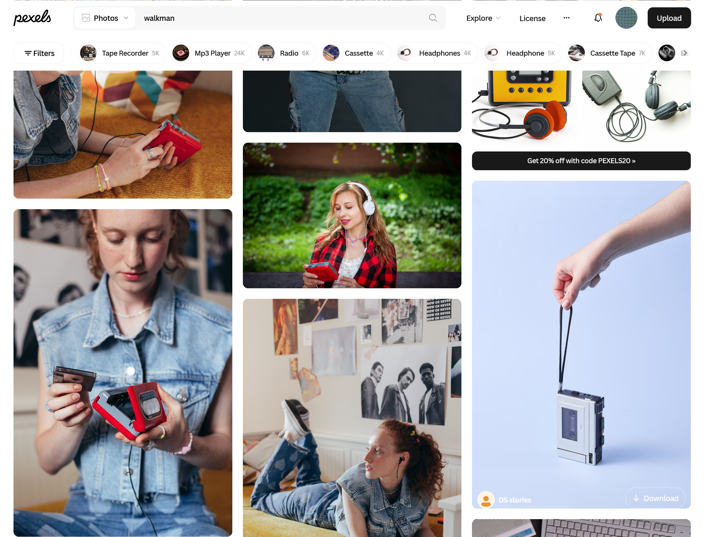


[Pexels - Person holding cassette player](https://www.pexels.com/photo/a-person-holding-a-cassette-player-9227554/)

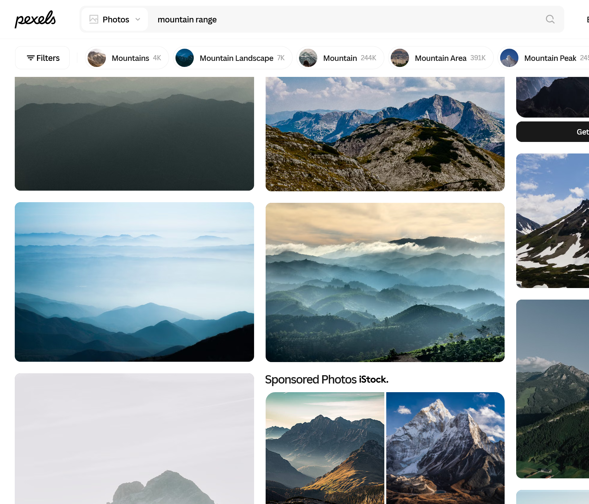
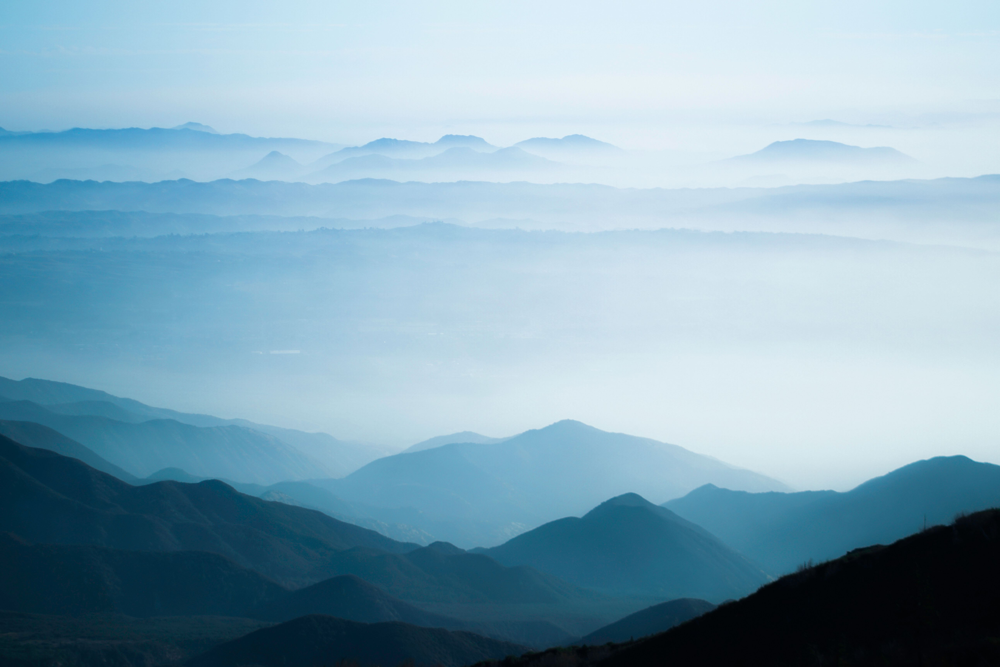

[Pexels - Foggy mountains](https://www.pexels.com/photo/foggy-mountains-10471894/)

### Mappenstructuur

Zet een ordelijke projectmap op in je OneDrive onder het vak **Motion**: `VoornaamA_Parallax`. Zorg voor duidelijke, gestandaardiseerde submappen en bestandsnamen:

```text
VoornaamA_Parallax/
├── 01_assets/          <- Originele foto's, fonts, audiobestanden
├── 02_photoshop/       <- VoornaamA_Parallax-Ontwerp.psd & *.jpg
├── 03_aftereffects/    <- VoornaamA_Parallax-Animatie.aep & (Footage)
└── 04_exports/         <- VoornaamA_Parallax-Animatie.mp4
```

### Beeldbewerking in Photoshop

#### Nieuw document
Maak een nieuw Photoshop-bestand aan met afmetingen **2160 × 2700 px** (of 1080 × 1350 px), kleurmodus **RGB**. Sla het bestand op als `VoornaamA_Parallax-Ontwerp.psd`.


#### Bestanden openen
Open de gedownloade beelden via **Bestand → Openen** (sleep ze niet rechtstreeks in het canvas), detoureren is anders omslachtiger.


#### Niet-destructief uitsnijden
* Activeer het gereedschap **Object selecteren** (*Object Selection Tool*, sneltoets `W`).
* Sleep een kader rond het voorgrondobject om Photoshop automatisch een selectie te laten maken.

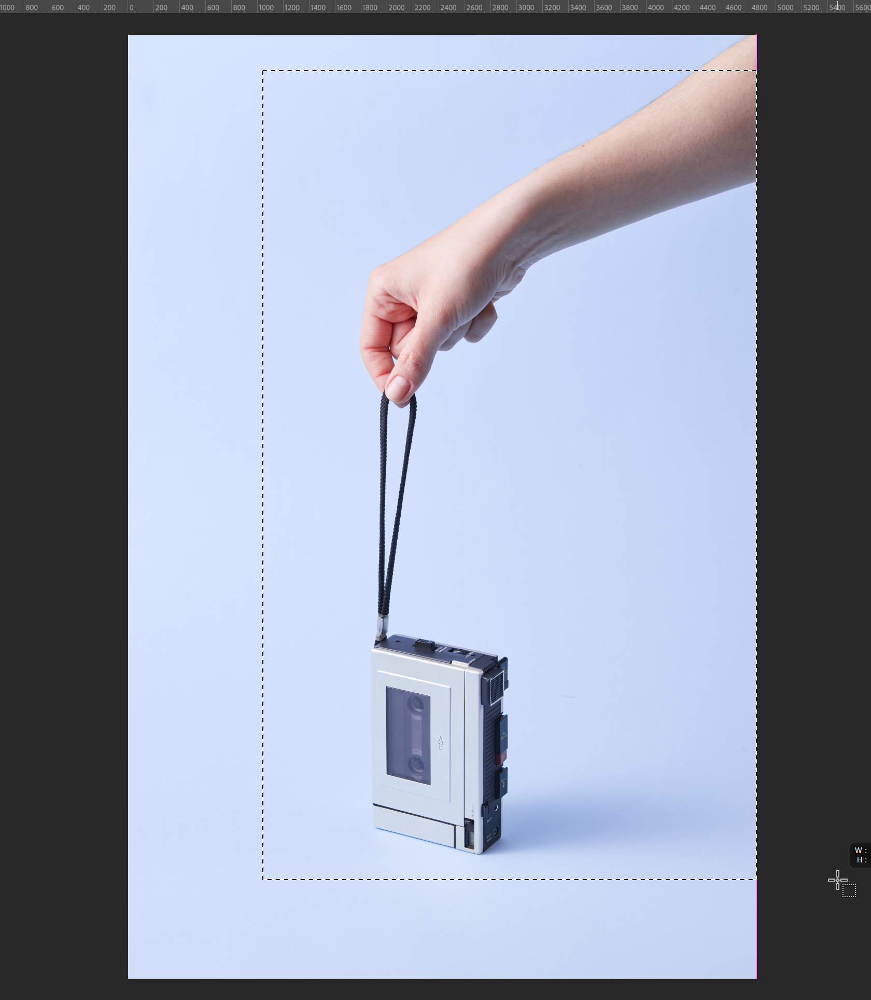
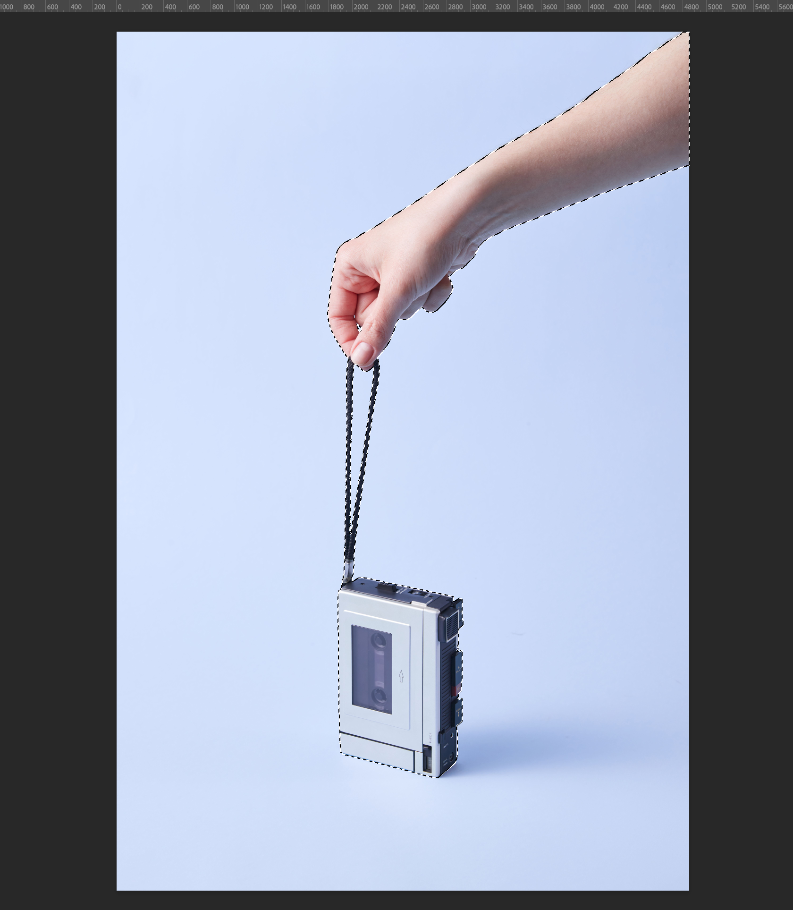

* Voeg onderaan het Lagenpaneel een **Laagmasker** toe (wis **nooit** pixels met de gom of delete, dan kun je niet meer terug indien je een fout maakt). Door te werken met maskers kun je altijd herstellen waar nodig.


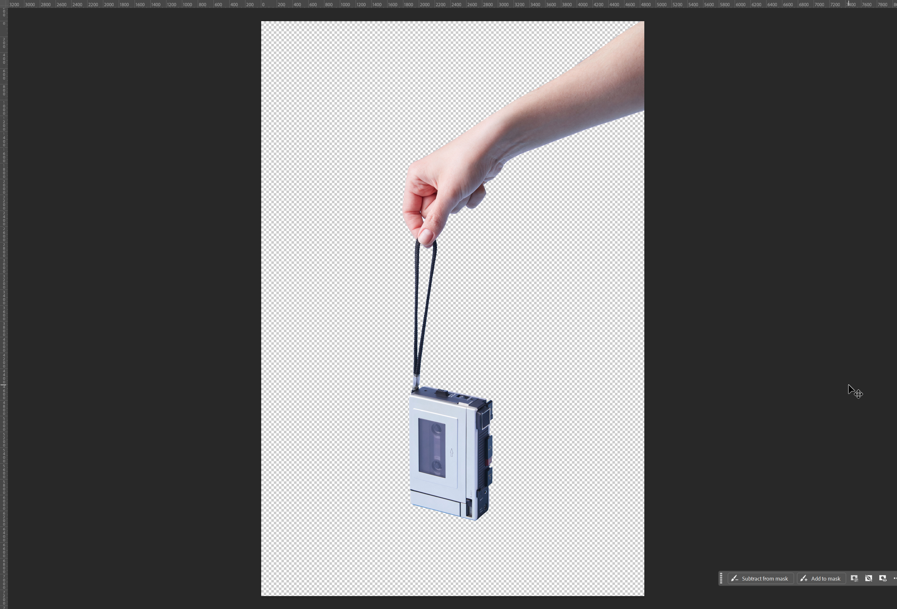

#### Converteren naar Slimme laag
Zet de gemaskeerde laag om met **Filter → Omzetten voor Slimme Filter** (*Convert for Smart Filters*). Hierdoor kun je de laag later onbeperkt schalen en transformeren zonder kwaliteitsverlies.


#### Samenvoegen in document
* Sleep de slimme laag naar je hoofdontwerpdocument (`VoornaamA_Parallax-Ontwerp.psd`).

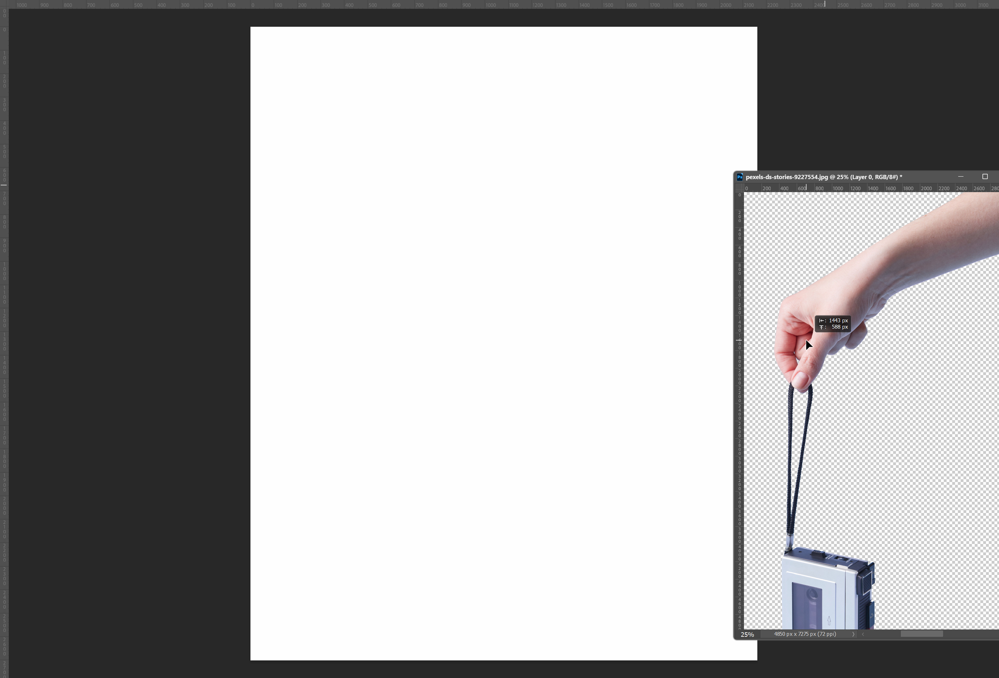

* Druk op `Ctrl + T` (*Vrije transformatie*) om positie, schaal en rotatie af te stemmen. Hernoem de laag naar `Voorgrond`.

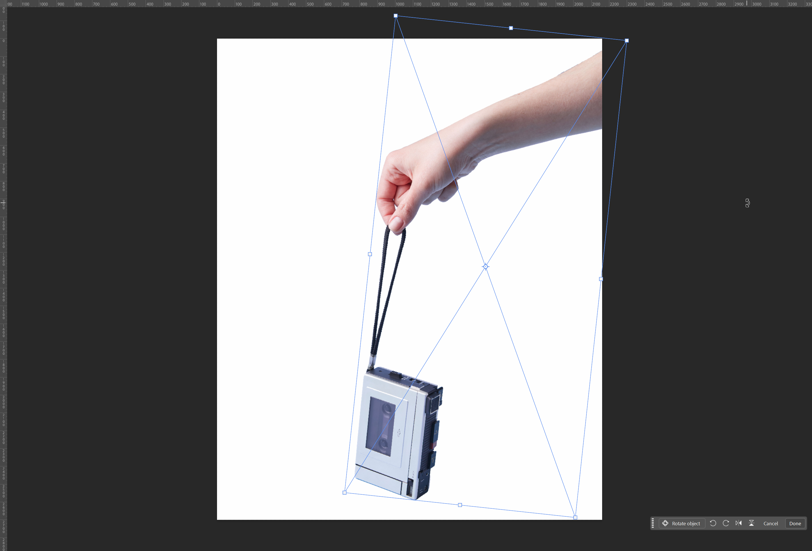


* Plaats ook de achtergrondfoto in het document en noem deze laag `Achtergrond`.

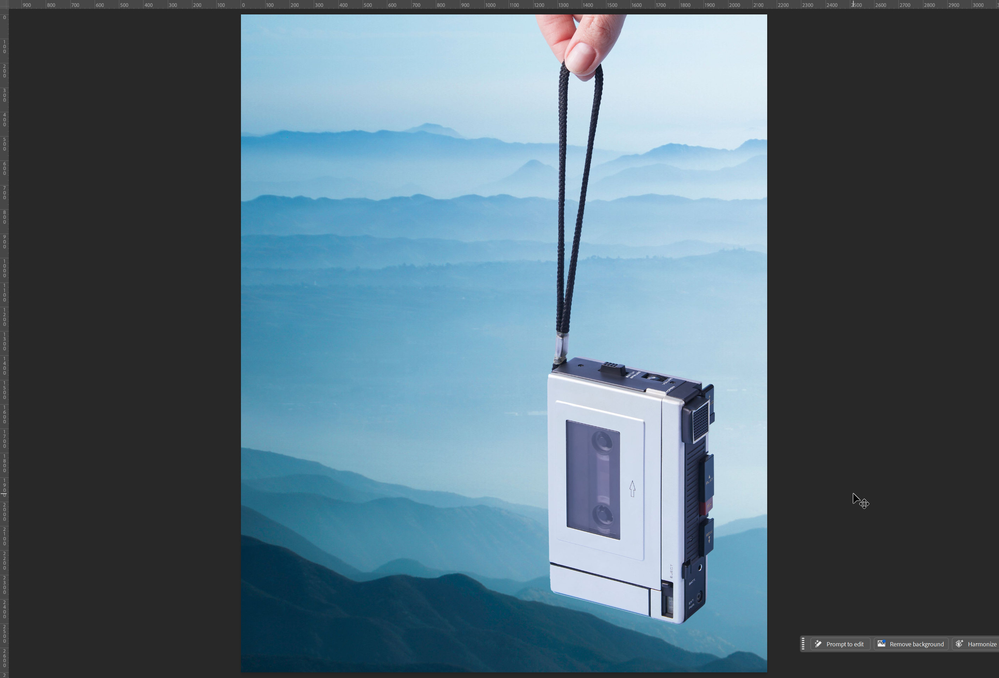
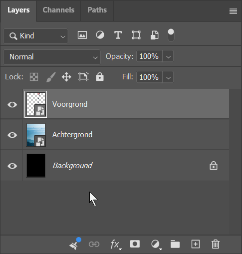

#### Kleurcorrectie (compositing)
Twee afzonderlijke foto's sluiten zelden direct op elkaar aan qua belichting, contrast, kleurtemperatuur, scherpte enzomeer. Gebruik **Aanpassingslagen** (*Kleurbalans*, *Curven*, *Helderheid/Contrast*) om voor- en achtergrond naadloos op elkaar af te stemmen.


*Vergelijk hieronder het beeld voor en na bewerking:*

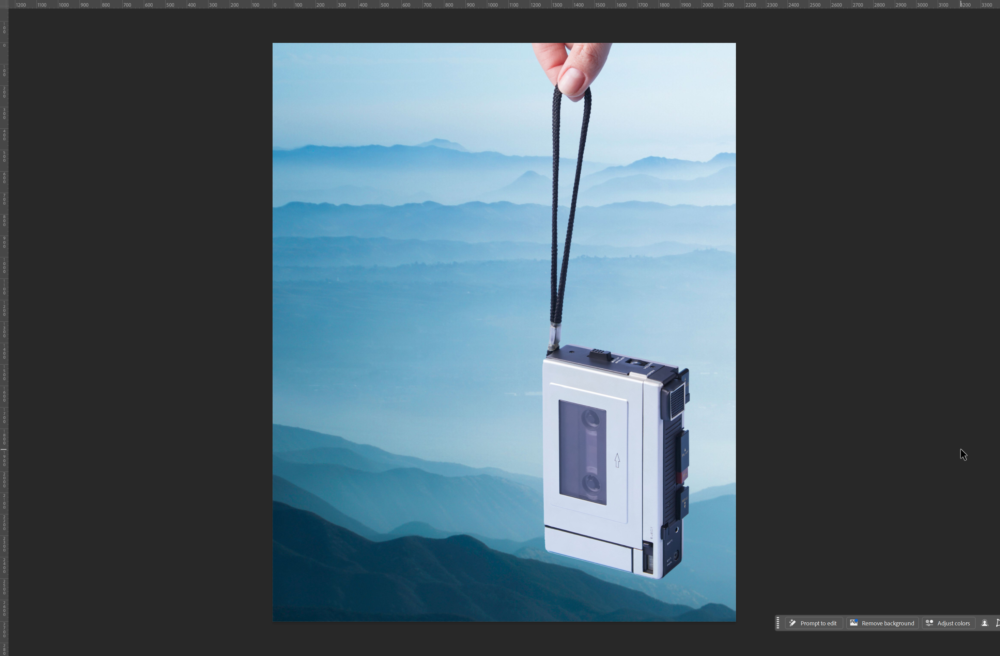
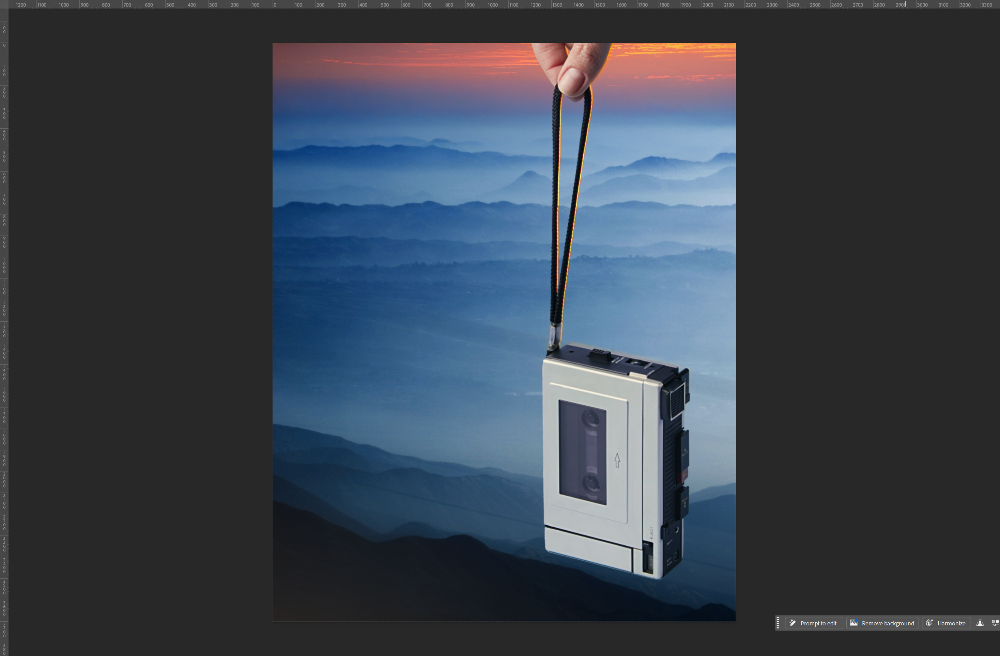

#### Typografie toevoegen
Plaats je tekst op aparte lagen. Experimenteer met fontkeuze, corpsgrootte, tracking en kleur. Zorg voor een sterke hiërarchie tussen het hoofdwoord en de slagzin.

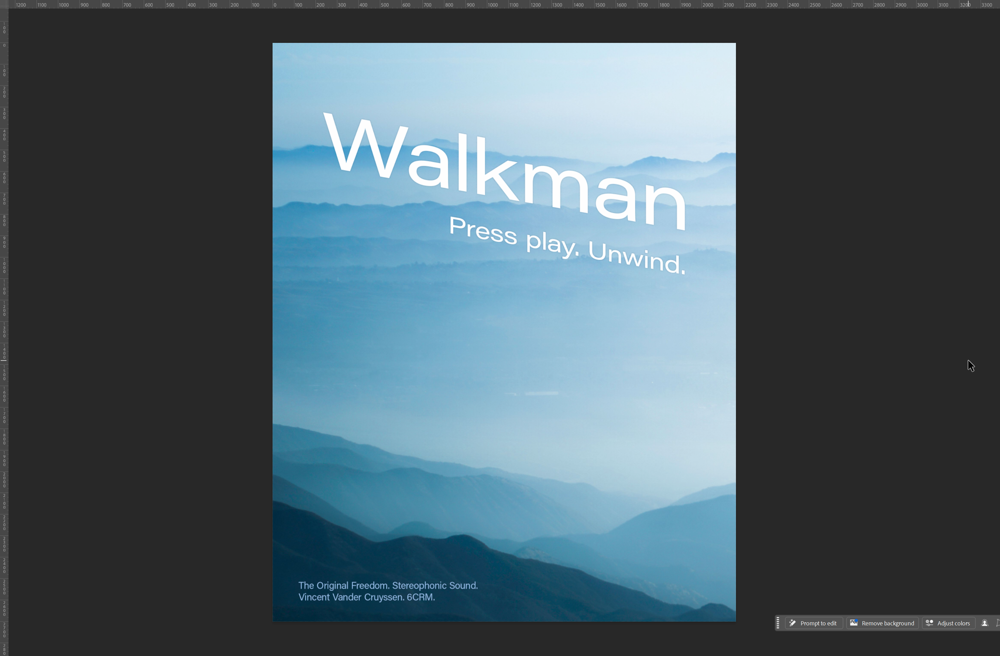
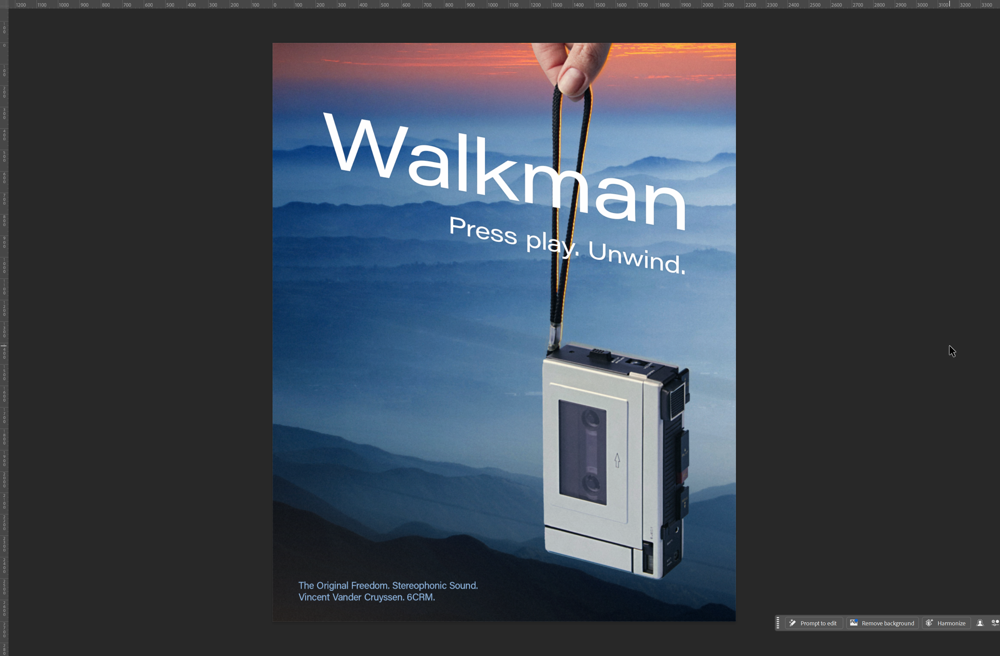

> **Oplevering voor het vak Beeld!**  
> `Familienaam_Voornaam_Voorstudie.psd` (gelaagd werkbestand)  
> `Familienaam_Voornaam_Voorstudie.jpg` (export)  

### Parallax animatie in After Effects

#### PSD importeren als Compositie
* Start After Effects en sleep je Photoshop-bestand naar het **Project-paneel** (of kies **File → Import → File...**).


* **Cruciaal:** Kies bij *Import Kind* voor **Composition - Retain Layer Sizes** en selecteer **Editable Layer Styles**. Hierdoor behoudt elke laag zijn eigen begrenzingskader en worden alle toekomstige aanpassingen in Photoshop automatisch bijgewerkt in After Effects!


Sla het project op als `VoornaamA_Parallax-Animatie.aep`.

#### Compositie-instellingen controleren
Dubbelklik op de compositie in het Project-paneel. Open de instellingen via `Ctrl + K` (*Composition Settings*) en controleer de framerate (**30 fps**) en de duur (**8 seconden**, `0:00:08:00`).


#### Camera
* Voeg een camera toe via **Layer → New → Camera...** (kies bv. een 35mm of 50mm lens).

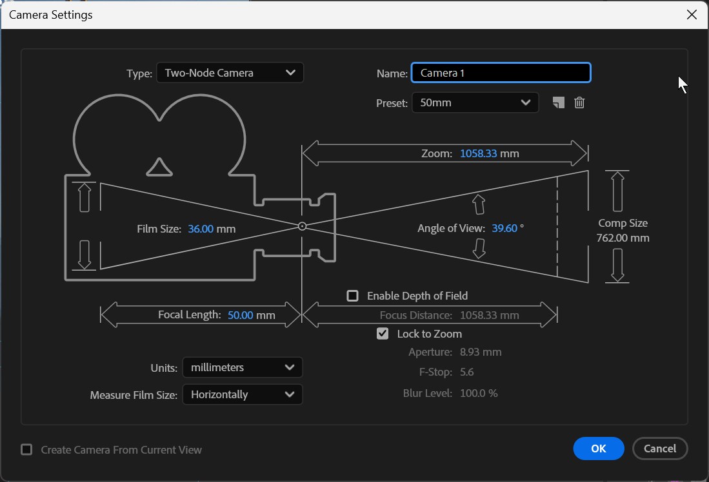

#### 3D-Lagen activeren
Schakel voor alle lagen (voorgrond, achtergrond, tekstlagen) de **3D Layer switch** (het kubus-icoontje) in.

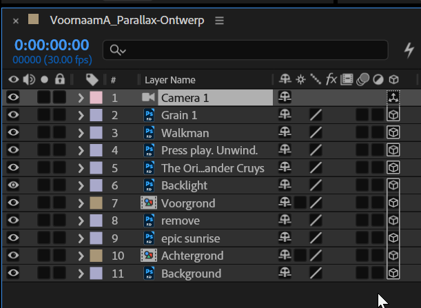

####  Diepte instellen (Z-as)
* Selecteer de voorgrondlaag, druk op `P` (*Position*) en wijzig de **Z-waarde** (de 3e waarde) zodat de voorgrond naar voren komt (negatieve Z-waarde, dichter bij de camera).
* Schaal de laag eventueel bij met `S` (*Scale*) om de gewenste kadrering te behouden.

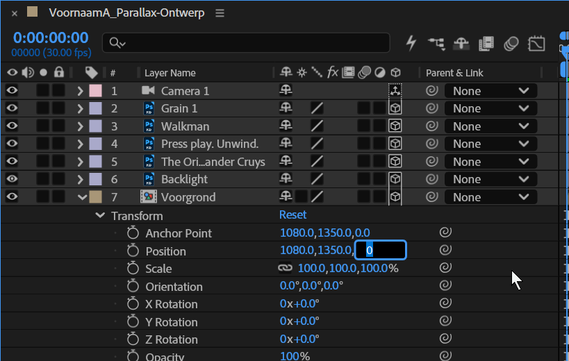
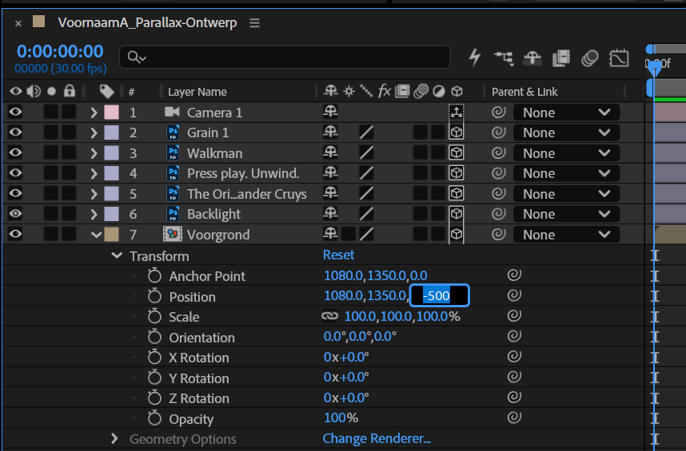

* Schakel in het weergavepaneel over naar *Custom View 1* of *Top View* om de ruimtelijke afstand tussen je lagen te inspecteren.

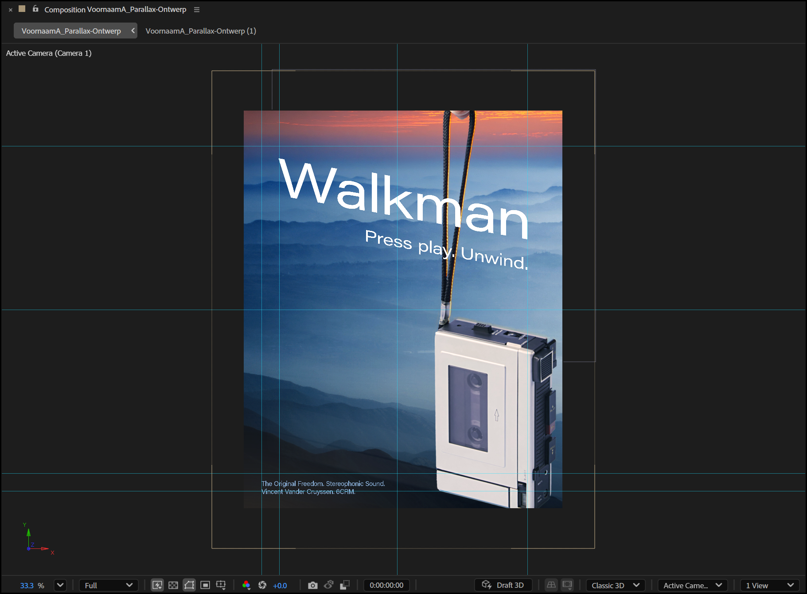

#### Camerabeweging en keyframes

* Gebruik de cameragereedschappen (wissel snel met sneltoets `C`):
  * **Orbit Tool:** Roteert de camera rond het focuspunt.
  * **Track XY / Pan Tool:** Verschuift de camera horizontaal en verticaal.
  * **Dolly Tool:** Beweegt de camera naar voren of achteren.


* Zet op seconde **0:00** een keyframe op **Position** en **Point of Interest**.

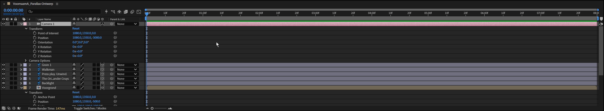

* Verplaats de tijdindicator naar het einde (**8:00**) en pas de camerapositie aan voor een subtiele, cinematische beweging (zoals een lichte push-in, orbit of pan).

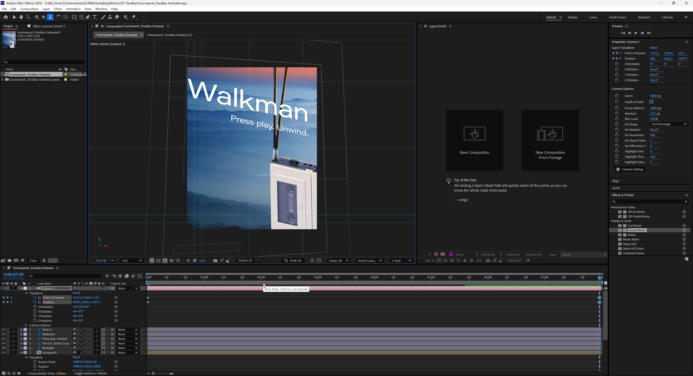

* Selecteer alle keyframes, druk op `F9` (*Easy Ease*) en verfijn de bewegingscurve in de **Graph Editor**.

**Alternatief: Laaganimatie zonder camera!**  
Als alternatief, zonder camera, kun je de lagen ook los van elkaar animeren door de eigenschappen *Position* en *Scale* van voorgrond en achtergrond rechtstreeks met verschillende snelheden te keyframen.

#### Typografische Animatie
Laat de tekst dynamisch verschijnen en bewegen. Animeer de *Position*, *Opacity*, *Tracking* of gebruik de ingebouwde **Text Animators** (met *Range Selectors*, *Blur* of *Wipe*-effecten). Zorg dat de beweging natuurlijk aansluit bij de sfeer van het beeld.

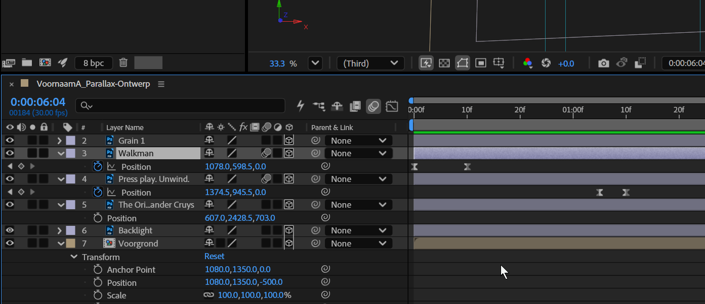

### Extra's

Voor wie een stap verder wil gaan en extra diepte wil toevoegen:

* **Audio & Sound Design:** Voeg een subtiele sfeervolle achtergrondtrack, een symfonisch cinema-orkest of een ASMR-soundbite toe die de visuele ervaring versterkt.
* **Visuele effecten:** Voeg zwevende stofdeeltjes (*particles*), een zachte film grain of subtiele lichtlekken (*light leaks*) toe. Bewaar hierbij altijd de rust en consistentie: *don't overdo it*.

### Renderen in Media Encoder

Selecteer je compositie in After Effects en druk op `Ctrl + Alt + M` (**Composition → Add to Adobe Media Encoder Queue**).

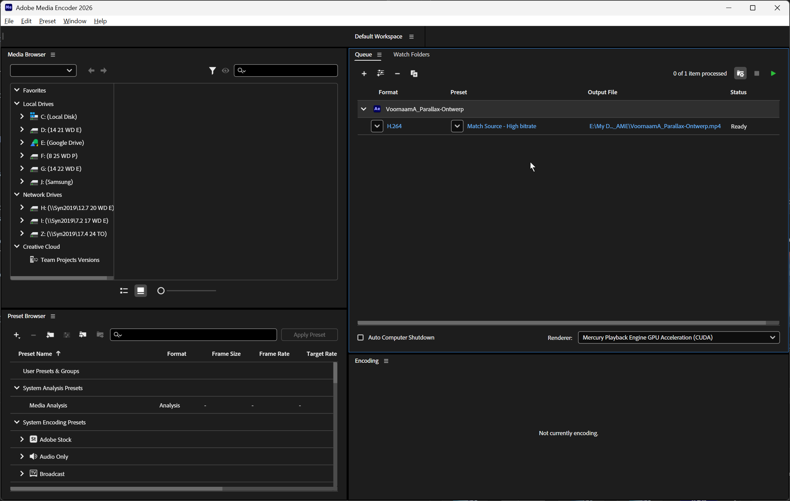

Stel in Adobe Media Encoder de parameters in:
* **Formaat:** `H.264`
* **Preset:** `Match Source - Medium Bitrate` (of pas de bitrate handmatig aan).
* **Doelgrootte:** Zorg dat het definitieve MP4-bestand tussen de **3 MB en 5 MB** blijft (maximaal 6 MB).


Klik op de groene afspeelknop om de render te starten.

## Checklist

Plaats de bestanden tijdig in de voorziene mappen op de uploadzone:

### Voor het vak Beeld
* Photoshop-werkbestand met alle lagen: `Familienaam_Voornaam_Voorstudie.psd`
* Export: `Familienaam_Voornaam_Voorstudie.jpg`

### Voor het vak Motion
* Volledig gearchiveerd After Effects-project (`.aep` + bronassets)
* Definitieve video-export: `Familienaam_Voornaam_Parallax.mp4`

### Kwaliteitscontrole
* Beeldverhouding is exact **4:5** (1080 × 1350 px).
* Framerate staat ingesteld op **30 fps**.
* De animatieduur is exact **8 seconden**.
* Het parallax-effect toont duidelijke diepte tussen voorgrond, tekst en achtergrond.
* Typografie is leesbaar en ondersteunend geanimeerd.
* Bestandsgrootte van de MP4 ligt tussen **3 MB en 5 MB**.
