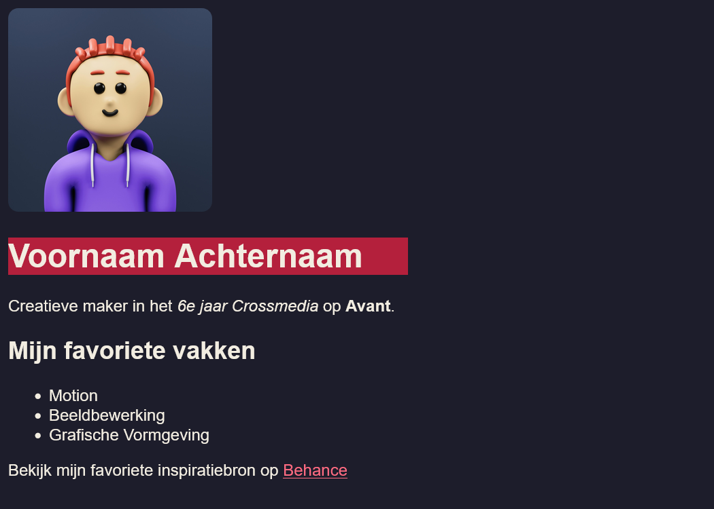
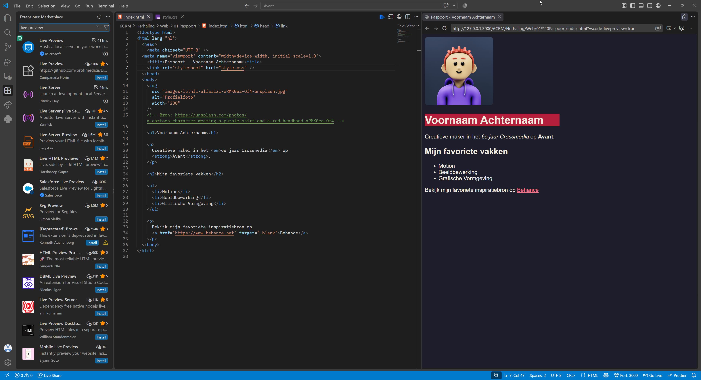

## Briefing & Concept

Je weet vast hoe een aantrekkelijke lay-out (UI) eruitziet en hoe een gebruiker door een omgeving navigeert (UX). Prachtige schermen heb je al ontworpen, knoppen toegevoegd en interactieve prototypes gebouwd. 

Maar hoe zet een webbrowser (zoals Firefox, Chrome, Safari of Edge) jouw visuele ontwerpen eigenlijk om tot een echte, werkende website?

In deze opdracht trek je de motorkap van het wereldwijde web open. Je start als een echte detective met het inspectiegereedschap van je browser en zoekt naar de bouwstenen achter websites. Vervolgens transformeer je jouw onderzoeksresultaten naar je allereerste eigen codeerproject: een strakke, persoonlijke profielpagina waarin je jezelf als creatieve crossmediamaker voorstelt.


### Inhoud en vormgeving

In webdesign worden inhoud en vormgeving strikt gescheiden door twee codeertalen.

* **HTML (HyperText Markup Language):** Dit is de inhoud van je website. Het bepaalt *wat* er op de pagina staat (titels, tekstblokken, foto's, lijstjes, knoppen).
* **CSS (Cascading Style Sheets):** Dit is de vormgeving van je website. Het bepaalt hoe alles eruitziet (kleuren, typografie, afmetingen, marges, afgeronde hoeken).




Voor en na het toevoegen of aanpassen van CSS.

## Afspraken

Hou bij het opzetten en bouwen van je webpagina's rekening met enkele technische basisafspraken:

### Bestandsstructuur
Het bestand `index.html` is universeel de standaard homepage die elke webserver als eerste zoekt.

Het bestand `style.css` bevat de code voor de styling van de website.

De afbeeldingen verzamel je in de map `img/`.

### Naamgeving
Schrijf bestandsnamen in **kleine letters**. Webservers maken onderscheid tussen hoofd- en kleine letters. Hou benamingen van afbeeldingen duidelijk, vermijd ontzettend lange namen.

### Code-editor
Gebruik bij voorkeur [Visual Studio Code](https://code.visualstudio.com/), de industriestandaard die overzichtelijke syntaxkleuren, automatische tag-sluiting en handige extensies biedt.



### Browser
Gebruik voor het testen en live inspecteren van je webpagina een actuele **Chromium-gebaseerde** browser (zoals Chrome of Edge), **Firefox** of **Safari** die beschikt over ingebouwde ontwikkelaarstools (*Developer Tools*).

### Mappenstructuur

Voor je start met coderen van projecten, zet je telkens een overzichtelijke mappenstructuur op in je OneDrive onder het vak **Web**, bijvoorbeeld:

```text
VoornaamA_Paspoort/
├── img/
│   └── profielfoto.jpg    <- Jouw profielfoto
├── index.html             <- Jouw HTML-pagina (de inhoud)
└── style.css              <- Jouw CSS-stijlbestand (de vormgeving)
```

> Zet je HTML-bestanden en je CSS-bestanden rechtstreeks in de hoofdmap van de opdracht (hier `VoornaamA_Paspoort`). Afbeeldingen plaats je netjes verzameld in de submap `img/`.

## Stappenplan

### Onderzoek

Elke website op het internet is openbaar te inspecteren via de browser. Voor je zelf start met coderen, analyseer je eerst hoe bestaande websites zijn opgebouwd en welke HTML-tags de basisstructuur vormen.

#### Hoe open je de inspectietool?
1. Open Google Chrome, Firefox of Safari.
2. Surf naar een website naar keuze (bijvoorbeeld [Wikipedia](https://nl.wikipedia.org), [VRT NWS](https://www.vrt.be/vrtnws/nl/), [Spotify Web](https://open.spotify.com), je favoriete webshop of iets heel anders).
3. Klik met de **rechtermuisknop** op een willekeurig onderdeel van de pagina en kies **Inspecteren** (of druk op `F12` / `Ctrl + Shift + C`).
4. Kijk naar het tabblad **Elements** (Elementen). Welkom in de broncode van het internet!

#### Opsporingsmissie

Voer de volgende zes opdrachten uit op verschillende websites. Noteer je antwoorden en bevindingen in je notities:

##### Koppen (Headings)

Klik met de rechtermuisknop op de allergrootste hoofdtitel bovenaan een nieuwsartikel of pagina en kies *Inspecteren*.

Welke tag staat er rond deze hoofdtitel? 

Zoek ook naar een kleinere tussentitel. Welke tag zie je daar?

Wat valt je op?

##### Tekst (Alinea's)

Inspecteer een gewone doorlopende leesalinea met tekst.

Welke korte tag staat er telkens aan het begin en einde van een alinea tekst?

Wat betekent de letter volgens jou?

##### Hacken?

Dubbelklik in het *Elements*-paneel van je DevTools rechtstreeks op de tekst van de hoofdtitel. Typ je eigen naam in en druk op `Enter`.

De live website toont nu jouw naam. 

Neem een screenshot van je gehackte pagina.

Is de website nu écht gewijzigd voor iedereen op de wereld, of enkel lokaal in jouw eigen browsergeheugen? Wat gebeurt er als je op `F5` (verversen) drukt?

##### Afbeeldingen

Klik met de rechtermuisknop op een foto of logo en kies *Inspecteren*.

Welke tag wordt gebruikt om een afbeelding te tonen?

Welk woordje (*attribuut*) zie je staan voor de bestandslink? 

##### Links (Hyperlinks)

Inspecteer een klikbare knop of navigatielink.

Welke tag herkent de browser als een hyperlink?

Welk woordje (*attribuut*) bepaalt naar welk webadres je surft als je klikt?

##### Lijstjes (Opsommingen)

Zoek een menu, navigatiebalk of opsomming met bullet points en inspecteer deze.

Welke twee tags werken hier altijd als een hecht duo samen?

### HTML

Je gaat nu zelf bouwen met de belangrijkste HTML-tags die je net beter hebt leren kennen. Geen kant-en-klare templates of websitebouwers, maar zuivere code vanaf nul!

#### Wireframe, schets op papier

Net zoals je eerst schermen uittekende met Adobe XD, maak je in webdesign vaak eerst een snelle **analytische schets**.

1. Neem een wit papier en teken een rechthoek (je computerscherm).
2. Teken de vlakken voor jouw **Paspoort**:
   * Waar komt je naam?
   * Waar komt je profielfoto?
   * Waar komt je introductietekst?
   * Waar komt je lijstje met creatieve skills?
   * Waar komt je favoriete inspiratielink?
3. **Schrijf bij elk getekend vak de exacte HTML-tag** die je gaat gebruiken (bijvoorbeeld: `[h1]`, `[img]`, `[p]`, `[ul > li]`, `[a]`).

#### HTML-basis in VS Code

1. Start **Visual Studio Code**.
2. Kies **File → Open Folder...** en selecteer jouw projectmap `VoornaamA_Paspoort`.
3. Maak een nieuw bestand aan met de naam `index.html`.
4. Typ het woord `!` (uitroepteken) en druk op `Tab` of `Enter` (Emmet-afkorting):

```html
<!DOCTYPE html>
<html lang="nl">
<head>
    <meta charset="UTF-8">
    <meta name="viewport" content="width=device-width, initial-scale=1.0">
    <title>Paspoort - Jouw Naam</title>
</head>
<body>

    <!-- Hier komt al jouw zichtbare inhoud! -->

</body>
</html>
```

> `<head>`: Het "brein" van de webpagina. Bevat instellingen, de paginatitel in het tabblad en koppelingen. Dit is **onzichtbaar** op de pagina zelf.  
> `<body>`: Het "lichaam" van de pagina. **Alles** wat hierbinnen staat, is zichtbaar voor de bezoeker.

#### Inhoud van je Paspoort

Plaats tussen de tags `<body>` en `</body>` de volgende onderdelen:

##### Hoofdtitel (`<h1>`)
Plaats jouw volledige naam als belangrijkste titel:
```html
<h1>Vincent Vander Cruyssen</h1>
```

##### Subtitel & Korte Biografie (`<h2>` en `<p>`)
Voeg een tussentitel toe (bijvoorbeeld je rol of studierichting) en minstens één alinea waarin je jezelf voorstelt:
```html
<h2>Creatief Crossmediamaker</h2>
<p>Welkom op mijn paspoort! Ik ben student in <strong>6CRM</strong> aan Avant. Mijn passie ligt bij <em>visuele communicatie</em>, animatie en digitale media.</p>
```
*(Zorg dat je minstens één woord in `<strong>` (vet) en één woord in `<em>` (cursief) plaatst!)*

##### Jouw Profielfoto (``)
1. Zoek een sprekende profielfoto of illustratie van jezelf.
2. Sla de foto op in je map `img/` als `profielfoto.jpg`.
3. Voeg de afbeeldingscode toe:
```html

```

> Let op het pad! Omdat de foto in het mapje `img` zit, moet je `src="img/profielfoto.jpg"` schrijven. Als je enkel `profielfoto.jpg` typt, vindt de browser de foto niet.

##### Jouw vaardigheden, interesses (`<ul>` en `<li>`)
Maak een ongeordende lijst met minstens 3 vaardigheden, tools of interesses.
```html
<h2>Mijn Creatieve Superkrachten</h2>
<ul>
    <li>Photoshop en Beeldbewerking</li>
    <li>After Effects en Motion design</li>
    <li>Interface design en Prototyping</li>
</ul>
```

##### Jouw persoonlijke top 3 (`<ol>` en `<li>`)
Waar een `<ul>` willekeurige opsommingstekens toont, gebruik je een `<ol>` (*Ordered List*) wanneer de volgorde of rangschikking belangrijk is. Maak een top 3 van je favoriete creatieve apps, favoriete muziek tijdens het ontwerpen, of doelen voor dit schooljaar.
```html
<h2>Mijn Top 3 Creatieve Software</h2>
<ol>
    <li>Adobe After Effects</li>
    <li>Visual Studio Code</li>
    <li>Adobe Illustrator</li>
</ol>
```

##### Inspiratielink (`<a>`)
Plaats een klikbare link naar jouw favoriete portfolio, designstudio, YouTube-kanaal of inspiratiebron:
```html
<p>Ontdek mijn favoriete inspiratiebron op <a href="https://www.behance.net" target="_blank">Behance Network</a>.</p>
```
*(Het attribuut `target="_blank"` zorgt ervoor dat de link netjes in een nieuw tabblad opent!)*

#### Bekijk je tussentijds resultaat!

Dubbelklik in je verkenner op `index.html` of installeer in VS Code de extensie **Live Preview**.

Je ziet nu jouw pagina in haar puurste vorm: zwarte tekst op een witte achtergrond, een grote foto en standaard blauwe links.

### CSS

Nu vorm je met CSS het kale HTML-document om tot een modern, fris en aantrekkelijk paspoort!

#### Hoe werkt CSS?
In CSS selecteer je eerst een HTML-element (de **selector**), en geef je tussen accolades `{ }` aan wat je wil veranderen (de **eigenschap** en de **waarde**):

```css
selector {
    eigenschap: waarde;
}
```

#### Maak het CSS-bestand aan en koppel het

1. Maak in VS Code een nieuw bestand aan in je hoofdmap en noem het exact `style.css`.
2. Open opnieuw `index.html`.
3. Voeg in het `<head>`-gedeelte (vlak onder `<title>`) de koppelingsregel toe. De Emmet-afkorting hiervoor is `link:css`.

```html
<head>
    <meta charset="UTF-8">
    <meta name="viewport" content="width=device-width, initial-scale=1.0">
    <title>Paspoort - Jouw Naam</title>
    
    <!-- Hier koppel je het stijlblad! -->
    <link rel="stylesheet" href="style.css">
</head>
```

#### Stijlen

Open `style.css` en voeg de volgende CSS-selectors en eigenschappen toe. Je kunt dit uiteraard naar eigen smaak aanpassen.

##### Achtergrondkleur (`background-color`)
Geef de hele pagina een zachte, moderne achtergrondkleur in plaats van fel wit.
```css
body {
    background-color: #f0f4f8; /* Een frisse, zachte lichtgrijze/blauwe tint */
}
```

##### Tekstkleur & Contrast (`color`)
Puur zwart (`#000000`) of wit (`#ffffff`) oogt vaak te hard op een beeldscherm. Kies bijvoorbeeld een elegante donkere antracietkleur.
```css
body {
    background-color: #f0f4f8;
    color: #2d3748; /* Zacht donkergrijs voor optimale leesbaarheid */
}
```

##### Typografie (`font-family`)
Vervang het ouderwetse standaardlettertype door bijvoorbeeld een strakke, moderne schreefloze letterfamilie.
```css
body {
    background-color: #f0f4f8;
    color: #2d3748;
    font-family: "Segoe UI", Roboto, sans-serif;
}
```

> De komma na elke waarde zorgt ervoor dat de browser de volgende waarde probeert als de vorige niet beschikbaar is. In dit geval is `sans-serif` het standaard schreefloze lettertype van de computer of smartphone.

##### Titels kleuren (`text-align` & kleuraccent)
Geef je titels een opvallende accentkleur.
```css
h1 {
    color: #1a365d; /* Donker marineblauw */
}

h2 {
    color: #2b6cb0; /* Helder blauw accent */
}
```

##### Profielfoto (`width`, `border-radius` & `display`)
Momenteel vult je profielfoto waarschijnlijk het hele scherm. Verklein de foto en maak er een avatar van met afgeronde hoeken.
```css
img {
    width: 180px;
    border-radius: 10px;
}
```

#### Extra uitdagingen

Heb je de basis onder de knie en wil je jouw paspoort nóg professioneler maken? Probeer ook extra technieken in je `style.css`.

Geef de hyperlinks bijvoorbeeld een interactieve hover.

```css
a:hover {
    color: #e53e3e;
    text-decoration: underline;
}
```

## Zelfevaluatie & Kwaliteitscontrole

Controleer jouw werk aan de hand van deze checklist voor je het project inlevert:

### Bestanden & mappen
- De hoofdmap heet exact `VoornaamA_Paspoort` (met jouw eigen voornaam en eerste letter achternaam).
- In de hoofdmap staan `index.html` en `style.css` (zonder hoofdletters).
- Jouw profielfoto staat in de submap `img/`.

### HTML (Inhoud & structuur)
- De basisstructuur (`<!DOCTYPE html>`, `<html>`, `<head>`, `<body>`) is correct opgebouwd.
- Er is exact één hoofdtitel (`<h1>`) met jouw eigen naam.
- Er is minstens één tussentitel (`<h2>`) en een introductieparagraaf (`<p>`).
- Er is minstens één woord in `<strong>` en één woord in `<em>`.
- De profielfoto (``) laadt correct met een werkend `src`-pad en een duidelijke `alt`-tekst.
- De ongeordende lijst (`<ul>`) en geordende top 3 (`<ol>`) zijn correct opgebouwd met `<li>`-items.
- De hyperlink (`<a>`) werkt, heeft een `href` en opent met `target="_blank"` in een nieuw tabblad.

### CSS (Vormgeving)
- Het bestand `style.css` is foutloos gekoppeld via een `<link>`-tag in de `<head>`.
- Er is een aangepaste `background-color` en `color` ingesteld.
- Er is een verzorgd schreefloos lettertype (`font-family`) geconfigureerd.
- De profielfoto is geschaald (`width`) en voorzien van een `border-radius`.
- De code is netjes ingesprongen (indented) zonder syntaxfouten.

## Oplevering

Comprimeer (zip) jouw volledige projectmap `VoornaamA_Paspoort` en upload het ZIP-bestand op de voorziene uploadzone:

> **Opleveringsformaat:** `VoornaamA_Paspoort.zip`  
> **Uploadzone:** *Vak 6CRM → Uploadzone → 2026-2027 → Herhaling → Web → Paspoort*  
> **Deadline:** Einde van de voorziene lesblokken.
