## Inleiding tot Adobe After Effects

**Adobe After Effects (AE)** is de toonaangevende industriestandaard voor motion design, digitale visuele effecten (VFX) en compositing. Waar programma's zoals Adobe Premiere Pro zich richten op montage en het aan elkaar knippen van videosequenties, gebruik je After Effects om grafische elementen, typografie, illustraties en video's tot leven te wekken met vloeiende animaties en dynamische effecten.


### De Drie Kernpanelen

De gebruikersinterface van After Effects is opgebouwd rond drie hoofdpanelen die voortdurend met elkaar samenwerken:

1. **Het Project-paneel (Project Panel):**  
   Links in beeld. Dit is de bibliotheek van je project. Hierin importeer en organiseer je alle externe bronbestanden: Illustrator-vectorbestanden (`.ai`), Photoshop-bestanden (`.psd`), video's, audio en gemaakte composities.
2. **Het Compositie-paneel (Composition Panel / Viewport):**  
   Het centrale voorvertoningsvenster. Hier zie je het visuele resultaat van je animatie op het huidige tijdstip en kun je objecten direct visueel selecteren, transformeren en animatiepaden bewerken.
3. **Het Tijdlijn-paneel (Timeline Panel):**  
   Onderaan het scherm. Hier worden alle lagen chronologisch gerangschikt. Met behulp van de tijdindicator (CTI) en **keyframes** bepaal je exact wanneer eigenschappen (zoals positie, schaal, rotatie of effecten) veranderen.

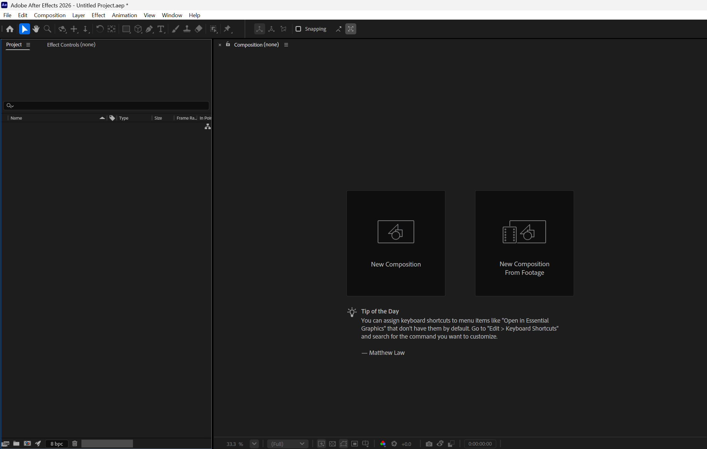


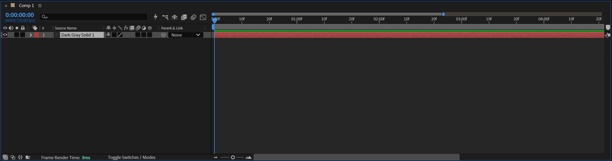


### Projectorganisatie & Mappenstructuur

Een motion design project bevat vaak tientallen losse bestanden (illustraties, audio-effecten, lettertypes, videofragmenten). Omdat After Effects met **koppelingen** (links) naar deze bronbestanden werkt, is een vaste mappenstructuur op je computer cruciaal:

```text
📁 Mijn_Animatieproject/
├── 📁 01_Project/          -> Bevat het .aep After Effects projectbestand
├── 📁 02_Illustraties_AI/  -> Illustrator vectorbestanden (.ai)
├── 📁 03_Beeld_PS/         -> Photoshop afbeeldingen en textures (.psd, .png)
├── 📁 04_Audio/            -> Voice-over, geluidseffecten en muziek (.wav, .mp3)
├── 📁 05_Video/            -> Videobronmateriaal (.mp4, .mov)
└── 📁 06_Renders/          -> Uitgerenderde videobestanden (.mp4, .mov)
```


> [!IMPORTANT]
> Verplaats of hernoem nooit bronbestanden nadat je ze in After Effects hebt geïmporteerd! Gebeurt dat toch, dan raakt de koppeling verbroken en toont After Effects een gekleurd testbeeld (*Missing Footage*).


## Starten van een Animatieproject

### Een Nieuwe Compositie Aanmaken

Elke animatie in After Effects leeft binnen een **Composition (Compositie)**. Dit is het canvas waarin de resolutie, verhouding, framerate en tijdsduur worden vastgelegd.

1. Ga in de menubalk naar **Composition > New Composition...** (of gebruik de sneltoets `Ctrl + N` / `Cmd + N`).
2. Stel de gewenste compositieparameters in:

| Instelling | Aanbevolen waarde (Full HD) | Aanbevolen waarde (Oefening) | Toelichting |
| :--- | :--- | :--- | :--- |
| **Composition Name** | `Hoofdcompositie` | `Oefening_Boot` | Geef altijd een duidelijke naam. |
| **Width & Height** | **1920 × 1080 px** (16:9) | **1280 × 720 px** (HD) | Resolutie van het canvas. |
| **Pixel Aspect Ratio**| Square Pixels | Square Pixels | Standaard voor alle moderne beeldschermen. |
| **Frame Rate** | **25 fps** (PAL) of **30 fps** | **25 fps** | Aantal beelden per seconde. |
| **Duration** | `0:00:10:00` (10 sec) | `0:00:06:00` (6 sec) | Tijdsduur in `uren:minuten:seconden:frames`. |
| **Background Color** | Zwart / Donkerblauw | Wit / Naar keuze | Achtergrondkleur van het voorvertoningsvenster. |

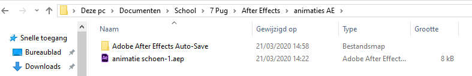


### Bestanden Importeren: Illustrator naar After Effects

Voor de oefeningen in deze cursus gebruiken we het Illustrator-oefenbestand **voorbeeld boot.ai**.

> [!TIP]
> 📥 **Download Oefenbestand:** [voorbeeld_boot.ai](oefenbestanden/voorbeeld_boot.ai) *(bevat gescheiden lagen: zee, boot, mast, zeil, vlag, wolk en meeuw).*

1. Ga naar **File > Import > File...** (of dubbelklik in een leeg deel van het *Project-paneel*, sneltoets `Ctrl + I`).
2. Selecteer het bestand `voorbeeld boot.ai`.
3. **Kies bij Import Kind:** **Composition - Retain Layer Sizes**.
   - **Footage:** Voegt alle lagen samen tot één platte afbeelding (niet handig voor animatie).
   - **Composition - Retain Layer Sizes:** Behoudt elke Illustrator-laag als een aparte, bewerkbare laag in After Effects en plaatst het ankerpunt netjes in het midden van elk afzonderlijk object!


4. In het *Project-paneel* verschijnen nu een compositie én een map met alle losse lagen.
5. Dubbelklik op de aangemaakte compositie of sleep de lagen naar de **Tijdlijn**.

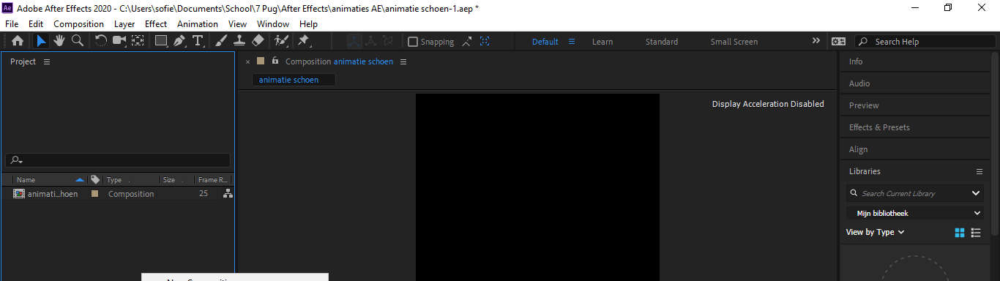
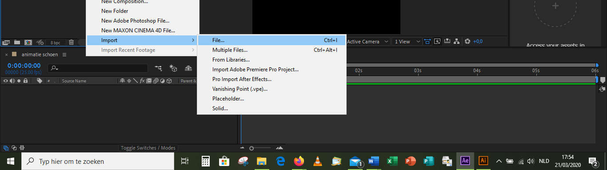
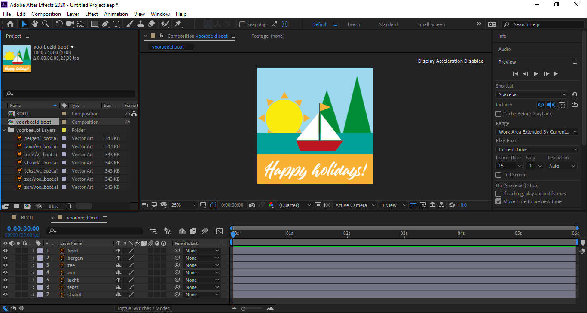


## Basiskennis Animatie & Transformaties

### Lagen Beheren op de Tijdlijn

Naast elke laag op de tijdlijn vind je handige schakelaars (*Layer Switches*):

- 👁️ **Zichtbaarheid (Oogje):** Schakelt de weergave van de laag in of uit.
- 🔊 **Audio (Luidspreker):** Dempt of activeert het geluid van de laag.
- 🔘 **Solo (Cirkeltje):** Isoleert de geselecteerde laag zodat alleen deze zichtbaar is.
- 🔒 **Vergrendelen (Slotje):** Voorkomt per ongeluk verplaatsen of bewerken van de laag.

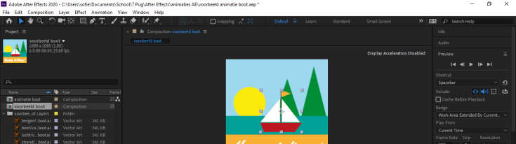
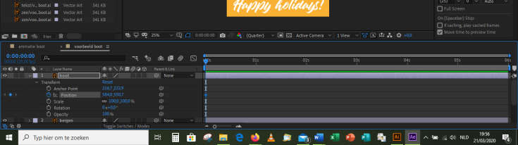


### De 5 Basistransformaties (Transform Properties)

Elke visuele laag beschikt over 5 fundamentele transformatie-eigenschappen. Je kunt deze snel openen met hun bijbehorende sneltoets:

| Eigenschap | Sneltoets | Omschrijving & Eenheid |
| :--- | :---: | :--- |
| **Anchor Point** | `A` | Het oriëntatiepunt waaromheen alle schalingen en rotaties plaatsvinden. |
| **Position** | `P` | De ruimtelijke coördinaten (X: horizontaal, Y: verticaal, eventueel Z: diepte). |
| **Scale** | `S` | De afmeting in procenten (standaard `100%, 100%`). |
| **Rotation** | `R` | De hoekverdraaiing in omwentelingen en graden (`0x + 0,0°`). |
| **Opacity** | `T` | De dekkingsgraad/transparantie in procenten (`0%` = onzichtbaar, `100%` = dekkend). |


### Het Principe van Keyframe-animatie

Een **keyframe** (sleutelbeeld) legt de waarde van een eigenschap vast op een specifiek tijdstip. Zodra je twee verschillende keyframes op verschillende tijdstippen plaatst, berekent After Effects automatisch alle tussenliggende beeldjes (**interpolatie** of *inbetweening*).

#### Stappenplan voor een basisanimatie:

1. Plaats de **CTI** (Current Time Indicator / blauwe afspeelkop) op het gewenste starttijdstip (bv. `0:00:00:00`).
2. Klik op het **Stopwatch-icoon** ⏱️ naast de eigenschap die je wilt animeren (bv. *Scale*). Het icoon licht blauw op en het eerste keyframe (ruitje ◆) verschijnt op de tijdlijn.
3. Verplaats de CTI naar een later tijdstip (bv. `0:00:02:00` / 2 seconden).
4. Pas de waarde van de eigenschap aan (bv. vergroot *Scale* van `40%` naar `120%`). After Effects maakt automatisch een nieuw keyframe aan!
5. Druk op de **Spatiebalk** om de animatie in real-time af te spelen.

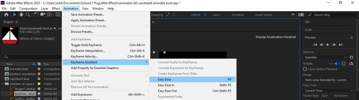
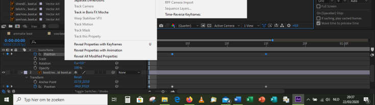

> [!CAUTION]
> Klik **nooit** een tweede keer op de stopwatch als je extra keyframes wilt toevoegen! Het opnieuw aanklikken van de stopwatch schakelt de animatie uit en **verwijdert al je gemaakte keyframes** voor die eigenschap.


### Vloeiende Beweging: Easy Ease (`F9`) & De Graph Editor

Standaard zijn keyframes in After Effects **lineair** (aangeduid als ruitjes ◆). Dit betekent dat een beweging met constante snelheid start en abrupt stopt, wat er mechanisch en onnatuurlijk uitziet.

In de echte wereld hebben objecten massa en traagheid: ze moeten **versnellen** (*Ease Out*) en **vertragen** (*Ease In*).

1. Selecteer de gewenste keyframes op de tijdlijn (sleep er een selectiekader omheen).
2. Druk op `F9` (of klik met de rechtermuisknop > **Keyframe Assistant > Easy Ease**).
3. De keyframes veranderen van ruitjes in zandlopers ⧗.

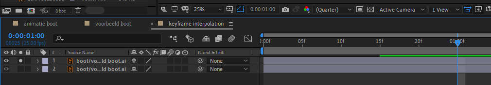

#### Fijnafstelling met de Graph Editor

Voor ultieme controle over de dynamiek klik je op het **Graph Editor** icoon (`Shift + F3`). Hier zie je de snelheidscurve (*Speed Graph*):

- Sleep aan de **Bézier-handvatten** van de curve om een beweging explosief te laten starten en langzaam te laten uitlopen (een populaire techniek in moderne motion graphics).


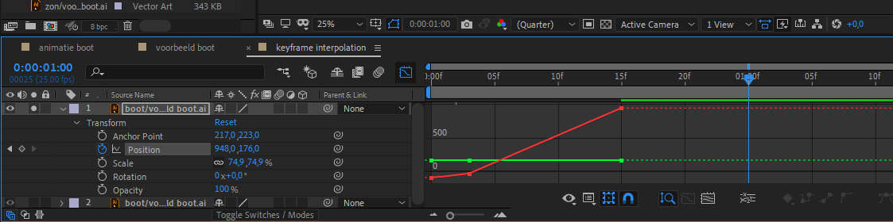


### Bewegingspaden (Motion Paths) Bewerken

Wanneer je de *Position* van een object animeert, verschijnt er in het compositiepaneel een zichtbaar **bewegingspad** met stippellijnen (waarbij elke stip één frame voorstelt).

- **Kromming toevoegen:** Selecteer het pad met de **Selection Tool** (`V`) of **Convert Vertex Tool** (`Alt + G`) en trek aan de ankerpunten om een sierlijke boog te creëren.
- **Ankerpunten toevoegen/verwijderen:** Gebruik de **Add Vertex Tool** (`Pen +`) om extra controlepunten op het pad te plaatsen.

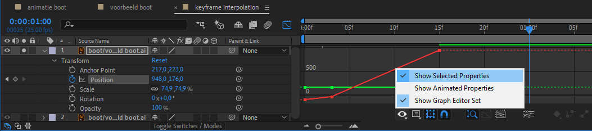
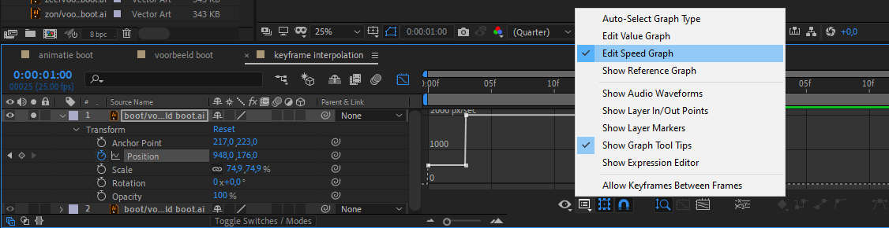
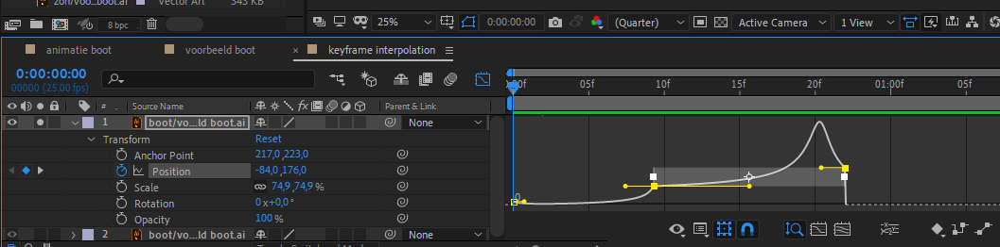
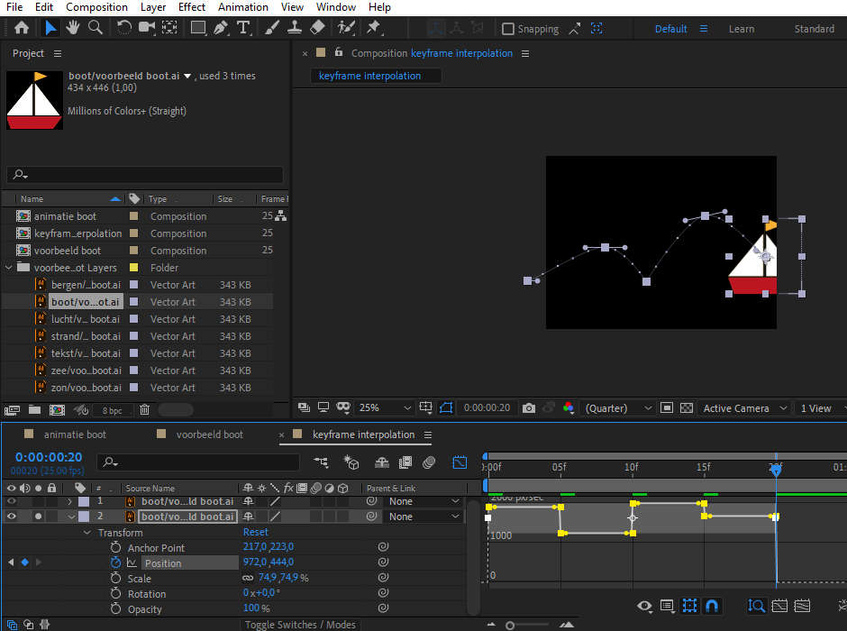
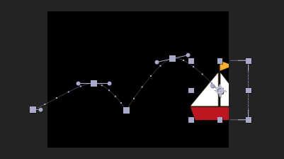
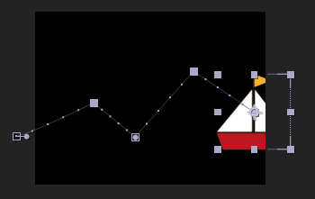


### Lagen Koppelen met Parent & Link (De Pickwhip)

In complexe animaties wil je vaak dat meerdere elementen samen meebewegen met een hoofdonderwerp. Denk aan onze boot: als de boot op en neer deint op de golven, moeten de mast, het zeil en de vlag exact dezelfde beweging volgen zónder dat je op elk onderdeel aparte positie-keyframes hoeft te zetten.

Dit lossen we op met **Parenting**:

1. Zorg dat de kolom **Parent & Link** zichtbaar is in de tijdlijn (klik rechts op de kolombalk > *Columns > Parent & Link*).
2. Selecteer het **spiraal-icoon** (de *Pickwhip* @) naast de kinderlaag (bv. de `mast`).
3. Klik en sleep de spiraal naar de ouderlaag (`boot`).
4. Herhaal dit voor de `vlag` en het `zeil`.
5. Animeer nu alleen de `boot` (bv. schommelen met *Rotation* of varen met *Position*): alle gekoppelde lagen bewegen automatisch perfect mee!

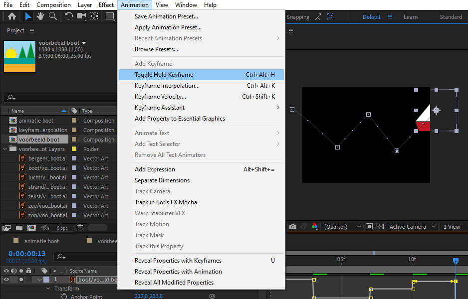
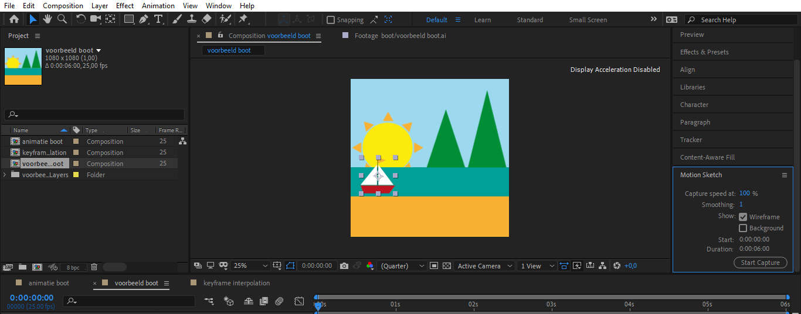
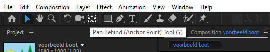

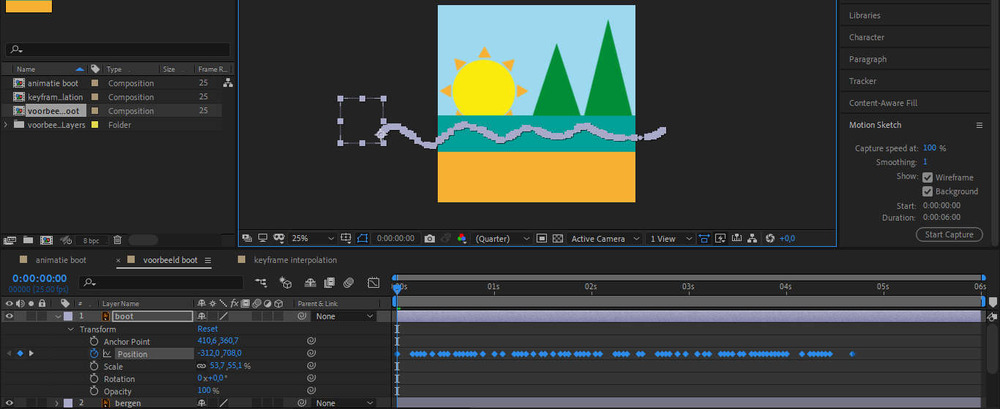


## Vormlagen (Shape Layers) & Vectoranimatie

### Vormen Tekenen in After Effects

Met de vormgereedschappen (*Shape Tools*) teken je rechtstreeks vectorvormen in After Effects:

- ⬛ **Rectangle Tool** (`Q`)
- 🔘 **Rounded Rectangle Tool** (`Q`)
- ⚪ **Ellipse Tool** (`Q`)
- ⬡ **Polygon Tool** (`Q`)
- ⭐ **Star Tool** (`Q`)


1. Klik en sleep in het compositiepaneel om een vorm te tekenen. Er ontstaat automatisch een nieuwe **Shape Layer**.
2. **Belangrijk:** Standaard wordt het oriëntatiepunt (Anchor Point) in het midden van de compositie geplaatst in plaats van in het midden van je figuur.
3. Om het ankerpunt direct exact in het centrum van je vorm te plaatsen:  
   Ga naar **Layer > Transform > Center Anchor Point in Layer Content** (sneltoets `Ctrl + Alt + Home` / `Cmd + Option + Home`).

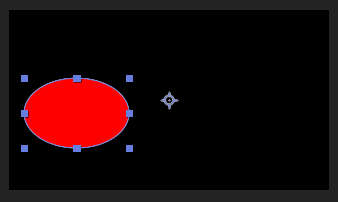

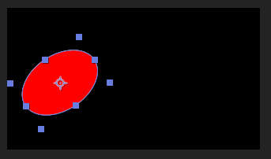


### Vulling (Fill) en Lijn (Stroke) Instellen

In de bovenste optiebalk pas je de kleuren aan:

- Klik op het **kleurvak** van *Fill* of *Stroke* om een kleur te kiezen.
- **Speciale vullingen:** Houd `Alt` ingedrukt en klik op het woord *Fill* om te schakelen tussen:
  - Geen vulling (*None*)
  - Effen kleur (*Solid Color*)
  - Lineair verloop (*Linear Gradient*)
  - Radiaal verloop (*Radial Gradient*)

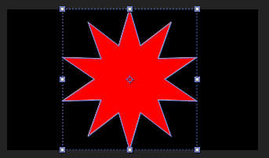


### Parametrische Vormeigenschappen Animeren

Een vormlaag bevat een subgroep **Contents**. Hierin vind je unieke, wiskundige parameters die je allemaal kunt animeren met keyframes!

#### Voorbeeld bij een Ster (Polystar):
- **Points:** Het aantal punten van de ster (bv. vloeiend veranderen van 5 naar 12 punten).
- **Inner / Outer Radius:** De straal van de binnenste en buitenste punten.
- **Inner / Outer Roundness:** Maakt van scherpe hoeken zachte, ronde bollen of bloemvormen.

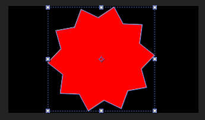
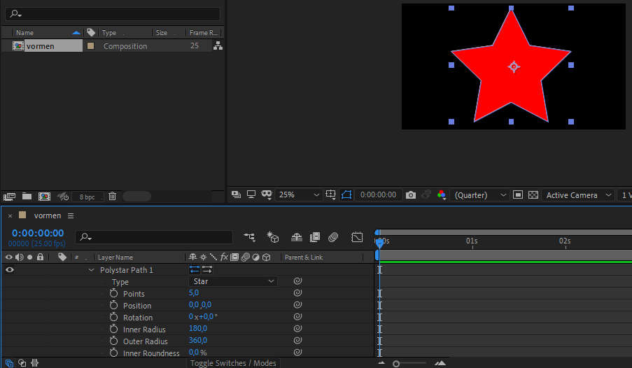
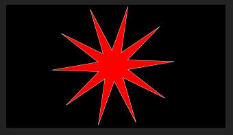
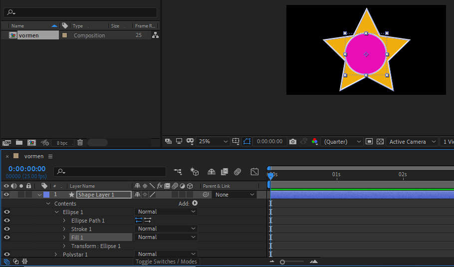


### Meerdere Vormen in Eén Laag & Transformaties

Je kunt meerdere vectorvormen (zoals een cirkel, veelhoek en ster) binnen dezelfde vormlaag combineren:

- **Laag-transformatie (`Transform`):** Roteert of schaalt de hele compositie van vormen als één geheel.
- **Vorm-eigenschappen (`Contents > Shape`):** Animeert de kleur (*Fill Color*), lijndikte (*Stroke Width*) of afmeting van elke afzonderlijke vorm onafhankelijk.


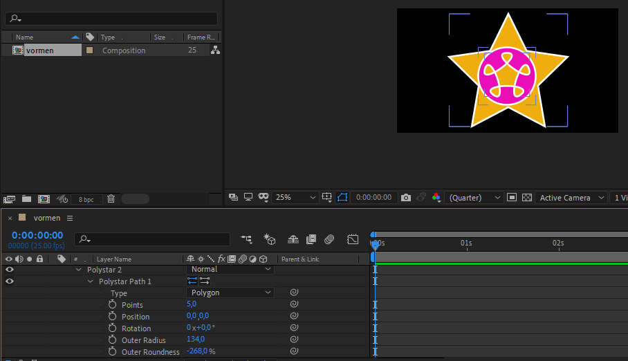
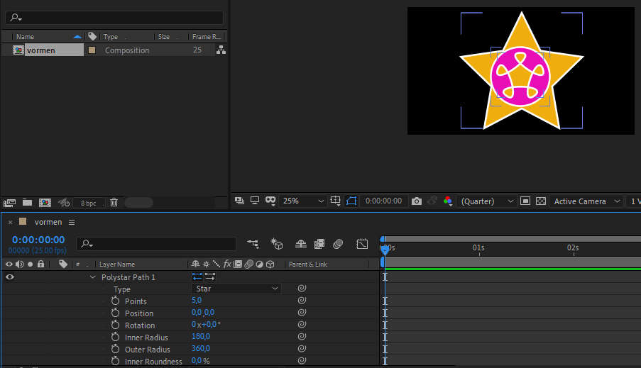
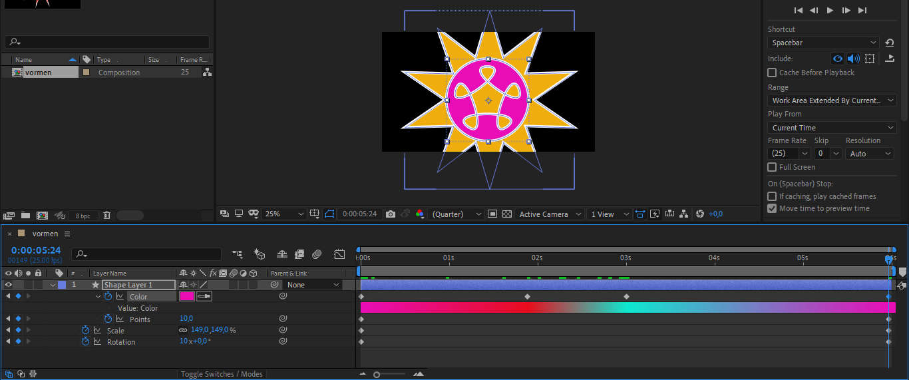


### Shape Morphing: Vorm A Laten Overvloeien in Vorm B

Een van de krachtigste effecten in After Effects is **Shape Morphing** (waarbij bijvoorbeeld een ster naadloos transformeert in een cirkel).

#### Stappenplan:
1. Teken een **ster** op het canvas.
2. Klik met de rechtermuisknop op `Polystar Path 1` in de tijdlijn en kies **Convert to Bezier Path**. *(Hiermee wordt de parametrische vorm omgezet in vrije vector-ankerpunten).*
3. Activeer de stopwatch van de eigenschap **Path** om een start-keyframe te plaatsen.
4. Zorg dat er **geen lagen geselecteerd zijn** (klik in een leeg deel van de tijdlijn) en teken een **ovaal/cirkel**.
5. Converteer ook bij de cirkel het pad naar een Bézier-pad: rechtermuisknop op `Ellipse Path 1` > **Convert to Bezier Path**.
6. Selecteer de eigenschap `Path 1` van de cirkel en kopieer deze met `Ctrl + C`.
7. Verwijder de tijdelijke cirkellaag (`Delete`).
8. Ga terug naar de sterlaag, verplaats de CTI naar bijvoorbeeld 2 seconden, selecteer de eigenschap `Path 1` van de ster en druk op `Ctrl + V` (plakken).
9. Speel de animatie af: de punten van de ster vloeien automatisch vloeiend over in de ronde vorm van de cirkel!

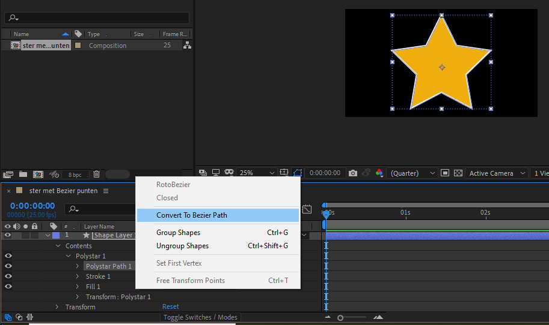
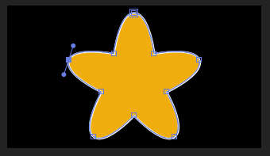
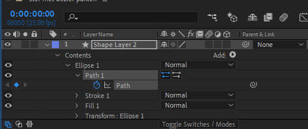
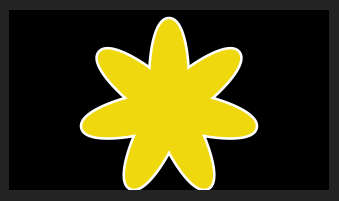
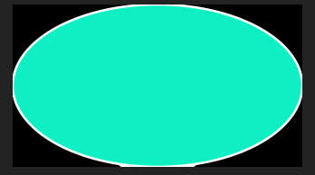


## Solids en Maskers

### Wat is een Solid Layer?

Een **Solid** is een effen gekleurd vlak dat exact de afmetingen van je compositie aanneemt. Solids worden gebruikt als achtergrondkleur, als basis voor effecten (zoals deeltjes of flares) of in combinatie met maskers om doorkijkvensters te creëren.

- Nieuwe Solid aanmaken: Ga naar **Layer > New > Solid...** (sneltoets `Ctrl + Y` / `Cmd + Y`).

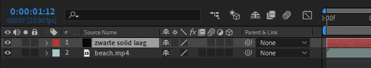


### Maskers Tekenen & Maskermodi (Add vs. Subtract)

Wanneer je een Solid (of videolaag) geselecteerd hebt en een vormgereedschap (`Q`) of de Pen-tool (`G`) gebruikt, tekent After Effects geen nieuwe vormlaag, maar een **Masker (Mask)**.

- **Add (Toevoegen):** Toont alleen het gebied *binnen* het masker; de rest wordt transparant.
- **Subtract (Aftrekken / Uitsnijden):** Snijdt een gat in de laag, waardoor onderliggende lagen of video's zichtbaar worden (zoals een doorkijkvenster).
- **Masker Dupliceren:** Selecteer `Mask 1` op de tijdlijn en druk op `Ctrl + D` om een tweede uitsnede te maken.

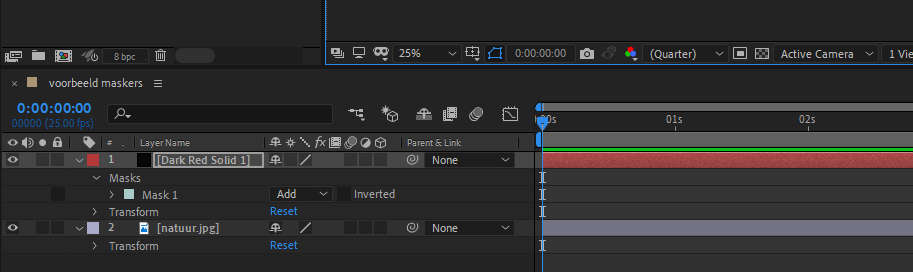
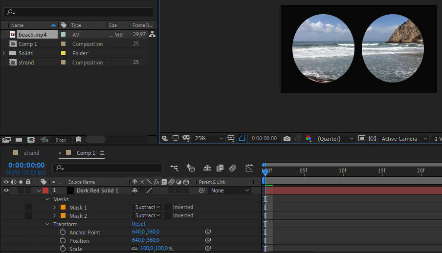
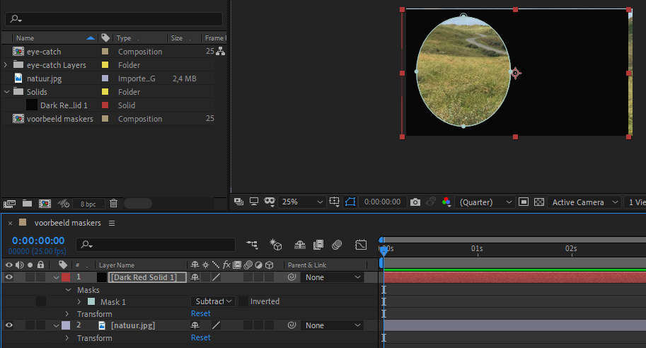
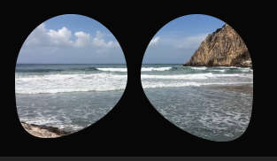
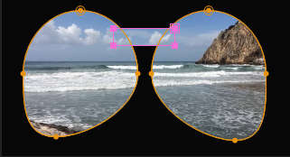


### Belangrijke Maskereigenschappen:

Druk op de sneltoets `M` (toont alleen Mask Path) of `MM` (toont alle maskereigenschappen):

- **Mask Path:** De vorm en positie van de ankerpunten (kan geanimeerd worden).
- **Mask Feather:** Maakt de randen van het masker zacht en wazig (*doezelaar*).
- **Mask Opacity:** De dekking van het gemaskerde vlak.
- **Mask Expansion:** Vergroot of verkleint het maskergebied ten opzichte van het getekende pad.


## Tekst Opmaken en Animeren

### Tekst Typen en Vormgeven

1. Activeer het **Horizontal Type Tool** (`Ctrl + T` / `Cmd + T`).
2. Klik in het compositievenster en typ je tekst.
3. Gebruik de panelen **Character** (lettertype, corpsgrootte, spatiëring, kleur) en **Paragraph** (uitlijning).
4. **Tekstankerpunt centreren:** Gebruik de **Pan Behind (Anchor Point) Tool** (`Y`) om het ankerpunt in het midden van het woord te slepen.

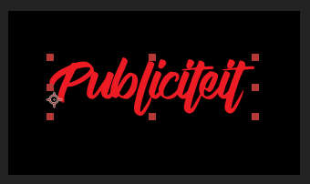
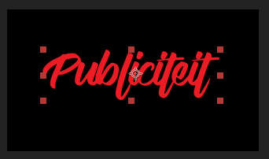


### Tekst Animeren met Transformaties & Bewegingscurven

1. Vouw de eigenschappen van de tekstlaag uit en activeer de stopwatches voor *Position* en *Scale*.
2. Verplaats de CTI naar 2 seconden en verander de positie en schaal.
3. Buig het ontstane animatiepad met de selectiepijl om een sierlijke boogbeweging te krijgen.
4. Voeg eventueel extra ankerpunten toe met de **Pen + Tool**. Door `Alt` ingedrukt te houden breek je de Bézier-handvatten om een scherpe knik in het pad te maken.
5. Selecteer de keyframes en druk op `F9` (*Easy Ease*).

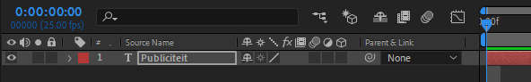
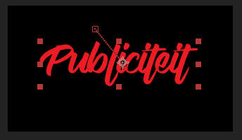
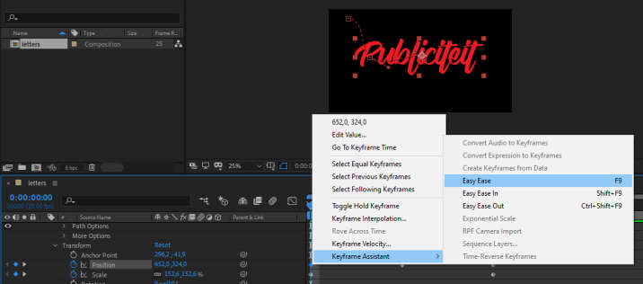


### Motion Blur (Bewegingsonscherpte) Inschakelen

Snelle animaties ogen direct professioneler en filmischer wanneer je **Motion Blur** inschakelt.

1. Activeer de schakelaar **Motion Blur** 🔘 op de gewenste laag in de tijdlijn.
2. Activeer de overkoepelende knop **Enable Motion Blur for all layers** bovenaan de tijdlijn.

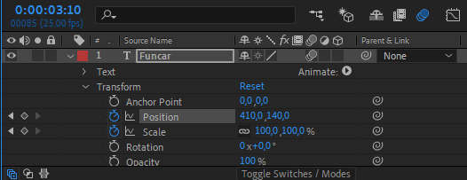


### Voorgedefinieerde Teksteffecten & Tekst Animators

After Effects bevat honderden kant-en-klare teksteffecten:

1. Open het paneel **Window > Effects & Presets** (`Ctrl + 5`).
2. Vouw de map `*Animation Presets > Text` uit. Hier vind je categorieën zoals:
   - `Animate In` (tekst letter voor letter laten invliegen, typmachine-effect, fades).
   - `Animate Out` (tekst laten oplossen of wegvallen).
   - `Tracking` (spatiëring tussen letters animeren).
3. Sleep het gewenste effect rechtstreeks op je tekstlaag of dubbelklik erop terwijl de CTI op het starttijdstip staat.
4. Er wordt een **Animator** met een **Range Selector** toegevoegd aan de laag, waarvan je de *Start*, *End* en *Offset* naar wens kunt verfijnen.


## Effecten & Aanpassingslagen

### Effecten Toepassen en Beheren

Effecten geven After Effects zijn ongekende visuele kracht. Je vindt alle effecten via het menu **Effect** of het paneel **Effects & Presets** (`Ctrl + 5`).

1. Selecteer de gewenste laag (bv. de laag `meeuw` uit ons oefenbestand).
2. Ga naar **Effect > Color Correction > Tritone**.
3. In het **Effect Controls paneel** (`F3`) verschijnen de instellingen van het effect:
   - *Highlights* (lichte tinten)
   - *Midtones* (middentonen)
   - *Shadows* (schaduwen)

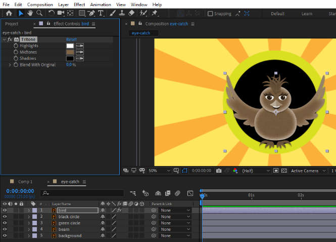


### Effectparameters Animeren

Elke eigenschap in het *Effect Controls* paneel met een stopwatch ⏱️ kan geanimeerd worden:

1. Plaats de CTI aan het begin van de tijdlijn en klik op de stopwatch naast **Midtones**.
2. Kies een startkleur (bv. oranje).
3. Verplaats de CTI naar 2 seconden en verander de kleur naar cyaan.
4. Verplaats de CTI naar 4 seconden en kies magenta.
5. De meeuw verandert tijdens het vliegen vloeiend van kleur!

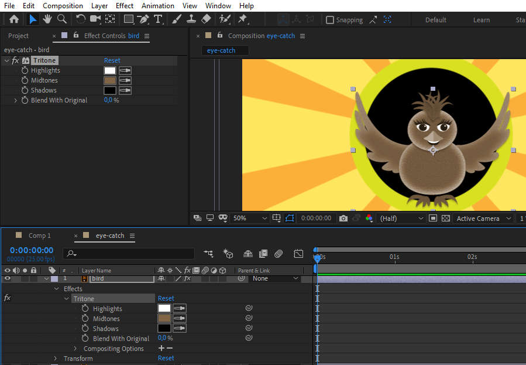

> [!NOTE]
> **Stapelvolgorde van effecten:** De volgorde waarin effecten onder elkaar staan in het *Effect Controls* paneel bepaalt het resultaat. Een *Blur* vóór een *Color Correction* levert een ander beeld op dan omgekeerd!


### Werken met Aanpassingslagen (Adjustment Layers)

Wil je een kleurcorrectie, ruis (*Noise*) of een filmische gloed (*Glow*) toepassen op **alle onderliggende lagen tegelijk** zonder elke laag apart te bewerken? Gebruik dan een **Adjustment Layer**:

1. Ga naar **Layer > New > Adjustment Layer** (sneltoets `Ctrl + Alt + Y` / `Cmd + Option + Y`).
2. Plaats de aanpassingslaag helemaal bovenaan in de tijdlijn.
3. Pas je gewenste effecten toe op deze laag. Elk effect beïnvloedt automatisch alle lagen die eronder liggen!


## Bestandsbeheer, Renderen & Exporteren

### Bestanden Bundelen: Collect Files

Voordat je een project inlevert of meeneemt naar een andere computer, moet je een compleet projectpakket maken zodat er geen gekoppelde bestanden ontbreken:

1. Ga naar **File > Dependencies > Collect Files...**
2. Kies bij *Collect Source Files:* **All**.
3. Klik op **Collect** en kies een opslaglocatie.
4. After Effects maakt een centrale projectmap met daarin het `.aep`-bestand én een map `(Footage)` met alle gekoppelde illustraties, video's en audiobestanden.


### Renderen & Exporteren naar MP4

Als je animatie klaar is, moet deze worden omgezet naar een afspeelbaar videobestand.

#### Methode 1: Adobe Media Encoder (Aanbevolen voor Web & Social Media)
1. Selecteer je compositie in de tijdlijn.
2. Ga naar **Composition > Add to Adobe Media Encoder Queue...** (sneltoets `Ctrl + Alt + M`).
3. Kies in Media Encoder de volgende instellingen:
   - **Format:** `H.264`
   - **Preset:** `Match Source - High bitrate` (of een custom preset zoals 1080×1920 9:16 / 1080×1350 4:5).
4. Klik op de groene afspeelknop ▶️ om de render te starten.

#### Methode 2: Render Queue (Voor Hoge Kwaliteit / Masters)
1. Ga naar **Composition > Add to Render Queue** (sneltoets `Ctrl + M`).
2. Klik op de *Output Module* om het formaat in te stellen (bv. *QuickTime Apple ProRes* voor archivering).
3. Klik op **Render**.


## Sneltoetsenoverzicht (Cheat Sheet)

| Categorie | Actie | Windows Sneltoets | macOS Sneltoets |
| :--- | :--- | :--- | :--- |
| **Project & Comp** | Nieuwe Compositie | `Ctrl + N` | `Cmd + N` |
| | Compositie-instellingen | `Ctrl + K` | `Cmd + K` |
| | Bestand importeren | `Ctrl + I` | `Cmd + I` |
| | Nieuwe Solid laag | `Ctrl + Y` | `Cmd + Y` |
| | Nieuwe Aanpassingslaag | `Ctrl + Alt + Y` | `Cmd + Option + Y` |
| **Tijdlijn Navigatie**| Preview afspelen / pauzeren | `Spatiebalk` | `Spatiebalk` |
| | Naar begin van tijdlijn | `Home` | `Fn + Pijl links` |
| | Naar einde van tijdlijn | `End` | `Fn + Pijl rechts` |
| | 1 frame vooruit / achteruit | `Page Down` / `Page Up` | `Cmd + Pijl rechts / links` |
| | 10 frames vooruit / achteruit| `Shift + Page Down / Up`| `Shift + Cmd + Pijl r/l` |
| **Transformaties** | **A**nchor Point tonen | `A` | `A` |
| | **P**osition tonen | `P` | `P` |
| | **S**cale tonen | `S` | `S` |
| | **R**otation tonen | `R` | `R` |
| | Opacity (**T**ransparency) tonen | `T` | `T` |
| | Alle actieve keyframes tonen | `U` | `U` |
| | Maskers tonen | `M` / `MM` | `M` / `MM` |
| | Effecten tonen | `E` / `EE` | `E` / `EE` |
| **Gereedschappen** | Selection Tool | `V` | `V` |
| | Hand Tool (verslepen canvas) | `H` (of `Spatiebalk` ingedrukt) | `H` |
| | Zoom Tool | `Z` | `Z` |
| | Pan Behind (Anchor Point Tool) | `Y` | `Y` |
| | Shape Tools (vormen) | `Q` | `Q` |
| | Pen Tool | `G` | `G` |
| | Horizontal Type Tool | `Ctrl + T` | `Cmd + T` |
| **Animatie & Easing**| Keyframe Easy Ease toepassen | `F9` | `F9` / `Fn + F9` |
| | Easy Ease In | `Shift + F9` | `Shift + F9` |
| | Easy Ease Out | `Ctrl + Shift + F9` | `Cmd + Shift + F9` |
| | Graph Editor openen/sluiten | `Shift + F3` | `Shift + F3` |
| | Ankerpunt in midden van laag | `Ctrl + Alt + Home` | `Cmd + Option + Home` |
| | Laag centreren in compositie | `Ctrl + Home` | `Cmd + Home` |
| | Laag dupliceren | `Ctrl + D` | `Cmd + D` |
| | Laag splitsen op CTI | `Ctrl + Shift + D` | `Cmd + Shift + D` |
| **Renderen** | Toevoegen aan Render Queue | `Ctrl + M` | `Cmd + M` |
| | Naar Adobe Media Encoder | `Ctrl + Alt + M` | `Cmd + Option + M` |
