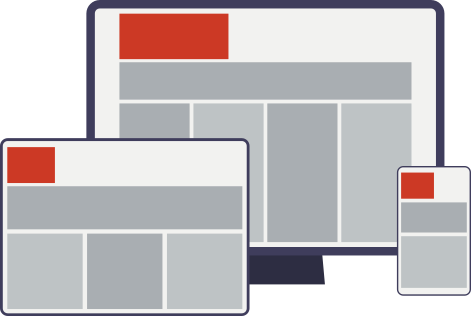
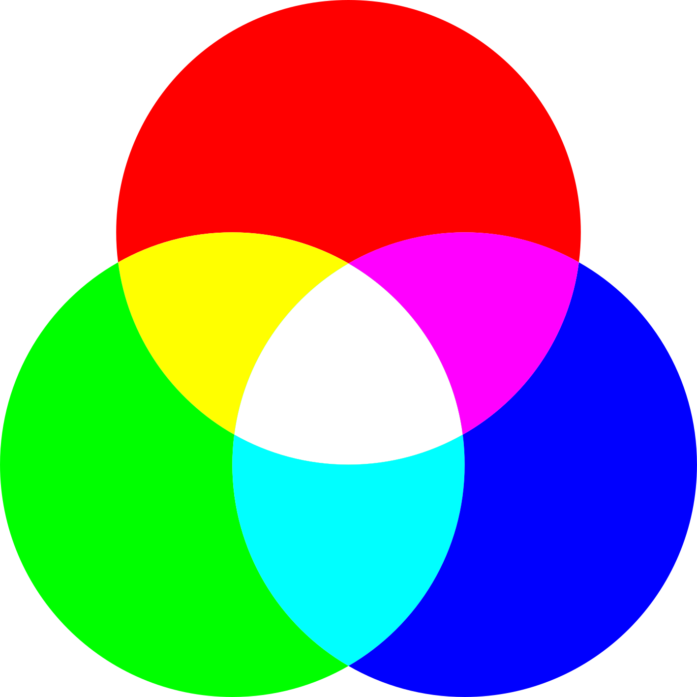
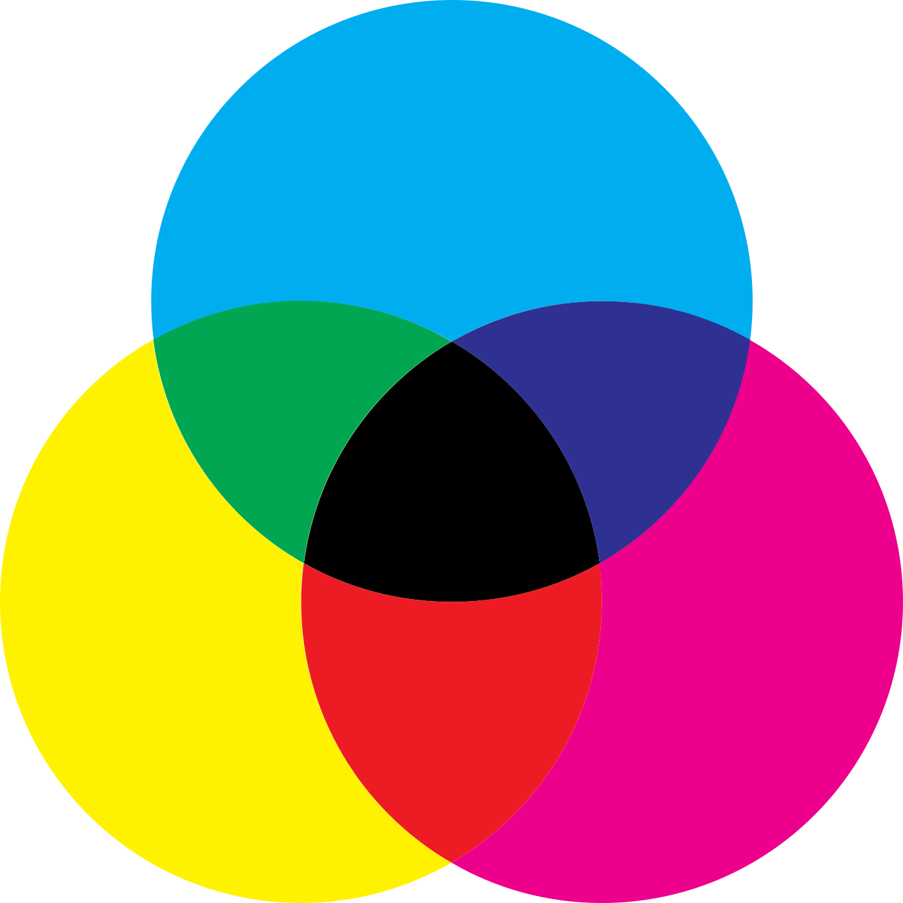
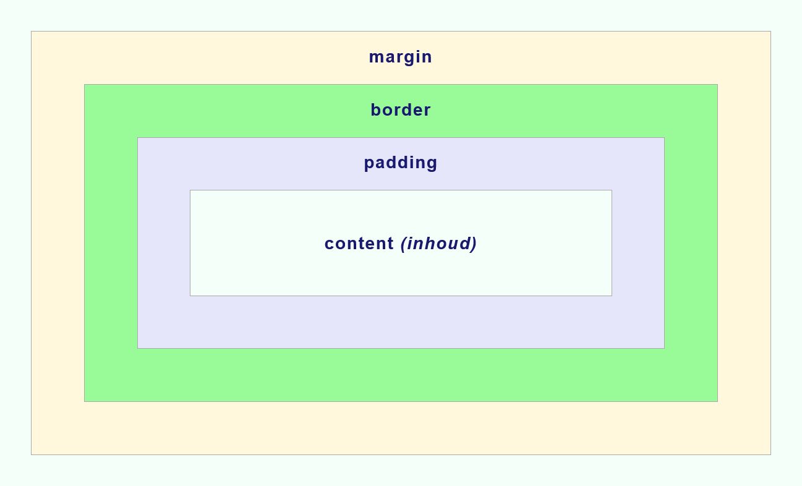

## Cascading style sheets

Alle HTML-elementen hebben standaard stijlkenmerken. Wanneer je een eigen website maakt, pas je deze stijlkenmerken aan met CSS. Je voegt informatie toe aan HTML-elementen, zoals kleur, lettertype, afstand en achtergrond. Dit kan binnen het HTML-document zelf (als inline attribuut van een element of met een `<style>`-element) of, nog veel beter, in een extern CSS-bestand via het `<link>`-element in de `<head>`:

```html
<link rel="stylesheet" href="style.css">
```

CSS staat voor **Cascading Style Sheets**. Het is een stijlspecificatietaal die wordt gebruikt om het uiterlijk en de lay-out van een webpagina te beschrijven. CSS gebruik je om alle HTML-elementen op een pagina vorm te geven, van koppen en alinea's tot navigatiemenu's, afbeeldingsgalerijen en formulieren. Je begint bij het geheel of het hoogst liggende element, om daarna steeds gedetailleerder te stijlen.

Dit stijlblad wordt verwerkt van boven naar beneden, vandaar de term *cascade* (waterval). CSS dient niet alleen om statische lay-outs vorm te geven, maar ook om subtiele transities, animaties en responsieve gebruikersinterfaces te bouwen.


### CSS-vernieuwingen

CSS is de afgelopen jaren bijzonder krachtig en veelzijdig geworden. Met moderne lay-outsystemen zoals **flexbox** en **grid** maak je eenvoudig vloeiende, flexibele lay-outs. Deze lay-outs zijn **responsive** of adaptief aan het beeldscherm: ze schalen mee en passen zich aan elke schermgrootte aan, van compacte smartphone tot breed desktopscherm.



* **Responsive design:** lay-outs die zich dynamisch aanpassen aan de schermgrootte en oriëntatie van het toestel van de bezoeker.
* **CSS flex(box):** een eendimensionale lay-outmethode die werkt met flex-items binnen een flex-container. Deze flex-items kunnen in een rij (*row*) of kolom (*column*) worden geplaatst en verdeeld.
* **CSS grid:** een tweedimensionale lay-outmethode die een vlak in rijen én kolommen verdeelt.

In tegenstelling tot de traditionele flow lay-out fungeren flex en grid als bovenliggende containers (*parent elements*). Zij krijgen specifieke eigenschappen die bepalen hoe onderliggende elementen (*children*) worden gepositioneerd, uitgelijnd en verdeeld.

## CSS-declaraties

Een CSS-regelset bestaat uit een **selector** en een **declaratieblok**. De selector verwijst naar het HTML-element dat je wil opmaken. Het declaratieblok staat tussen accolades `{ }` en bevat één of meerdere declaraties, telkens afgesloten met een puntkomma `;`. Elke declaratie bestaat uit een CSS-eigenschap (*property*) en een bijhorende waarde (*value*), gescheiden door een dubbele punt `:`.

```css
p {
  color: red;
  text-align: center;
}
```

Declaraties eindigen altijd met een puntkomma en declaratieblokken worden omsloten door accolades. De volgorde waarin regels geschreven staan is doorslaggevend: wanneer meerdere declaraties dezelfde eigenschap targeten met gelijke specificiteit, overschrijft de laatste regel alle voorgaande regels.

```css
p {
  color: red;
  color: blue; /* → deze waarde wordt uiteindelijk toegepast */
}
```

## CSS-selectors

* Bekijk ook de handige selector-tester op de [W3Schools CSS Selector Reference](https://www.w3schools.com/CSSref/trysel.asp).

Met CSS gebruik je selectors om nauwkeurig aan te wijzen welke elementen je van vormgeving wil voorzien. Selectors nemen verschillende vormen aan:

* **Element-selector:** selecteert alle HTML-elementen van een bepaald type.
* **Id-selector:** selecteert één uniek element met een specifiek `id`-attribuut.
* **Klasse-selector:** selecteert alle elementen die een bepaalde `class` dragen.
* **Pseudo-selector:** selecteert elementen op basis van hun specifieke toestand of hiërarchische positie.

### Element-selector

De meest elementaire selector is de element-selector (of typesoort). Hiermee spreek je direct alle tags van een bepaalde soort aan via de tagnaam, zoals `body`, `h1`, `p` of `header`.

```css
body {
  background-color: #f5f5f5;
}

h1 {
  font-family: sans-serif;
}
```

### Id-selector

Een id-selector past stijlen toe op één enkel, uniek HTML-element met een specifiek `id`-attribuut. In CSS noteer je een id-selector met een hekje (`#`) gevolgd door de exacte id-naam.

```css
#uniek {
  background-color: yellow;
}
```

### Klasse-selector

Een klasse-selector past stijlen toe op elk HTML-element dat voorzien is van het gevraagde `class`-attribuut. In CSS start een klasse-selector altijd met een punt (`.`).

```css
.groepje {
  background-color: red;
}
```

### Pseudo-selector

Met een pseudo-selector pas je stijlregels toe op een element in een specifieke toestand of gebruikersinteractie. Het bekendste voorbeeld is de pseudo-class `:hover`, waarmee je de weergave aanpast zodra de bezoeker met de muisaanwijzer over het element beweegt.

```css
a:hover {
  color: red;
}
```

### Combinaties

Je maakt verfijnde selecties door een spatie tussen selectors te plaatsen. Daarmee selecteer je uitsluitend afstammelingen (*descendants*) binnen een overkoepelend element. In het onderstaande voorbeeld selecteer je bijvoorbeeld alleen de `li`-elementen die zich binnen een `nav`-element bevinden:

```css
nav li {
  display: inline-block;
}
```

### Selectorlijst

Een selectorlijst groepeert meerdere selectors gescheiden door komma's. Alle opgegeven elementen krijgen hierdoor in één klap dezelfde stijlregels toegewezen:

```css
header, main, footer {
  padding: 2vh 4vw;
}
```

## CSS-eigenschappen

CSS-eigenschappen (*properties*) zijn de instrumenten waarmee je de vormgeving bepaalt: kleuren, typografie, tussenafstanden, randen en lay-outverhoudingen.

### De meest gebruikte CSS-eigenschappen


| **Kleur en tekst** | **Lay-out** | **Geavanceerd** |
| :--- | :--- | :--- |
| `background` | `position` | `overflow` |
| `color` | `z-index` | `cursor` |
| `font-family` | `inset` (`top`, `right`, `bottom`, `left`) | `opacity` |
| `text-align` | `display` | `filter` |
| `line-height` | `margin` | `transform` |
| `text-transform` | `border` | `animation` |
| `text-decoration` | `width` | `transition` |
| `letter-spacing` | `height` | `aspect-ratio` |
| `word-spacing` | `padding` | `object-fit` |
| `list-style` | `gap` | `user-select` |

### Shorthands

Een shorthand is een verkorte schrijfwijze om meerdere gerelateerde CSS-eigenschappen in één enkele regel samen te vatten. Voor eigenschappen zoals `margin` en `padding` is een shorthand erg praktisch en overzichtelijk. Voor complexe achtergronden is het vaak helderder om eigenschappen zoals `background-color` en `background-image` expliciet uit te schrijven.

### Background

De eigenschap `background` fungeert als shorthand voor onder andere `background-color`, `background-image`, `background-position`, `background-repeat` en `background-size`:

```css
body {
  background: #ff0000 url("img/hero.png") center no-repeat 200px;
}
```

Dit is gelijk aan de uitgeschreven vorm:

```css
body {
  background-color: #ff0000;
  background-image: url("img/hero.png");
  background-position: center;
  background-repeat: no-repeat;
  background-size: 200px;
}
```

### Background-image

Met `background-image` ken je één of meerdere achtergrondafbeeldingen toe aan een element:

* **`background-repeat`:** bepaalt hoe het achtergrondbeeld herhaald wordt langs de horizontale en verticale as (`repeat`, `repeat-x`, `repeat-y` of `no-repeat`).
* **`background-position`:** bepaalt de exacte uitlijning van de achtergrondafbeelding (`left`, `right`, `top`, `bottom`, `center` of coördinaten zoals `center top`).
* **`background-size`:** bepaalt de schaling van het beeld. Naast absolute afmetingen (`px`, `%`, `vw`) gebruik je sleutelwoorden zoals `cover` (vult het volledige vlak, snijdt eventueel af) of `contain` (toont het volledige beeld zonder bijsnijden).

#### Background-image eigenschappen



### Color

De eigenschap `color` bepaalt de tekstkleur van een element. Je noteert kleuren via kleurnamen, hexadecimale codes, RGB- of HSL-waarden:

```css
p {
  color: red;
  color: #ff0000;
  color: rgb(255, 0, 0);
  color: hsl(0, 100%, 50%);
}
```

#### Standaardkleuren

Alle moderne browsers ondersteunen 140 officiële kleurnamen, zoals `firebrick`, `midnightblue` of `coral`. Raadpleeg de volledige lijst op de [W3Schools Colors Names Reference](https://www.w3schools.com/colors/colors_names.asp).

```css
color: firebrick;
```

#### Hexadecimale kleuren

Een hexadecimale kleur noteer je als `#RRGGBB`. De componenten voor rood (`RR`), groen (`GG`) en blauw (`BB`) zijn hexadecimale waarden tussen `00` (laagste intensiteit) en `FF` (maximale intensiteit).

```css
color: #b22222;
```

#### RGB-kleuren

De notatie `rgb()` definieert een kleur met drie kanalen: rood, groen en blauw. Elk kanaal krijgt een waarde tussen `0` en `255`. Met `rgba(r, g, b, alpha)` voeg je een alfakanaal toe voor transparantie (waarde tussen `0` en `1`).

```css
color: rgb(178, 34, 34);
```

#### HSL-kleuren

De notatie `hsl()` drukt kleuren uit volgens drie intuïtieve parameters: tint (*hue*, 0°–360° op de kleurencirkel), verzadiging (*saturation*, 0%–100%) en lichtheid (*lightness*, 0%–100%).

```css
color: hsl(0, 68%, 42%);
```



#### Additieve en subtractieve kleuren

Additieve kleuren ontstaan door lichtbundels te mengen. Zichtbaar licht is een mix van verschillende golflengtes: hoe meer lichtkleuren samenkomen, hoe lichter het mengresultaat wordt. De primaire additieve kleuren zijn **rood, groen en blauw (RGB)**, de basis voor beeldschermen.

Subtractieve kleurmenging daarentegen werkt met pigmenten en inkt die licht absorberen (aftrekken). De primaire subtractieve kleuren zijn **cyaan, magenta en geel (CMY/CMYK)**, de basis voor drukwerk.




#### Kleurenkiezer in VS Code

In Visual Studio Code kies en wissel je snel tussen verschillende kleurnotaties door met de muis over een kleurcode te zweven (*hover*) en in het pop-up venster op de titelbalk van de kleur te klikken:



### Font

Met `font` regel je de typografische eigenschappen van tekst. Je kunt individuele eigenschappen instellen of de shorthand gebruiken:

```css
section {
  font-family: Georgia, serif;
  font-size: 1.5rem;
  font-weight: bold;
}
```

#### Font-family

Een `font-family` specificeert het gewenste lettertype voor de browser. Je geeft bij voorkeur een geordende rij (*font stack*) op die eindigt met een generieke valkuilfamilie zoals `sans-serif` of `serif`.

#### Font-size

De eigenschap `font-size` bepaalt de lettergrootte van de tekst. Gebruik bij voorkeur relatieve eenheden zoals `rem` of `em` voor optimale toegankelijkheid.

#### Font-weight

Met `font-weight` bepaal je de dikte van het lettertype, van dun (`100` of `lighter`) over normaal (`400` of `normal`) tot vet (`700` of `bold`).

#### Schreefloos (sans-serif) en met schreef (serif)

Een schreefloos lettertype (*sans-serif*) heeft strakke uiteinden zonder dwarsstreepjes. Een schreeflettertype (*serif*) bezit fijne dwarsstreepjes aan de uiteinden van de lettervormen:


Schreefloos (sans-serif)



Schreef (serif)


#### Proportioneel en monospace

Bij een proportioneel lettertype neemt elk karakter een variabele breedte in (een 'i' is smaller dan een 'm'). Bij een monospace-lettertype heeft elk teken exact dezelfde vaste breedte:


Proportioneel: alle schrifttekens hebben steeds een verschillende breedte.



Monospace: alle schrifttekens hebben telkens dezelfde breedte.


#### CDN-fonts

Webfonts laad je eenvoudig in via een CDN (*Content Delivery Network*):

* [Google Fonts](https://fonts.google.com/)
* [Adobe Fonts](https://fonts.adobe.com/)

## Flow lay-out

De normale documentstroom (*normal flow*) bepaalt hoe block- en inline-elementen standaard op de webpagina worden gerenderd:

* **Inline-elementen** volgen de leesrichting van de tekst (van links naar rechts). Ze beginnen niet op een nieuwe regel en nemen enkel de strikt noodzakelijke breedte in.
* **Block-elementen** stapelen zich verticaal onder elkaar (van boven naar beneden). Ze beginnen steeds op een nieuwe regel en strekken zich horizontaal uit over de volledige beschikbare breedte van hun container.

### Display

Met de eigenschap `display` wijzig je het standaard weergavegedrag van een element:

* `display: none;` verbergt het element en al zijn geneste kinderen volledig uit de documentstructuur.
* `display: inline;` dwingt een element om inline op dezelfde regel te blijven.
* `display: block;` dwingt een element om als een volledig blok op een nieuwe regel te starten.
* `display: inline-block;` combineert inline-plaatsing op dezelfde regel met de mogelijkheid om een eigen breedte, hoogte, padding en marge in te stellen.
* `display: flex;` en `display: grid;` transformeren het element in een geavanceerde lay-outcontainer.

```text
→ → inline → → ░░░░░░░░░░░░░░░░░░░ ↓↓↓↓↓ ░░░░░░░░░░░░░░░░░░░░░░░
░░░░░░░░░░░░░░░░░░░░░░░░░░░░░░░░░░ block ░░░░░░░░░░░░░░░░░░░░░░░
░░░░░░░░░░░░░░░░░░░░░░░░░░░░░░░░░░ ↓↓↓↓↓ ░░░░░░░░░░░░░░░░░░░░░░░
```



#### Flow lay-out navigatie



## Box model

Elk HTML-element op een webpagina wordt door de browser behandeld als een rechthoekige doos: het **CSS Box model**. Dit model telt vier opeenvolgende lagen van binnen naar buiten:

1. **Content:** de effectieve inhoud van het element (tekst, een afbeelding of video).
2. **Padding:** de binnenmarge of opvulling rondom de inhoud, binnen de rand.
3. **Border:** de zichtbare rand rondom de padding en inhoud.
4. **Margin:** de buitenmarge die zorgt voor witruimte en afstand tussen dit element en aangrenzende elementen.



### Padding

Padding gebruik je om ademruimte te creëren rond de inhoud van een element. De shorthand-notatie stelt de vier zijden tegelijk in:

* **1 waarde:** geldt voor alle vier de zijden (`padding: 20px;`).
* **2 waarden:** de eerste voor boven/onder, de tweede voor links/rechts (`padding: 10px 20px;`).
* **3 waarden:** boven, links/rechts, en onder (`padding: 10px 20px 15px;`).
* **4 waarden:** met de klok mee: boven, rechts, onder, links (`padding: 10px 15px 20px 25px;`).

### Border

Een border trekt een lijn rondom de padding van het element:

```css
section {
  border-width: 4px;
  border-style: dotted;
  border-color: red;
}
```

Met de shorthand schrijf je dit korter en bondiger:

```css
section {
  border: 4px dotted red;
}
```

### Margin

Margin creëert afstand tussen elementen onderling. Net als padding volgt margin de kloksgewijze shorthand (boven, rechts, onder, links).

#### Horizontale centrering

Om een block-element met een vaste breedte horizontaal te centreren binnen zijn bovenliggende container, geef je de linker- en rechtermarge de waarde `auto`:

```css
.container {
  max-width: 960px;
  margin: 0 auto;
}
```

#### Centreren met margin



### Box-sizing

Standaard telt het CSS-boxmodel borders en paddings op bij de opgegeven `width` en `height`, waardoor een element breder wordt dan verwacht. Door `box-sizing: border-box;` in te stellen, blijven borders en paddings binnen de opgegeven afmetingen:

```css
* {
  box-sizing: border-box;
}
```



## Eenheden

In CSS gebruik je verschillende maateenheden om afmetingen, lettergroottes en tussenafstanden nauwkeurig in te stellen.

### Absolute eenheden

Absolute eenheden zijn vast en veranderen niet mee met de schermresolutie of omgevingscontext. De meest gebruikte absolute eenheid op het web is pixels (`px`).

### Relatieve eenheden

Relatieve eenheden passen zich aan op basis van de lettergrootte van een element of de afmetingen van het venster (*viewport*):

| **Eenheid** | **Verhouding en toepassing** |
| :--- | :--- |
| `%` | Relatief ten opzichte van de afmeting van het bovenliggende element (*parent*). |
| `em` | Relatief ten opzichte van de actuele `font-size` van het huidige of bovenliggende element. |
| `rem` | Relatief ten opzichte van de root-lettergrootte van het HTML-document (`<html>`). |
| `ch` | Gelijk aan de breedte van het cijfer `0` in het actieve lettertype. |
| `vw` | Viewport Width: `1vw` is gelijk aan 1% van de breedte van het browservenster. |
| `vh` | Viewport Height: `1vh` is gelijk aan 1% van de hoogte van het browservenster. |



## Flexbox

CSS Flexbox (*Flexible Box Layout*) is een krachtige eendimensionale lay-outmethode om elementen binnen een container flexibel uit te lijnen, te verdelen en te schalen. Je activeert flexbox door het bovenliggende element (*parent*) de eigenschap `display: flex;` te geven.

### Flex-container (parent)

Een element wordt een flex-container zodra je de eigenschap `display: flex;` toekent. Alle eigenschappen die je op deze container instelt, bepalen de overkoepelende richting, verdeling en uitlijning van de onderliggende inhoud.


#### justify-content

Bepaalt hoe flex-items worden verdeeld en uitgelijnd langs de hoofdas (*main axis*) van de container (standaard horizontaal van links naar rechts).


#### align-items

Bepaalt hoe flex-items worden uitgelijnd langs de dwarsas (*cross axis*) van de container (standaard verticaal van boven naar beneden).


#### flex-wrap

Bepaalt of flex-items verplicht op één enkele regel moeten blijven (`nowrap`) of netjes mogen doorlopen naar een volgende regel (`wrap`) zodra de breedte van de container ontoereikend is.


#### gap

Bepaalt de vaste tussenruimte tussen de opeenvolgende flex-items binnen de container, zonder dat je handmatige marges op elk individueel item hoeft te plaatsen.


### Flex-items (children)

Alle direct onderliggende elementen binnen een flex-container worden automatisch **flex-items**. Met specifieke eigenschappen op deze items stuur je hun individuele gedrag, afmetingen en volgorde aan.


#### flex

De eigenschap `flex` (of de uitgeschreven eigenschappen `flex-grow`, `flex-shrink` en `flex-basis`) specificeert hoe een flex-item meegroeit of krimpt om de beschikbare restruimte in de container evenredig in te nemen.


#### order

Standaard worden flex-items gerangschikt in de exacte volgorde van de HTML-broncode. Met `order` pas je de visuele volgorde aan waarin een item binnen de flex-container verschijnt, zonder de onderliggende HTML-code te wijzigen.


#### align-self

Hiermee overschrijf je de algemene `align-items` uitlijning op de dwarsas voor één specifiek individueel flex-item.


* Verdiepende documentatie: [CSS Flexbox Layout Guide (CSS-Tricks)](https://css-tricks.com/snippets/css/a-guide-to-flexbox/) en [CSS Layout: Flexbox (MDN)](https://developer.mozilla.org/en-US/docs/Learn/CSS/CSS_layout/Flexbox).

### Kolommen met flexbox



### Centreren met flexbox



### Flexbox-eigenschappen (demo)



## CSS-at-rules en responsive design

### @font-face

Met `@font-face` laad je aangepaste webfonts vanaf de webserver of vanuit lokale mappen:

```css
@font-face {
  font-family: "Open Sans";
  font-weight: 400;
  src: url("fonts/OpenSans-Regular-webfont.woff2") format("woff2");
}
```

### @import

Met `@import` laad je externe stijlbladen in, bijvoorbeeld lettertypes van Google Fonts:

```css
@import url("https://fonts.googleapis.com/css2?family=Rubik:wght@400;700&display=swap");
```

### @media

Met `@media` pas je stijlregels voorwaardelijk toe op basis van specifieke schermkenmerken zoals de breedte van het venster. Dit is de basis van responsive webdesign.

Dezelfde HTML-structuur toont zich hierdoor anders op een smartphone dan op een tablet of een brede monitor, zonder dat je dubbele HTML hoeft te schrijven.

Een mediaquery bestaat uit:
1. Een **media condition** (bijvoorbeeld een maximale schermbreedte via `max-width`).
2. Een **declaratieblok** met specifieke stijlen die uitsluitend binnen dat bereik gelden.

```css
@media (max-width: 768px) {
  body {
    font-size: 1.1rem;
  }

  nav {
    flex-direction: column;
  }
}
```

De meest gebruikte media queries werken met de viewportbreedte:
* `max-width:` regels gelden tot en met de opgegeven schermbreedte (ideaal voor desktop-first verfijningen).
* `min-width:` regels gelden vanaf de opgegeven schermbreedte (standaard bij mobile-first ontwerpen).

Schrijf altijd eerst de algemene basisstijl van je elementen en pas deze vervolgens gericht aan met gerichte mediaqueries.

## Bronnen

### Icoontjes

* [SVG Repo](https://www.svgrepo.com/): Uitgebreide bibliotheek met gratis, vectoriële SVG-iconen.

### Fotografie

* [Unsplash](https://unsplash.com/): Rechtenvrije fotografie in hoge resolutie.
* [Pexels](https://www.pexels.com/): Kwalitatieve stockbeelden en videoclips.

### Typografie

* [Adobe Fonts](https://fonts.adobe.com/): Professionele lettertypebibliotheek via Adobe Creative Cloud.
* [Google Fonts](https://fonts.google.com/): Toegankelijke, open webfonts voor elk project.

### Kleuren

* [Adobe Color](https://color.adobe.com/create/color-wheel): Interactieve kleurencirkel voor harmonieuze kleurenpaletten.
* [Monsido Contrast Checker](https://monsido.com/tools/contrast-checker): Test contrastverhoudingen conform de WCAG-toegankelijkheidsrichtlijnen.

### Cheatsheets en tools

* [W3Schools CSS Reference](https://www.w3schools.com/cssref/trysel.asp): Volledig naslagwerk voor alle CSS-selectors en eigenschappen.
* [CSS-Tricks Almanac](https://css-tricks.com/almanac/): Heldere uitleg over moderne CSS-technieken.
* [Flexbox Cheat Sheet](https://flexboxsheet.com/): Visueel overzicht van alle flexbox-eigenschappen.
* [Can I Use](https://caniuse.com/): Controleer de browserondersteuning voor nieuwe CSS-features.
* [A Guide to Flexbox (CSS-Tricks)](https://css-tricks.com/snippets/css/a-guide-to-flexbox/): De ultieme referentiegids voor flexbox.

### Meer leren

* [FreeCodeCamp](https://www.freecodecamp.org/learn/): Interactieve oefeningen in HTML, CSS en JavaScript.
* [Kepowob YouTube Channel (Kevin Powell)](https://www.youtube.com/kepowob/): De toonaangevende autoriteit op YouTube voor moderne CSS.
* [MDN Web Docs (HTML & CSS)](https://developer.mozilla.org/en-US/docs/Web/CSS): De officiële webstandaarddocumentatie van Mozilla.

### Inspiratie

* [Site Inspire](https://www.siteinspire.com/): Samengestelde showcase van toonaangevend webdesign.
