## Inleiding tot de fotografie

Fotografie is letterlijk schrijven met licht. Het woord stamt af van de Griekse woorden *phos* (licht) en *graphē* (schrijven of tekenen). Met één druk op de ontspanknop maakt iedereen vandaag een foto op een smartphone. Maar maakt dat van iedereen een fotograaf?

Om foto's te maken die zich onderscheiden van toevallige snapshots heb je twee zaken nodig: technische beheersing van je camera én een geoefende, actieve blik. Fotograferen begint niet bij de techniek, maar bij bewust leren kijken naar de wereld om je heen.

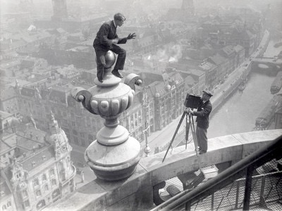

### Het oerprincipe van de camera obscura

Lang voor er sprake was van chemische film of digitale beeldsensoren, ontdekten wetenschappers en kunstenaars het principe van de **camera obscura** (Latijn voor *donkere kamer*).

Wanneer licht door een minuscuul gaatje (een zogeheten *pinhole*) in een verder volledig verduisterde ruimte of doos valt, wordt op de tegenoverliggende wand een omgekeerd beeld (ondersteboven en gespiegeld) van de buitenwereld geprojecteerd.

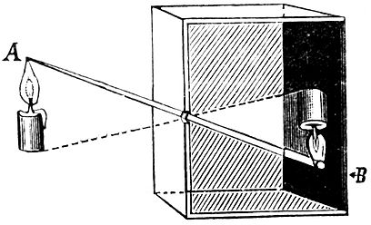
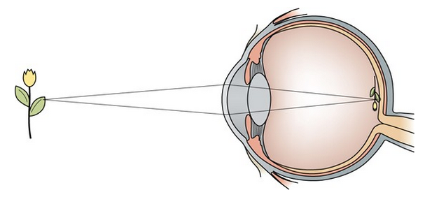

Vanaf de 16e eeuw werd het kleine gaatje vervangen door een glazen **lens**. Hierdoor werd de lichtbundel scherper gebundeld en ontstond een aanzienlijk helderder en scherper projectiebeeld.

De eerste camera obscura's kenden soms gigantische afmetingen. De Italiaanse geleerde Giovanni Battista della Porta bouwde zelfs een camera obscura met zitplaatsen: buiten liet hij acteurs optreden, terwijl toeschouwers binnen in de donkere zaal naar de allereerste geprojecteerde livebeelden keken.

### Hulpmiddel voor klassieke meesters

Klassieke schilders zoals Caravaggio (1571–1610) en Johannes Vermeer (1632–1675) maakten zeer waarschijnlijk gebruik van een camera obscura als optisch hulpmiddel om perspectief, lichtval en stofuitdrukking uiterst accuraat op hun doeken over te zetten.

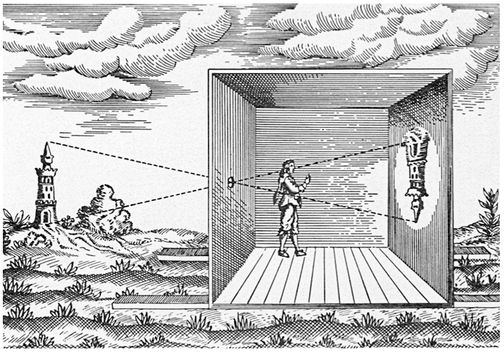
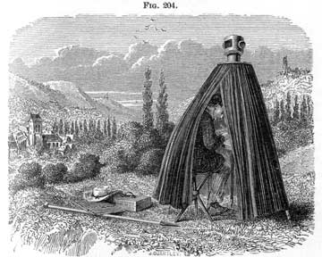

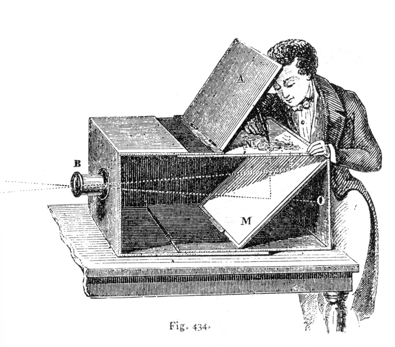

Zelfs vandaag kun je camera obscura's bezoeken, zoals de bekende installatie aan **Lands End** in San Francisco. Je kunt van je eigen slaapkamer ook een gigantische camera obscura maken door alle ramen met zwart karton af te plakken en er één opening van 1 à 2 cm in uit te snijden!

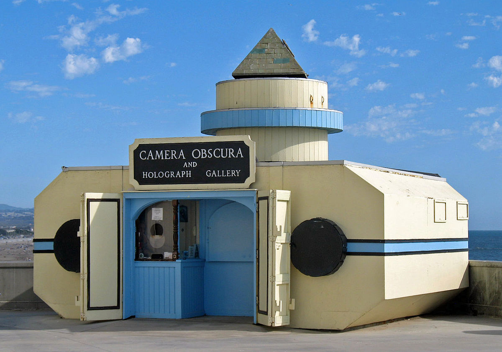



## De intrede en evolutie van de fotografie

De camera obscura had één fundamentele beperking: zodra het licht verdween, verdween ook het beeld. Vanaf het einde van de 18e eeuw zochten scheikundigen en uitvinders naar manieren om dit vluchtige lichtbeeld permanent chemisch te fixeren.

### Joseph Nicéphore Niépce en de eerste foto

De Franse uitvinder **Joseph Nicéphore Niépce** slaagde er in **1826** in om het allereerste permanente fotografische beeld vast te leggen: *Point de vue du Gras* (het uitzicht uit zijn werkkamer). Hij gebruikte een tinnen plaat bedekt met een dunne laag bitumen (Judea-asfalt) en stelde de plaat ruim 8 uur lang bloot aan zonlicht in een camera obscura.

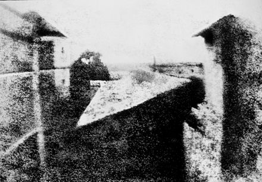
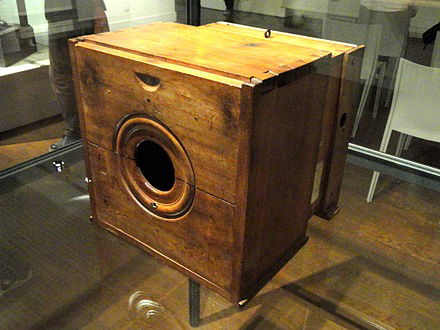

### Daguerreotypie en calotypie

Na het vroege succes van Niépce volgden technologische doorbraken elkaar in hoog tempo op:

1. **Louis Daguerre (1839) — De Daguerreotypie:**  
   Daguerre ontwikkelde een procedé met verzilverde koperplaten die met jodiumdampen lichtgevoelig werden gemaakt en met kwikdampen werden ontwikkeld. De belichtingstijd daalde van uren naar minuten. Het resultaat was een haarscherp, spiegelend unicum: er bestond geen negatief, waardoor dupliceren onmogelijk was.
2. **William Henry Fox Talbot (1841) — De Calotypie:**  
   De Brit Fox Talbot vond het **negatief-positief proces** uit op basis van met zilverzout behandeld papier. Hiermee kon één opgenomen negatief beeld eindeloos vaak worden afgedrukt als positief op fotopapier. Dit principe vormde anderhalve eeuw lang het fundament van de analoge fotografie.

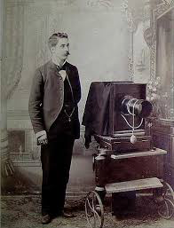
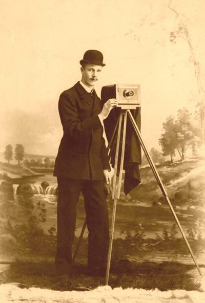
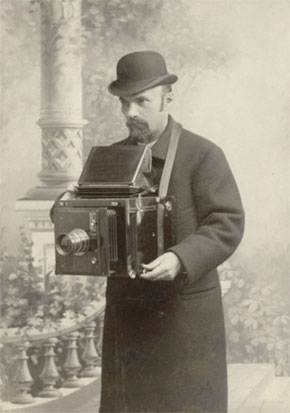

### George Eastman en de opmars van Kodak

Tot het einde van de 19e eeuw bleef fotograferen een complex, chemisch ambacht dat zware glazen platen en mobiele donkere kamers vereiste. 

In **1888** ontketende de Amerikaanse ondernemer **George Eastman** een wereldwijde revolutie met de uitvinding van flexibele **rolfilm** en de lancering van de **Kodak No. 1** boxcamera. 

> De historische slogan van Kodak luidde: *"You press the button, we do the rest."*  
> De consument kocht de camera geladen met een film voor 100 ronde foto's, schoot de opnames en stuurde het hele toestel terug naar de fabriek om de afdrukken te laten ontwikkelen. De snapshot was geboren!

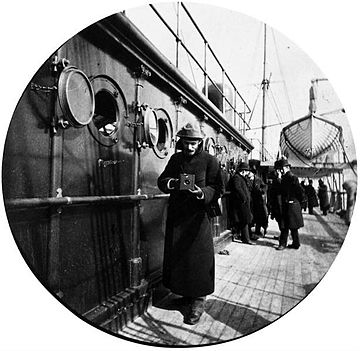
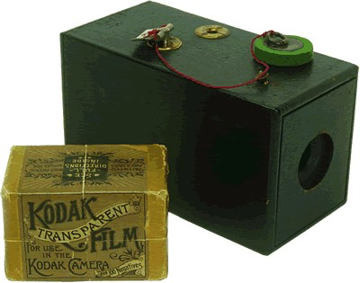

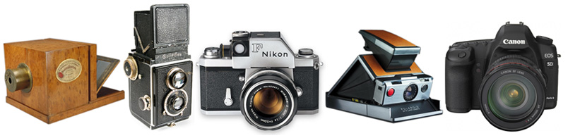
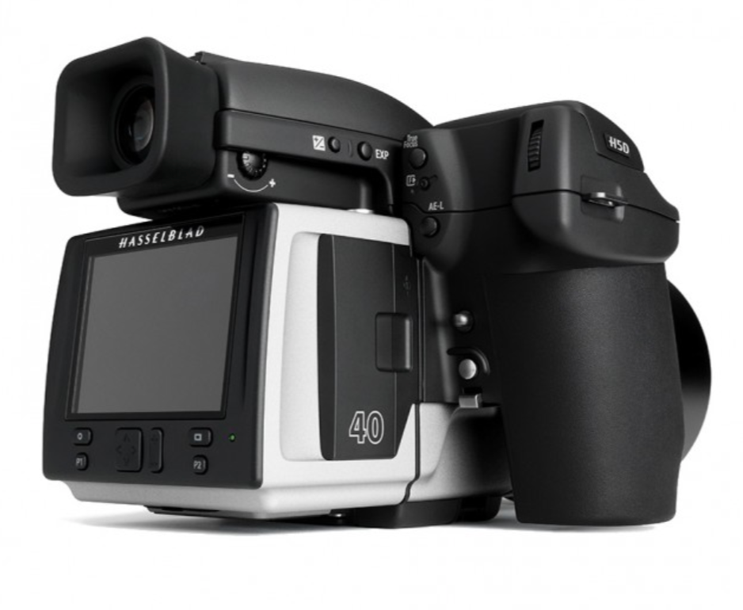

## Cameratechniek en hardware

### Spiegelreflex (DSLR) versus systeemcamera (DSLM)

In hedendaagse digitale fotografie werken we voornamelijk met onderstaande camerabouwtypes.

**DSLR (Digital Single Lens Reflex — Spiegelreflex)**

Het licht valt door de lens op een spiegel die onder een hoek van 45 graden staat. De spiegel kaatst het licht via een matglas omhoog in een **pentaprisma**, waardoor je via de optische zoeker (OVF) rechtstreeks en zonder enige digitale vertraging door het glas van de lens kijkt. Zodra je afdrukt, klapt de spiegel bliksemsnel omhoog, opent de sluiter en valt het licht op de beeldsensor.

**DSLM (Digital Single Lens Mirrorless — Systeemcamera)**

Bij een spiegelloze systeemcamera is het spiegelhuis en pentaprisma volledig weggelaten. Het licht valt permanent direct op de sensor. De sensor stuurt het beeld digitaal door naar een hogeresolutie **elektronische zoeker (EVF)** of het achterscherm. Wat je ziet in de zoeker is exact het resultaat met alle actuele instellingen (belichting, scherptediepte en witbalans). Systeemcamera's zijn lichter, compacter en focussen extreem snel via oog- en onderwerptracking.

   
**Compact camera**

Compact camera's zijn lichte en eenvoudige toestellen met een vast objectief en ingebouwde flitser, waarbij een LCD-scherm als zoeker dient. Ze zijn gebouwd voor het gebruiksgemak, waardoor ze vaak worden gebruikt in de automatische stand. Deze camera’s zijn niet zo efficiënt als je creatief aan de slag wilt gaan met belichting, sluitertijd en diafragma. Door het beperkt aantal knoppen verloopt alles via ingebouwde menu’s. Hierdoor verlies je kostbare tijd die vaak van belang is om net dat ene geweldige moment vast te leggen.

### De basisuitrusting van de fotograaf

Fotograferen is meer dan alleen een camera vasthouden. Om flexibel in te spelen op veranderende opnamesituaties heb je een betrouwbare basisuitrusting nodig:

- **Camerabody:** Het hart van je systeem waarin de beeldsensor, beeldprocessor en bedieningselementen huizen.
- **Kwalitatieve objectieven:** De bepalende factor voor scherpte, contrast en lichtsterkte.
- **Voldoende reservebatterijen & oplader:** Accu's lopen snel leeg, zeker in koude omstandigheden of bij intensief gebruik van scherm en elektronische zoeker. Laad je batterijen altijd tijdig op voor een opdracht.
- **Snelle SD-geheugenkaarten:** Gebruik kaarten met voldoende opslagcapaciteit (minimaal 64 GB of 128 GB) en een hoge schrijfsnelheid (UHS-I / UHS-II, Class 10 / V30). Wie in RAW fotografeert, vult trage kaartjes razendsnel.
- **Degelijk statief (Tripod):** Onmisbaar voor nachtfotografie, studio-opstellingen, lange sluitertijden en haarscherpe productopnames.
- **Cameratas & Onderhoudsset:** Bescherm je lenzen tegen stof en vocht. Gebruik een blaasbalgje en lensdoekjes om glasoppervlakken krasvrij schoon te houden.

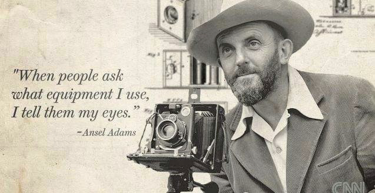

### Belangrijkste cameraknoppen en bedieningselementen

Om snel te kunnen anticiperen op een situatie moet je de bediening van je camera blindelings beheersen. Hieronder zie je de ergonomische indeling van een moderne camera aan drie zijden:

#### Bovenzijde van de camera

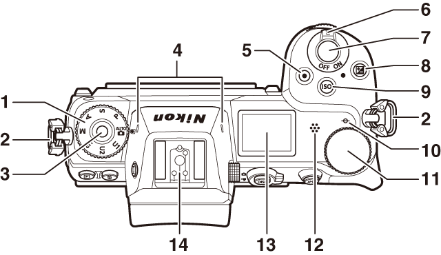

1. **Standknop (Moduswiel):** Keuze tussen M, A/Av, S/Tv, P en automatische standen.
2. **Oogje voor camerariem:** Voor een veilige draagriem rond hals of pols.
3. **Ontgrendelingsknop van de standknop:** Voorkomt per ongeluk verdraaien van de opnamestand.
4. **Stereomicrofoon:** Ingebouwde geluidsopname voor video.
5. **Filmopnameknop:** Start en stopt direct video-opnames (rode stip).
6. **Hoofdschakelaar (On/Off):** Toestel in- en uitschakelen.
7. **Ontspanknop:** Half indrukken activeert autofocus (AF) en lichtmeting; doordrukken maakt de foto.
8. **Belichtingscorrectie (+/-):** Belichting bewust lichter of donkerder maken in halfautomatische standen.
9. **ISO-gevoeligheidsknop:** Directe toegang tot de ISO-waarde van de sensor.
10. **Filmvlakmarkering:** Exacte positie van het sensorvlak in de body.
11. **Hoofdinstelschijf:** Draaiwiel voor het snel aanpassen van sluitertijd of diafragma.
12. **Luidspreker:** Voor het afspelen van camerageluiden en audio bij videoclips.
13. **Statusdisplay / Top LCD:** Snelle aflezing van sluitertijd, diafragma, ISO en resterende opnames.
14. **Accessoireschoen (Flitsschoen / Hot Shoe):** Montagepunt voor externe rapportageflitsers of draadloze triggers.

#### Voorzijde van de camera

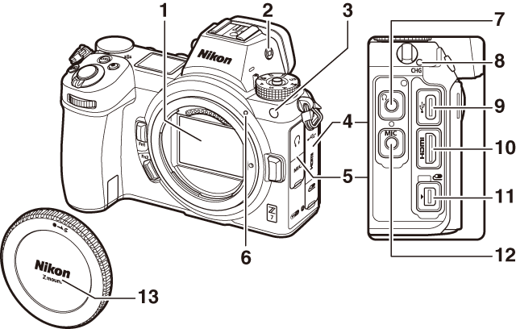

1. **Beeldsensor:** Registreert het licht (Full-frame, APS-C of Micro Four Thirds).
2. **Monitorstandknop:** Schakelen tussen zoeker en LCD-achterscherm.
3. **AF-hulpverlichting / Zelfontspannerlampje:** Ondersteunt scherpstelling bij schemering en knippert bij de timer.
4. **Poortklep voor USB- en HDMI-aansluitingen:** Voor tethered shooting en externe monitoren.
5. **Poortklep voor audio:** Ingang voor externe microfoons en hoofdtelefoonuitgang voor audiobewaking.
6. **Objectiefbevestigingsmarkering (Lens mount index):** Uitlijnmarkering om lenzen correct op de bajonet te klikken.
7. **Objectiefontgrendelingsknop:** Indrukken om een objectief veilig los te draaien.

#### Achterzijde van de camera

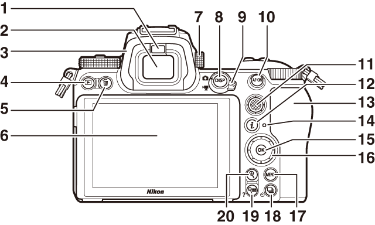

1. **Oogsensor:** Schakelt automatisch tussen scherm en zoeker wanneer je je oog voor het oculair brengt.
2. **Zoeker:** Optische zoeker (DSLR) of OLED elektronische zoeker (DSLM).
3. **Zoekeroculair met rubberen oogschelp:** Blokkeert invallend strooilicht.
4. **Afspeelknop:** Gemaakte opnames en video's terugkijken.
5. **Verwijderknop (Prullenbak):** Mislukte opnames wissen.
6. **LCD-kantelscherm:** Live view voorvertoning, menu-instellingen en touchscreenbediening.
7. **Dioptrieregelaar:** Stelt de zoeker scherp op de sterkte van jouw eigen ogen.
8. **DISP / Info-knop:** Wisselt schermweergaves (histogram, waterpas, opnamegegevens).
9. **Foto- en filmkeuzeschakelaar:** Schakelt tussen fotomodus en videofuncties.
10. **AF-ON-knop:** Voor *back-button focusing* (scherpstellen loskoppelen van de ontspanknop).
11. **Sub-selector / Joystick:** Snel verplaatsen van het actieve autofocuspunt.
12. **Quick Menu / i-knop:** Snelpaneel met de meest gebruikte parameters.
13. **Geheugenkaartsleuf:** Toegang tot SD-, CFexpress- of XQD-kaarten.
14. **Toegangsled geheugenkaart:** Brandt oranje/rood wanneer data naar de kaart wordt geschreven (nooit kaart verwijderen!).
15. **OK-knop:** Keuzes in menu's bevestigen.
16. **Multiselectie-draaiwiel:** Navigatie door foto's en menu-items.
17. **Menuknop:** Openen van het volledige camerasysteemmenu.
18. **Transportstand / Drive mode:** Schakelen tussen enkel beeld, continue burstmodus (H/L) en zelfontspanner.
19. **Miniatuurweergave & Help:** Overzicht van foto's verkleinen of helptoelichting openen.
20. **Zoomweergave:** Inzoomen op gemaakte foto's om 100% beeldscherpte te controleren.

## Het objectief: Het oog van je camera

Het objectief is bepalend voor de optische kwaliteit, scherpte, kleurweergave en het perspectief van je foto. Je kunt een uitmuntende camerabody bezitten, maar met een zwak objectief zal het beeld nooit optimaal presteren.

### Brandpuntsafstand en beeldhoek

De **brandpuntsafstand** (aangegeven in millimeters, bv. `24mm`, `50mm`, `200mm`) is de afstand tussen het optische middelpunt van de lens en het brandpunt op de sensor wanneer de lens op oneindig staat scherpgesteld.

- Een **korte brandpuntsafstand** (bv. 16mm–28mm) geeft een **grote beeldhoek** (groothoek): je krijgt heel veel van de omgeving in beeld.
- Een **lange brandpuntsafstand** (bv. 135mm–400mm) geeft een **kleine beeldhoek** (telelens): het onderwerp wordt optisch dichterbij gehaald.

### Indeling van objectieven

1. **Groothoekobjectief (14mm – 35mm):**  
   Ideaal voor landschappen, architectuur, interieurs en krappe ruimtes. Geeft een sterke suggestie van diepte en trekt lijnen aan de randen wijd uiteen.
2. **Standaardobjectief (35mm – 70mm, klassiek 50mm):**  
   Het 50mm objectief benadert het menselijk gezichtsveld en perspectief het dichtst. Beelden ogen natuurlijk, zonder optische vervorming. Uitstekend voor straatfotografie, reportage en portretten.
3. **Teleobjectief (70mm – 300mm+):**  
   Haalt verre onderwerpen dichtbij en drukt het perspectief samen (achtergrond lijkt dichter op het onderwerp te staan). Zeer geliefd bij sport-, natuur- en portretfotografen vanwege de sterke achtergrondisolatie.
4. **Prime vs. Zoom:**  
   - **Prime-lens:** Vaste brandpuntsafstand (bv. 50mm f/1.8). Je zoomt met je voeten. Voordelen: extreem scherp, lichtsterk, lichter van gewicht en compacter.
   - **Zoomlens:** Variabele brandpuntsafstand (bv. 24-70mm of 70-200mm). Voordelen: veelzijdig en snel van kadrering wisselen zonder van lens te moeten wisselen.

### Praktijkvoorbeeld: huwelijksreportage

Stel: je fotografeert een huwelijksdag. Het bruidspaar vraagt overzichtsbeelden van de feestzaal en de voltallige familie, sfeervolle portretten van de gasten, én gedetailleerde macro-opnames van het overhandigen van de ringen. Hoe pak je dit aan?

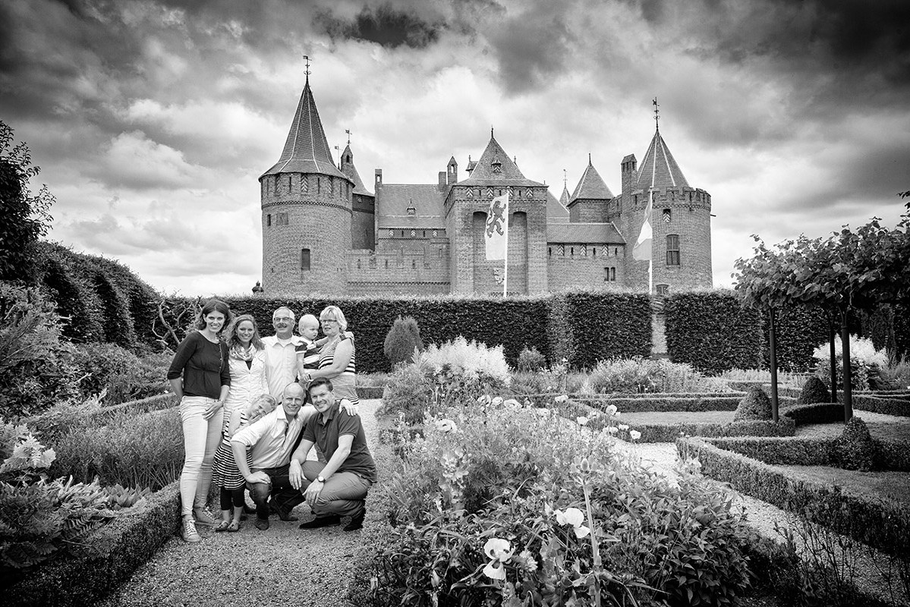
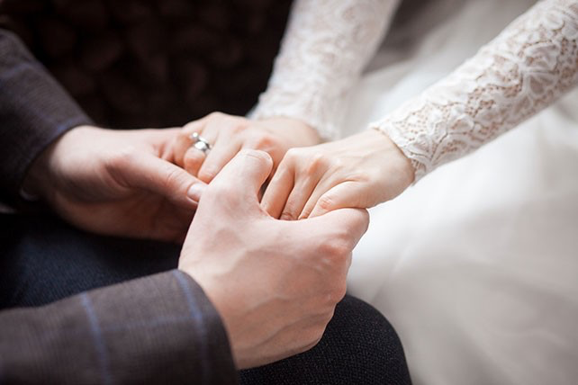
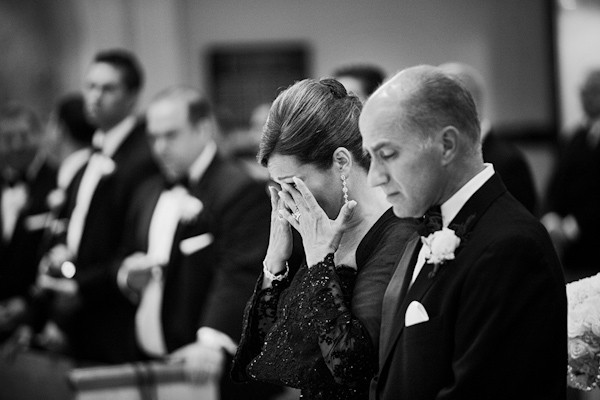

- **Totaalbeeld (zaal & familie):** Gebruik een groothoekobjectief (bv. 24mm). Je krijgt de hele ruimte en alle gasten scherp in beeld, zelfs wanneer je niet ver achteruit kunt stappen.
- **Portret (bruidspaar & emoties):** Gebruik een standaardlens (50mm of 85mm). De gezichten worden natuurlijk en onvervormd vastgelegd met een zachte achtergrond.
- **Details (ringen & taart):** Gebruik een tele- of macro-objectief (100mm). Je kunt van veilige afstand ragfijne details vastleggen zonder de ceremonie fysiek te storen.

### Lichtsterkte van een objectief

Naast de brandpuntsafstand is de **lichtsterkte** de tweede cruciale eigenschap van een lens. De maximale lichtsterkte wordt aangegeven met de grootste diafragma-opening (bv. `f/1.4`, `f/2.8` of `f/4`).

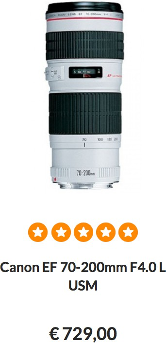
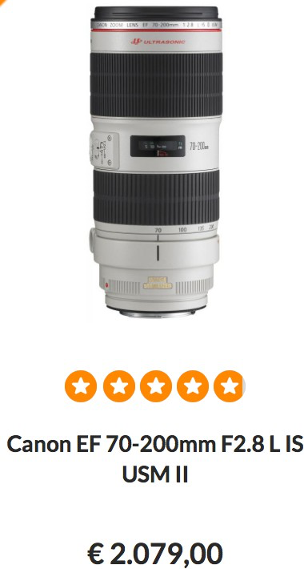

Een lichtsterke lens (bv. f/1.4 of f/2.8) heeft een grotere fysieke lensopening. Daardoor valt er aanzienlijk meer licht op de sensor binnen dezelfde tijd. Dat levert twee grote voordelen op:
1. Je kunt fotograferen in donkere omstandigheden met kortere sluitertijden en lagere ISO-waarden.
2. Je kunt een flinterdunne scherptediepte creëren waardoor je onderwerp loskomt van een zacht vervaagde achtergrond (*bokeh*).

## De belichtingsdriehoek: Beheersing van licht en creativiteit

Elke geslaagde foto rust op het fundament van de **belichtingsdriehoek**: de constante wisselwerking tussen **sluitertijd**, **diafragma** en **ISO-waarde**. Samen bepalen deze drie parameters hoeveel licht de beeldsensor bereikt én hoe de foto er visueel uitziet.

> Verander je één parameter in de belichtingsdriehoek, dan beïnvloed je direct de belichting. Om dezelfde belichting te behouden, moet je minimaal één van de andere twee factoren evenredig mee corrigeren!

### Sluitertijd: Beweging bevriezen of vervagen

De sluitertijd is de tijdsduur waarin de mechanische of elektronische sluiter van de camera openstaat en licht doorlaat naar de beeldsensor.

| Eigenschap | Korte sluitertijd (bv. 1/1000s – 1/4000s) | Lange sluitertijd (bv. 1/15s – 30s) |
| :--- | :--- | :--- |
| **Lichtopbrengst** | Weinig licht valt op de sensor (beeld wordt donkerder). | Veel licht valt op de sensor (beeld wordt lichter). |
| **Visueel effect** | **Bevriest snelle beweging:** druppels, sporters en vogels staan haarscherp stil. | **Toont bewegingsonscherpte:** dynamische lichtsporen, zijdeachtig stromend water, bewegende mensenmassa's. |
| **Hulpstukken** | Fotograferen uit de hand met camerariem. | **Statief absoluut verplicht** om onbedoelde cameratrilling te voorkomen. |
| **Opnamestand** | Modus **Tv** (Time Value bij Canon) of **S** (Shutter Priority bij Nikon/Sony). | Modus **Tv / S** of volledig Manueel (**M**). |

### Diafragma: Lichtinval en scherptediepte

Het diafragma is een cirkelvormige verstelbare opening van overlappende lamellen in het objectief. Het regelt de hoeveelheid licht én bepaalt de **scherptediepte (Depth of Field / DoF)**.

Het diafragma wordt uitgedrukt in een **f-getal** (zoals f/1.4, f/2.8, f/5.6, f/11, f/22). Let op de omgekeerde verhouding:

- **Klein f-getal (grote opening, bv. f/1.8):** Veel licht, kleine scherptediepte. Het onderwerp is scherp, de voor- en achtergrond zijn wazig.
- **Groot f-getal (kleine opening, bv. f/16):** Weinig licht, grote scherptediepte. Zowel onderwerpen dichtbij als elementen ver weg in het landschap zijn scherp.

| Eigenschap | Groot diafragma (Laag f-getal, bv. f/1.4 – f/2.8) | Klein diafragma (Hoog f-getal, bv. f/11 – f/22) |
| :--- | :--- | :--- |
| **Lichtinval** | Maximale hoeveelheid licht bereikt de sensor. | Sterk gereduceerde hoeveelheid licht bereikt de sensor. |
| **Scherptediepte** | **Kleine scherptediepte (Selective focus):** onderwerp springt naar voren, achtergrond vervaagt zacht. | **Grote scherptediepte:** maximale scherpte van voorgrond tot oneindig. |
| **Toepassing** | Portretten, macrofotografie, schemering/nachtfotografie. | Landschapsfotografie, architectuur, stadsgezichten. |
| **Opnamestand** | Modus **Av** (Aperture Value bij Canon) of **A** (Aperture Priority bij Nikon/Sony). | Modus **Av / A** of Manueel (**M**). |

### ISO-waarde: Sensorlichtgevoeligheid en digitale ruis

De ISO-waarde bepaalt hoe gevoelig de digitale sensor reageert op het binnenvallende licht. In feite versterk je met een hogere ISO-waarde het elektrische sensorsignaal.

- **Lage ISO (ISO 50 – 200):** Optimale beeldkwaliteit, maximale kleurechtheid, rijkste dynamische bereik en geen storende digitale ruis. Gebruik dit bij daglicht en in de studio.
- **Hoge ISO (ISO 1600 – 12800+):** Maakt fotograferen bij zwak licht mogelijk zonder flitser of statief. Nadeel: er ontstaat **digitale ruis** (kleurspikkels, korreligheid, verlies aan fijne details en contrast).

| ISO-instelling | Typische lichtomstandigheden | Resultaat & Beeldkwaliteit |
| :--- | :--- | :--- |
| **ISO 100 – 200** | Fel zonlicht, helder buitenlicht, gecontroleerde studiolampen. | Haarscherp, kristalhelder beeld, geen ruis. |
| **ISO 400 – 800** | Bewolkt weer, schaduwrijke buitenlocaties, goed verlichte binnenruimtes. | Zeer zuiver beeld, minimale nauwelijks zichtbare korrel. |
| **ISO 1600 – 3200** | Binnenhuisverlichting 's avonds, schemering, optredens en concerten. | Lichte tot matige ruis, fijne details beginnen zachter te worden. |
| **ISO 6400 – 12800+** | Donkere nachtelijke omgevingen, donkere zalen waar flitsen verboden is. | Duidelijk zichtbare digitale ruis, verminderd contrast en valere kleuren. |

## Kleurtemperatuur en witbalans

### De Kelvin-schaal

Licht heeft een kleurtemperatuur die wordt gemeten in graden **Kelvin (K)**. Onze hersenen corrigeren kleurtemperaturen automatisch: een wit vel papier zien wij zowel onder een warme tafellamp als in de koude buitenschaduw als *wit*.

Een camerasensor heeft die biologische intelligentie niet. Zonder correctie kleurt een foto onder een gloeilamp oranje/geel en in de schaduw koel blauw. De **witbalans (White Balance / WB)** compenseert deze kleurzweem zodat wit ook op de foto daadwerkelijk neutraal wit oogt.

> [!NOTE]
> Witbalans heeft **geen invloed op de belichting** (hoe licht of donker je foto is), maar uitsluitend op de **kleurweergave**.

### Voorkeuzestanden en handmatige kalibratie

Moderne camera's bieden een reeks handige voorkeuzestanden aan:

| Pictogram | Modus | Kleurtemperatuur | Omschrijving & Toepassing |
| :---: | :--- | :--- | :--- |
| **AWB** | **Automatisch (Auto)** | 3000K – 7000K | De camera berekent zelf het meest neutrale witpunt. Handig bij wisselend licht. |
| ☀️ | **Daglicht (Direct Sun)** | ~5200K – 5500K | Voor opnames in helder, direct zonlicht. |
| ☁️ | **Bewolkt (Cloudy)** | ~6000K – 6500K | Voegt warmte toe aan diffuus, koel bewolkt buitenlicht. |
| 🏠 | **Schaduw (Shade)** | ~7000K – 7500K | Compenseert het sterk blauwige licht in open schaduwplekken. |
| 💡 | **Kunstlicht (Tungsten / Gloeilamp)** | ~3200K | Voegt koel blauw toe om de warme oranje gloed van huiskamerlampen te neutraliseren. |
| 📏 | **TL-licht (Fluorescent)** | ~4000K | Neutraliseert de groenige zweem van traditionele TL-buizen. |
| ⚡ | **Flitslicht (Flash)** | ~5500K – 6000K | Afgestemd op het neutrale flitslicht van externe rapportageflitsers. |
| **K** | **Kelvin (Handmatig)** | 2500K – 10000K | Stel zelf exact de gewenste kleurtemperatuur in stappen van 100 Kelvin in. |
| 🔲 | **Custom (Maatwerk)** | — | Fotografeer een 18% grijskaart of wit vel papier onder het opnamelicht en stel dit in als referentiepunt. |

## Belichtingscontrole en het histogram

Vertrouw tijdens het fotograferen nooit uitsluitend op wat je ziet op het LCD-achterscherm van je camera. In de volle zon lijkt je foto al snel veel te donker (waardoor je geneigd bent over te belichten), terwijl in een donkere kamer het scherm verblindend helder lijkt.

De enige 100% objectieve en betrouwbare controlemethode is het digitale **histogram**.

### Het histogram aflezen

Het histogram is een grafische weergave van alle pixels in je foto, gerangschikt van puur zwart aan de linkerkant (waarde 0) naar puur wit aan de rechterkant (waarde 255). De hoogte van de grafiek geeft aan hoeveel pixels er binnen die specifieke helderheidswaarde vallen.

Het histogram is opgebouwd uit vijf aansluitende zones:
1. **Donkere tinten (Diepzwart):** Uiterst links.
2. **Schaduwen:** Links van het midden.
3. **Middentinten (50% grijs):** Het centrum van het histogram.
4. **Witte tinten:** Rechts van het midden.
5. **Hooglichten (Puur wit):** Uiterst rechts.

### De vijf belichtingsprofielen

1. **Onderbelicht:**  
   De grafiek plakt tegen de uiterste linkerkant aan. Er zijn *clipping schaduwen* (*crushed blacks*). Deze donkere delen bevatten geen doortekening meer. Probeer dit te vermijden: oplichten in Lightroom leidt tot zware digitale ruis. Kies voor een groter diafragma, langere sluitertijd of hogere ISO.
2. **Op links belicht:**  
   De massa van de pixels bevindt zich links van het midden, maar raakt de linkerrand net niet. Dit is acceptabel en natuurlijk bij avond-, nacht- en *low-key* opnames.
3. **Neutraal belicht:**  
   De meest veilige, gebalanceerde belichting. De grafiek vormt een harmonieuze klokvorm in het midden zonder aan de linker- of rechterkant afgekapt te worden.
4. **Op rechts belicht (*Expose To The Right / ETTR*):**  
   De pixels leunen tegen de rechterzijde aan, maar raken de uiterste rand niet. Dit levert de hoogste signaal-ruisverhouding op bij RAW-opnames en geeft de schoonste schaduwen na nabewerking.
5. **Overbelicht:**  
   De grafiek botst tegen de uiterste rechterkant op. De hooglichten zijn *geclipt* (*blown out*). Witte delen (luchten, reflecties, huidglans) zijn puur wit (waarde 255) zonder enig detail. Uitgebeten witten zijn in nabewerking **onherstelbaar verloren**! Verlaag je ISO, verkort de sluitertijd of sluit je diafragma.

## Storytelling en beeldcompositie

Wat een schrijver formuleert met woorden, vertelt een fotograaf met visuele bouwstenen. Een foto is geen willekeurige registratie van een stukje werkelijkheid, maar een bewuste constructie.

Voor je de ontspanknop indrukt, stel je jezelf drie vragen:
1. **Wat is mijn onderwerp?** Waar moet het oog van de toeschouwer als eerste naartoe?
2. **Wat vertel ik met dit beeld?** Welk gevoel, welke sfeer of boodschap breng ik over?
3. **Welke elementen laat ik weg?** Compositie is de kunst van het weglaten van storende ballast.

## De tien fotografische beeldaspecten

Om je beeldcompositie kracht, diepte en zeggingskracht te geven, hanteer je tien fundamentele beeldaspecten:

### Regel van derden, de gulden snede, kadrering

Plaats je een onderwerp precies in het midden van het kader, dan levert dat vaak een statische, weinig boeiende compositie op.

De **regel van derden** verdeelt het zoekerbeeld met twee horizontale en twee verticale lijnen in negen gelijke vlakken. De vier snijpunten van deze lijnen vormen de natuurlijke **sterke punten** van je frame. Plaats je hoofdonderwerp (bv. het oog van een model, een boom of een bootje) op een van deze snijpunten, en leg de horizonlijn op de bovenste of onderste derdenlijn voor maximale visuele dynamiek.

De **gulden snede** (verhouding 1:1,618) en de Fibonacci-spiraal vormen de wiskundige voorloper hiervan, zoals we die in schelpen, planten en klassieke kunst terugvinden.

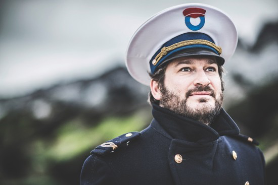
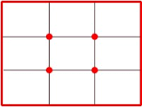
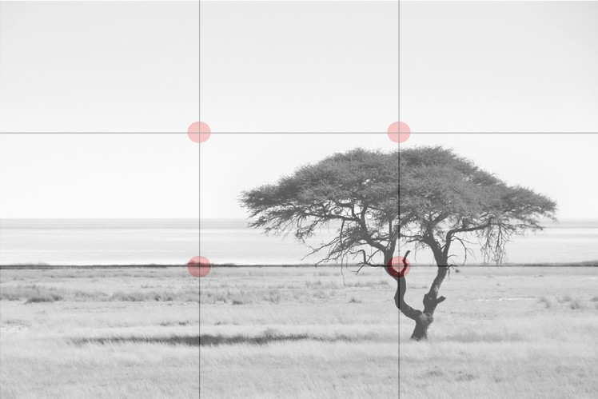

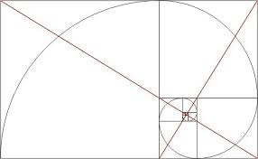
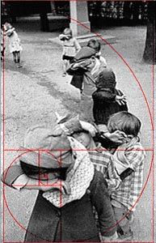

### Dieptewerking en ruimtelijkheid

Een foto is een tweedimensionaal plat vlak. Als fotograaf is het jouw uitdaging om daarin de illusie van een driedimensionale wereld te wekken.

Je suggereert diepte door:
- **Inlopende diagonalen:** Lijnen die vanuit de hoeken naar het centrum of verdwijnpunt lopen.
- **Overlappende lagen:** Een duidelijke voorgrond (*foreground*), middenplan (*midground*) en achtergrond (*background*).
- **Kijklijnen:** Wegen, hekwerken, spoorrails of rivieren die het oog diep het landschap in zuigen.

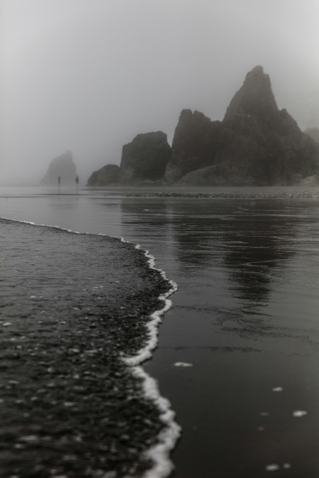
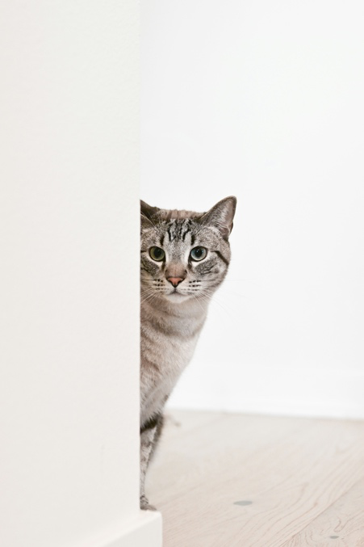

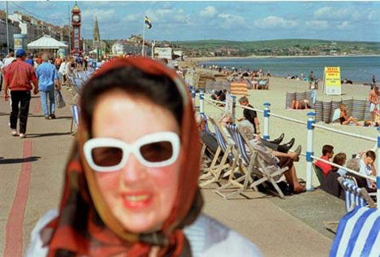
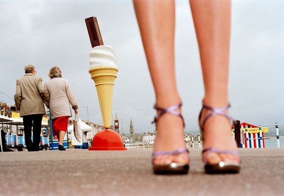
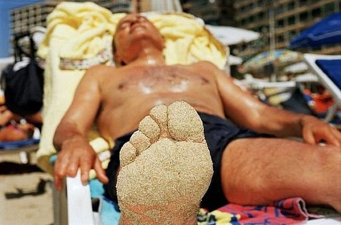

### Scherptediepte en focusisolatie

Met een bewuste keuze voor een groot diafragma (klein f-getal) isoleer je een onderwerp volledig van zijn achtergrond. Met een klein diafragma integreer je het onderwerp juist in zijn omgeving.

De Amerikaanse topfotografe **Sally Mann** demonstreerde dit meesterlijk in haar beroemde kinderportretten:

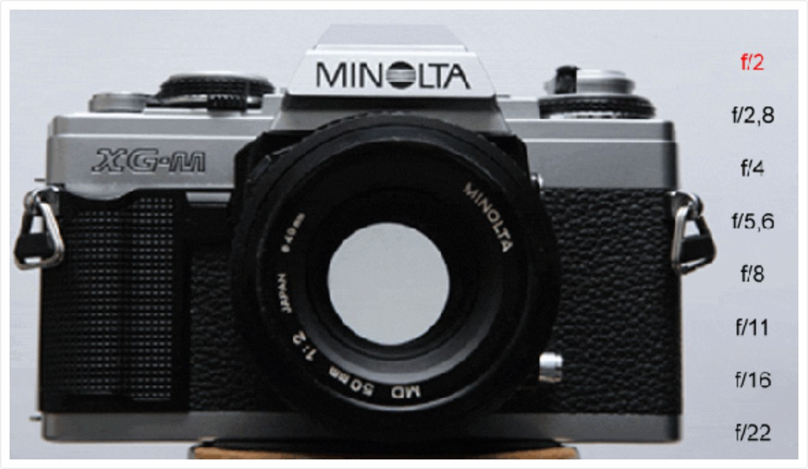
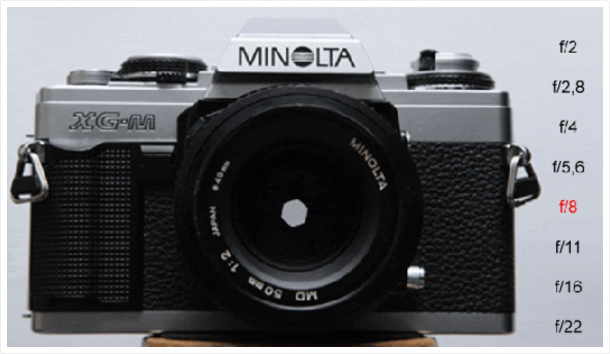
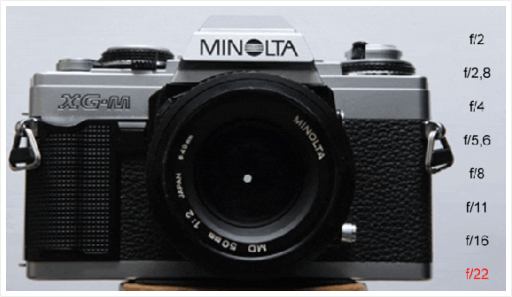

- **In het eerste beeld** kiest Sally Mann voor een groot diafragma. De achtergrond vervaagt tot een zachte waas. De blik focust uitsluitend op het meisje en haar kwetsbaarheid.
- **In het tweede beeld** gebruikt ze een kleiner diafragma. De achtergrond en de omstanders worden haarscherp zichtbaar en vertellen direct mee het verhaal van de sociale context.

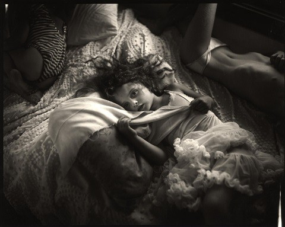
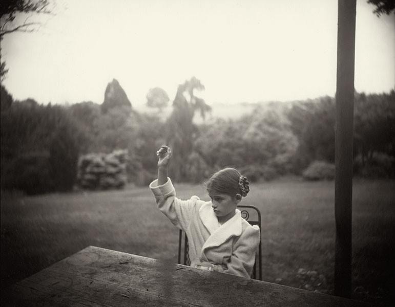

### Standpunt, perspectief en beeldpsychologie

De hoogte van waaruit je fotografeert stuurt rechtstreeks de psychologische perceptie van de toeschouwer:

- **Ooghoogte:** Neutraal, gelijkwaardig en documentair.
- **Kikvorsperspectief (Laag standpunt):** Je kijkt omhoog naar het onderwerp. Het onderwerp oogt imposant, machtig, dominant of dreigend.
- **Vogelperspectief (Hoog standpunt):** Je kijkt neer op de scène. Het onderwerp oogt klein, overzichtelijk of kwetsbaar.

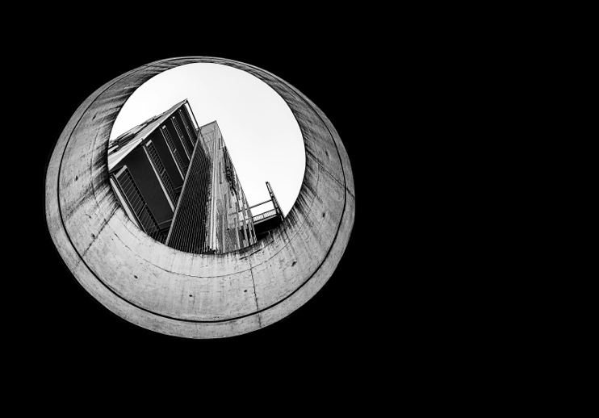

Veel politici begrijpen de psychologie van camerastandpunten als geen ander. Vele dictators lieten zich nagenoeg uitsluitend vanuit een uiterst laag kikvorsperspectief fotograferen, terwijl anderen zich bewust vaker op ooghoogte lieten vastleggen als "man van het volk".

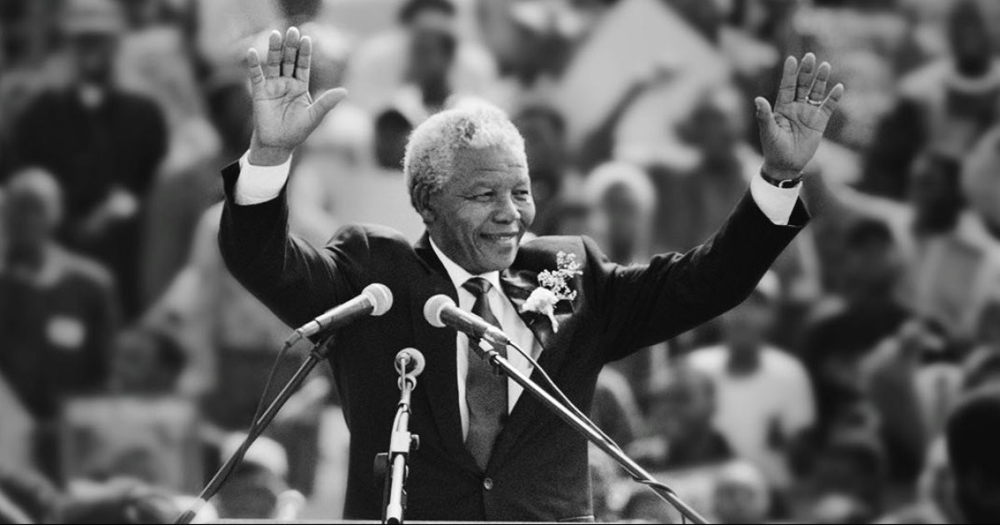

#### Persfotografie: Jimmie Kets in Brussel

De Belgische persfotograaf **Jimmie Kets** toonde na de aanslagen op Brussels Airport in Zaventem aan hoe een fotograaf met standpuntkeuze de werkelijkheid kan sturen. Op exact dezelfde locatie en hetzelfde tijdstip nam hij foto's vanuit kikvorsperspectief (die een sfeer van acute militaire dreiging uitstraalden) en foto's op ooghoogte (die juist menselijke hulpvaardigheid en rust toonden).

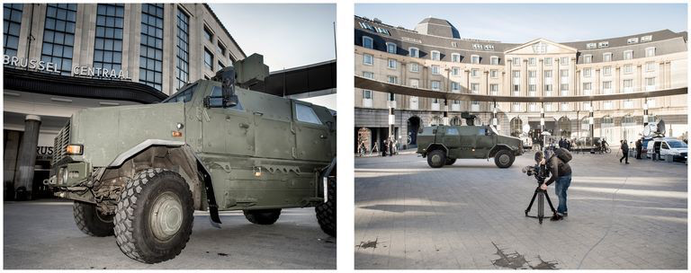
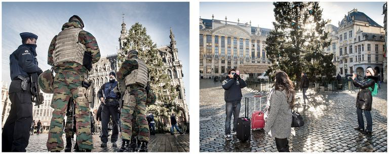

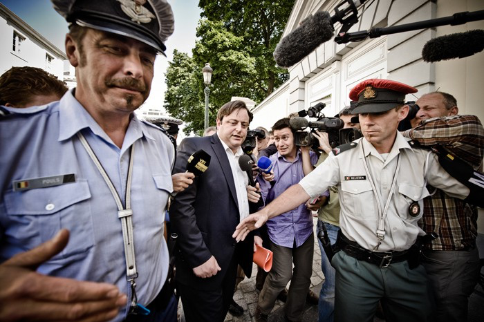

### Weerspiegeling en reflectie

Reflecties in ramen, spiegels, plassen, zonnebrillen of gepolijste architectuur voegen een surrealistische, poëtische gelaagdheid toe aan je werk. Ze combineren twee werelden binnen één frame.

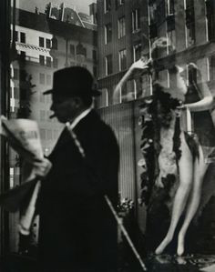
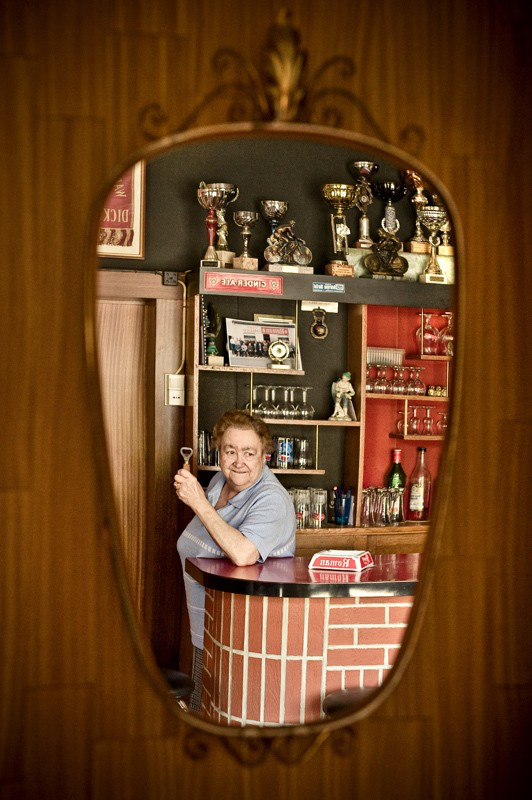
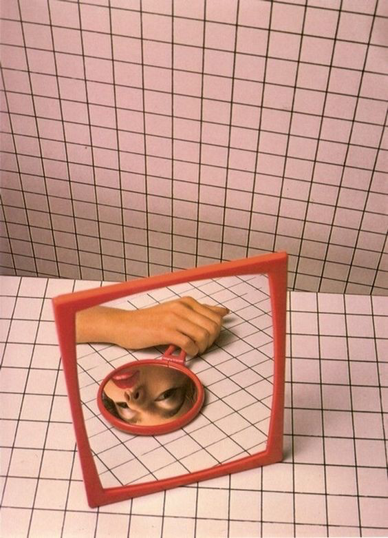

### Lijnenwerk, diagonalen en curven

Lijnen sturen het oog van de kijker door het beeld. Elk type lijn brengt een eigen emotionele lading met zich mee:

- **Horizontale lijnen:** Brengen rust, stabiliteit, vrede en weidsheid. De befaamde fotograaf **Andreas Gursky** is een meester in het vangen van monumentale horizontale rust.
- **Verticale lijnen:** Roepen kracht, grootsheid en monumentaliteit op (hoge bomen, wolkenkrabbers). Kunstenaar **Filip Dujardin** gebruikt dit in zijn architectuurcollages.
- **Diagonale lijnen:** Creëren dynamiek, spanning, diepte en energie. Het oog van de kijker wordt langs deze lijn doorheen het beeld geleid. 
- **S-curven en rondingen:** Geleiden het oog op een sierlijke, ontspannen en organische manier door de compositie.
- **Samenkomende (convergerende) lijnen:** Suggereren oneindige diepte en afstand.
- **Dynamische onregelmatige lijnen:** Creëren spanning, chaos, alertheid of onbehagen.

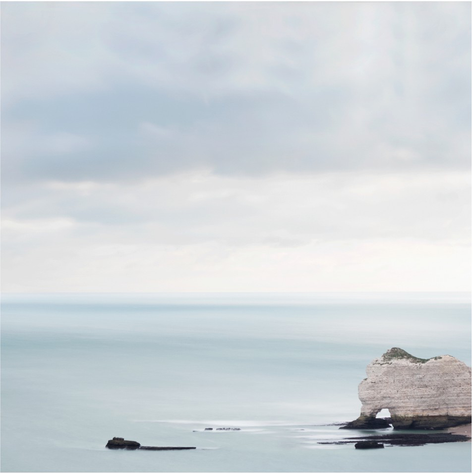

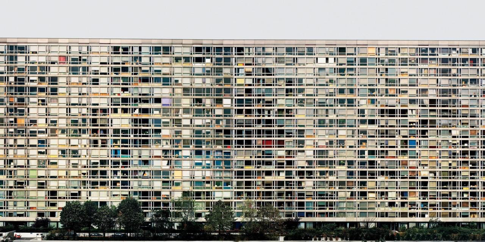


### Kleur en kleurcontrast

Kleur heeft een directe psychologische impact op de toeschouwer:

- **Warm-koud contrast:** Oranje/rood (actief, nabij, warm) tegenover blauw/cyaan (rustig, afstandelijk, koel).
- **Complementair contrast:** Kleuren die tegenover elkaar liggen op de kleurencirkel (bv. blauw en oranje, geel en paars) versterken elkaar maximaal.
- **Monochroom & Zwart-wit:** Door kleur weg te laten, dwing je de toeschouwer te focussen op licht-donker contrasten, vormen, lijnen en emotionele expressie.


### Beweging, lange sluitertijd en panning

Beweging in beeld breng je op drie verschillende manieren:

1. **Beweging bevriezen (Korte sluitertijd, bv. 1/1000s):**  
   Waterdruppels in de lucht of een opspringende atleet staan haarscherp stil.
2. **Bewegingsonscherpte op statief (Lange sluitertijd, bv. 1/2s – 10s):**  
   Onbeweeglijke onderdelen (rotsen, bruggen, gebouwen) blijven messcherp, terwijl het bewegende water of passerend verkeer vervaagt tot mistige slierten en lichtsporen.
3. **Panning (Meetrekken met het onderwerp):**  
   Kies een sluitertijd tussen 1/30s en 1/60s. Beweeg je camera tijdens het afdrukken vloeiend mee met de snelheid van een voorbijrijdende auto of fietser. Het resultaat: het bewegende onderwerp blijft scherp, terwijl de achtergrond in horizontale vegen wegschiet!


### Ritme, herhaling en structuur

Het menselijk brein zoekt van nature naar patronen en regelmaat. Door architecturale elementen, schaduwen, bogen of ramen ritmisch te herhalen, creëer je rust, orde en een hypnotiserende esthetiek. Een kleine verstoring in het patroon kan juist hét ankerpunt van je foto worden.


### Kader-in-kader compositie

Bij een **kader-in-kader** gebruik je een natuurlijk element binnen je compositie om je hoofdonderwerp nogmaals te omlijsten. Denk aan een raamkozijn, deuropening, poort, overhangende boomtakken of zelfs een doorkijk door twee personen heen. Dit versterkt het gevoel van voyeurisme, intimiteit en driedimensionale diepte.


## Portretfotografie: Karakter, identiteit en storytelling

Portretfotografie legt een persoon of groep vast met als doel emoties, karakter en identiteit tastbaar te maken. Een sterk portret overstijgt de puur technische registratie: het vertelt een verhaal en bouwt een onmiddellijke band op tussen het model en de toeschouwer.

Storytelling helpt om de unieke achtergrond en persoonlijkheid van de geportretteerde over te brengen. Door bewuste keuzes te maken in licht, compositie, pose en context geef je betekenis en psychologische diepgang aan je beeld.

### Belichtingstechnieken in portretfotografie

Belichting bepaalt niet alleen de technische scherpte en helderheid van je opname, maar dicteert vooral de emotionele sfeer van het portret.

- **Soorten licht:** Natuurlijk daglicht (zonlicht, noorderlicht door een raam) versus kunstlicht (studiolampen, flitsers, continulicht).
- **Aard van het licht:** Zacht diffuus licht (door een softbox of op een bewolkte dag; egaliseert huidoneffenheden) versus hard direct licht (creëert felle schaduwen en dramatisch contrast).
- **Richting van het licht:** Frontaal licht (weinig schaduw, vlakker), zijlicht (benadrukt textuur en gelaatstrekken) en tegenlicht (*rim light* / contourlicht dat het haar laat oplichten).

In de professionele portretfotografie onderscheiden we vijf klassieke basisopstellingen:

#### Rembrandtbelichting

Vernoemd naar de Hollandse meesterschilder Rembrandt van Rijn. Eén hoofdlamp staat onder een hoek van 45 graden ten opzichte van het model en iets hoger dan het hoofd. Hierdoor ontstaat aan de schaduwzijde van het gezicht een karakteristieke **verlichte driehoek op de wang** onder het oog. Deze opstelling geeft diepte, mysterie en een klassieke, dramatische uitstraling.

#### Butterflybelichting (Paramount lighting)

De lichtbron wordt recht voor en boven het gezicht van het model geplaatst. Dit werpt een klein, symmetrisch schaduwtje direct onder de neus dat doet denken aan een **vlinder**. Deze techniek werd wereldberoemd in de Hollywood-glamourfotografie van Paramount Studios: het accentueert hoge jukbeenderen en geeft een elegante, flatterende uitstraling.

#### Splitbelichting

De lichtbron staat haaks op het model (onder een hoek van 90 graden). Hierdoor wordt het gezicht exact in tweeën gesplitst: de ene helft baadt in fel licht, terwijl de andere helft volledig in diepe schaduw gehuld blijft. Dit levert een uiterst grafisch, krachtig en dramatisch contrast op.

#### High-key belichting

Bij high-key dompel je het model onder in een overvloed aan zacht, helder licht met minimale schaduwen en een lichte achtergrond. De lichte witten en pasteltinten overheersen. Dit creëert een serene, pure, vrolijke en optimistische sfeer.

#### Low-key belichting

Het tegenovergestelde van high-key: donkere tonen, diepe schaduwen en gitzwarte achtergronden domineren het frame. Slechts een selectief deel van het gezicht wordt belicht door een gericht *accent-* of *contourlicht*. Dit wekt spanning, intensiteit, introspectie en mysterie op.

### Compositie en beeldopbouw bij portretten

De compositie bepaalt hoe de toeschouwer het portret "leest". Als fotograaf ben jij de gids die de blik naar het karakter van het model stuurt.

#### Plaatsing van het model: Regel van derden

Door de ogen van je model op de bovenste horizontale derdenlijn of op een van de bovenste snijpunten te plaatsen, voelt het portret onmiddellijk natuurlijk en levendig aan.


#### Middenkadering en symmetrie

Waar de regel van derden dynamiek schept, zorgt een centrale plaatsing voor directe confrontatie, rust, stabiliteit en autoriteit. Dit werkt uitmuntend bij krachtige gelaatsuitdrukkingen en symmetrische gezichten.


#### Asymmetrie en dynamiek

Een asymmetrische plaatsing brengt spanning en beweging in het beeld, zeker wanneer het model interageert met een actieve achtergrond of een opvallend decor.


#### Gebruik van negatieve ruimte

Negatieve ruimte is de lege, rustige ruimte rondom het model (bv. een egale muur, een open lucht of een zachte schaduw). Deze leegte dwingt alle visuele aandacht direct naar het onderwerp en schenkt het portret ademruimte en een minimalistische kracht.

#### Framing en natuurlijke omlijsting

Gebruik elementen in de omgeving — deuropeningen, ramen, planten, gordijnen of schaduwvormen — om het gelaat of lichaam visueel te omlijsten. Dit versterkt het gevoel van driedimensionale diepte en intimiteit.


#### Richting van de blik en kijkruimte

De kijkrichting van het model creëert een onzichtbare vectorlijn. Geef het model voldoende "kijkruimte" in de richting waarin het kijkt. Kijkt het model naar links, plaats het dan aan de rechterzijde van het kader. Kijkt het model recht in de lens, dan ontstaat er een intieme, directe dialoog met de toeschouwer.


#### Scherptediepte en focus op de ogen

De ogen vormen het venster naar de ziel van het portret. Stel je autofocuspunt altijd haarscherp scherp op het oog dat het dichtst bij de camera staat. Kies je voor een groot diafragma (f/1.8 – f/2.8), dan smelt de achtergrond weg tot een boterzachte waas (*bokeh*).


#### Voorgrond en achtergrond: Gelaagdheid

Plaats bewust objecten op de voorgrond (out-of-focus) om een gevoel van nabijheid en diepte te wekken. Fotografen zoals Martin Parr en Eli Reinholdtsen gebruiken voorgrond- en achtergrondelementen om ironie, context en maatschappelijke verhalen in te bedden.


#### Leidende lijnen naar het model

Architecturale lijnen, balustrades, leuningen of muren kunnen als een pijl functioneren die de blik van de toeschouwer feilloos naar het gezicht van het model voert.


#### Kadrering: Close-up versus omgevingskader

- **Strakke kadering (Close-up / Extreme close-up):** Vangt micro-expressies, rimpels, oogopslagen en ademt intense intimiteit.
- **Wijd kader (Medium / Full body shot):** Toont lichaamstaal, kledingstijl en de relatie van de persoon met de fysieke ruimte.


#### Standpunt en perspectief

- Een **laag standpunt** verleent het model waardigheid, autoriteit en kracht.
- Een **hoog standpunt** benadrukt kwetsbaarheid, tederheid of bescheidenheid.

#### Bewust doorbreken van compositieregels

Zodra je de regels van de compositieleer beheerst, mag je ze bewust overtreden. Een model gedeeltelijk afkappen, extreme hoeken kiezen of onscherpte toelaten kan leiden tot intrigerende, grensverleggende beelden.


### Communicatie en regie van je model

Een technisch perfecte foto met een ongemakkelijk model is een mislukt portret. Jouw sociale vaardigheden als fotograaf zijn minstens even belangrijk als je camerakennis:

1. **Creëer een ontspannen sfeer:**  
   Begin nooit direct met schieten. Maak eerst contact, drink een glas water, voer een ontspannen babbeltje en stel je model gerust.
2. **Geef duidelijke, constructieve instructies:**  
   Het model ziet niet wat jij door de zoeker ziet. Zeg niet *"doe eens iets leuks"*, maar geef concrete richtlijnen: *"kantel je kin een fractie naar beneden"*, *"kijk net over mijn rechterschouder"*, *"adem diep in en ontspan je schouders"*.
3. **Vang spontane micro-momenten:**  
   De beste momenten ontstaan vaak net voor of na een geposeerde instructie: een schaterlach, een zucht van verlichting of een introspectieve blik. Blijf alert en schiet door.
4. **Houding en gezichtshoeken:**  
   Experimenteer met verschillende profielen: *en-face* (recht naar voren), driekwart profiel (slankt het gelaat optisch af en toont de kaaklijn) of puur profiel (silhouet en neusvorm).
5. **Setting en storende details:**  
   Controleer vóór je afdrukt de achtergrond. Groeit er geen lantaarnpaal of boomtak uit het hoofd van je model? Ligt er geen storend afval op de achtergrond? Ruim storende elementen op voor je klikt.

## Genres en toepassingen in de portretfotografie

Portretfotografie kent een rijke diversiteit aan stijlen en professionele toepassingen:

### Klassieke portretten

Tijdloze beelden waarin de geportretteerde persoon centraal staat, veelal tegen een neutrale studio-achtergrond. De focus ligt volledig op gelaatstrekken, belichting en karakter.  
*Toepassing: Familiearchieven, officiële staatsieportretten, herinneringsfotografie.*


### Omgevingsportretten (Environmental portraits)

Het model wordt geportretteerd in zijn of haar vertrouwde habitat: een kunstenaar in het atelier, een kok in de keuken, een architect tussen bouwtekeningen. De omgeving levert de context die het levensverhaal van de persoon vertelt.  
*Toepassing: Fotojournalistiek, bedrijfsreportages, storytelling.*


### Lifestyle portretten

Spontane, levendige en schijnbaar ongedwongen beelden die mensen in alledaagse situaties vastleggen. De foto's ademen authenticiteit en levensvreugde.  
*Toepassing: Commerciële reclamecampagnes, social media branding, reismagazines.*


### Mode- en glamourportretten

Gefocust op schoonheid, esthetiek, styling, make-up en kleding. Het model belichaamt een sfeer of trend om een modemerk of visueel concept te verkopen.  
*Toepassing: Modebladen, lookbooks, reclamecampagnes, portfolio's van modellenbureaus.*


### Conceptuele portretten

Artistieke creaties waarin een abstract idee, emotie of maatschappelijk thema wordt verbeeld via surrealistische composities, symboliek en rekwisieten.  
*Toepassing: Kunsttentoonstellingen, albumcovers, redactionele artikels.*


### Kunstzinnige portretten (Fine art)

Beelden waarin de subjectieve visie en vormtaal van de kunstenaar primeren boven de waarheidsgetrouwe weergave. Pioniers zoals dadaïst **Man Ray** experimenteerden met fotogrammen (*rayografieën*), dubbele belichtingen en grafische schaduwwerkingen.  
*Toepassing: Kunstgalerijen, musea, gelimiteerde art-prints.*


### Familie- en groepsportretten

Foto's van meerdere mensen waarin onderlinge interactie, hiërarchie en genegenheid worden gevangen. De uitdaging ligt in het gelijktijdig balanceren van compositie, licht en oogcontact voor alle groepsleden.  
*Toepassing: Huwelijksfotografie, familiealbums, bedrijfsteams.*

### Documentaire portretten

Rauwe, ongecensureerde beelden van het echte leven, vastgelegd zonder regie of esthetiserende filters. De Belgische topfotograaf **Jimmy Kets** toont hoe documentaire portretten maatschappelijke tendensen en menselijke kwetsbaarheid blootleggen.  
*Toepassing: Fotojournalistiek, reportages, sociaal-culturele publicaties.*


### Zelfportretten (Self-portraits)

De fotograaf treedt zelf voor de camera als model, criticus en observator. De legendarische Amerikaanse straatfotografe **Vivian Maier** ontdekte in winkelruiten, spiegels en haar eigen schaduwen een poëtische manier om haar identiteit en fascinatie voor de wereld vast te leggen.  
*Toepassing: Zelfonderzoek, kunstprojecten, autobiografisch werk.*

### Zakelijke portretten (Corporate & personal branding)

Professionele portretten die deskundigheid, betrouwbaarheid en toegankelijkheid uitstralen.  
*Toepassing: LinkedIn-profielen, websites van ondernemingen, redactionele artikels, jaarverslagen.*


## Visuele analyse: Uit het leven gegrepen versus geënsceneerd

In onze hedendaagse visuele cultuur word je dagelijks overspoeld met duizenden beelden. Een volleerd crossmediaal vormgever bezit het vermogen om een foto kritisch te ontleden:

- **Uit het leven gegrepen (*Candid* / Spontaan):** De fotograaf observeert als een onzichtbare toeschouwer (*fly on the wall*). Het moment is authentiek, toevallig en onherhaalbaar.
- **In scène gezet (*Staged* / Geregisseerd):** Elk detail in het beeld — van de lichtinval en de kledingkeuze tot de blikrichting van het model en de rekwisieten — is minutieus gepland en geconstrueerd.

Hieronder vind je een boeiende reeks inspiratiebeelden uit de praktijk. Analyseer ze grondig: zie jij welke beelden spontaan uit het echte leven gegrepen zijn, en welke beelden tot in de puntjes geënsceneerd werden?


## Deontologie, auteursrecht en portretrecht

Als fotograaf en crossmediale content creator draag je een grote verantwoordelijkheid. Professioneel werken betekent dat je niet alleen technisch en artistiek uitblinkt, maar ook integer en juridisch correct handelt.

### Auteursrecht van de maker

Het **auteursrecht** beschermt de foto zelf als intellectuele creatie.
- Zodra jij als fotograaf een foto maakt, bezit jij automatisch het auteursrecht op dat beeld. Het is jouw intellectuele eigendom.
- Jij beslist wie jouw foto mag publiceren, vermenigvuldigen, exposeren of commercieel mag exploiteren.
- **Plagiaat:** Gebruik nooit foto's van anderen zonder uitdrukkelijke schriftelijke toestemming of geldige licentie. Vermeld bij legaal hergebruik altijd nauwgezet de auteursnaam en bron.
- **Rechtenvrije beeldbanken:** Werk voor schoolprojecten of mock-ups uitsluitend met geverifieerde rechtenvrije beeldbanken (zoals Unsplash of Pexels) en controleer de Creative Commons-licentievoorwaarden.

### Portretrecht van het model

Het **portretrecht** beschermt de persoon die herkenbaar op de foto staat (diens persoonlijke levenssfeer, privacy en menselijke waardigheid).
- Het model bezit te allen tijde het portretrecht. Zelfs al ben jij de fysieke maker en eigenaar van het bestand, je mag de foto niet zonder toestemming van de geportretteerde openbaar maken of verspreiden.
- **Minderjarigen (< 18 jaar):** Ouders of wettelijke voogden moeten altijd het toestemmingsformulier medeondertekenen. Houd rekening met wetgeving rond kinderarbeid bij langdurige shoots.
- **GDPR / AVG (Europese Privacywetgeving):** Een herkenbare foto van een persoon geldt wettelijk als een **persoonsgegeven**. Je bent verplicht het model te informeren over de opslag, het doel en de bewaartermijn van de beelden.

### Uitzonderingen op het portretrecht

In twee specifieke situaties geldt het portretrecht minder strikt:
1. **Toevallige personen in een mensenmassa:** Foto's genomen op publieke plaatsen (bv. op de Meir, een festivalterrein of een drukke markt) waarbij individuele passanten louter toevallig deel uitmaken van een groter geheel en niet als hoofdonderwerp geïsoleerd worden.
2. **Actuele nieuwswaarde:** Publieke figuren of personen die centraal staan in een actuele gebeurtenis in het kader van feitelijke nieuwsgaring.

> Zelfs bij deze wettelijke uitzonderingen geldt: schaadt de publicatie de menselijke waardigheid of integriteit van de geportretteerde, dan weegt het recht op privacy altijd zwaarder dan het publicatierecht van de fotograaf!

### Schriftelijke overeenkomst: De model release

Voor elke fotoshoot met een model laat je vóór aanvang een **Model Release (Toestemmingsverklaring)** ondertekenen. Dit document dekt jou en je model juridisch in tegen latere disputen:

| Onderdeel | Inhoud & Aandachtspunten |
| :--- | :--- |
| **Partijen** | Volledige naam, adres, telefoonnummer en e-mailadres van zowel fotograaf als model (plus wettelijke vertegenwoordiger bij minderjarigen). |
| **Omschrijving fotoshoot** | Datum van de shoot, opnamelocatie en korte samenvatting van het projectthema. |
| **Aantal beelden** | Omschrijving en selectie van de gemaakte en overgedragen opnames. |
| **Gebruiksdoeleinden** | Nauwkeurige aanduiding van de toegestane kanalen: schoolproject/portfolio, expo, website, sociale media of commerciële publicatie. |
| **Bewerking & Retouche** | Toestemming om het beeld professioneel te bewerken (uitsnijden, kleurcorrectie, retouche) zolang de waardigheid van het model niet wordt geschaad. |
| **Vergoeding** | Vastlegging of de shoot op vrijwillige basis gebeurde (*TFP - Time for Portfolio / Print*) of dat er een financiële vergoeding werd afgesproken. |
| **GDPR & Herroeping** | Informatie over veilige dataopslag en het recht om toestemming voor toekomstige publicaties in te trekken. |
| **Ondertekening** | Datum, plaats en handtekening van beide partijen. |

