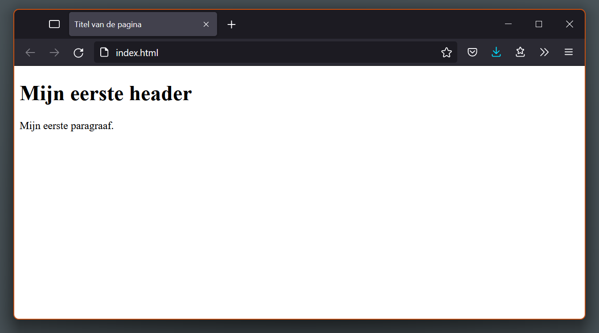

## Hypertext markup language

HTML (HyperText Markup Language) vormt de basis van elke webpagina. Het is de standaard opmaaktaal die bepaalt wat er op een pagina staat: teksten, afbeeldingen, video's, formulieren en hyperlinks. Naast HTML zorgt CSS voor de vormgeving (kleuren, typografie en lay-out) en JavaScript voor dynamische interactie.

HyperText verwijst naar hyperlinks die webpagina's met elkaar verbinden, zowel binnen eenzelfde website als tussen verschillende websites over het hele internet. Links zijn een essentieel onderdeel van het web.

Markup (opmaaktaal) betekent dat inhoud wordt gestructureerd met speciale elementen of **tags**, zoals `<header>`, `<main>`, `<p>`, `` en `<a>`. Deze tags geven betekenis aan de inhoud, zodat een webbrowser precies weet wat een hoofdtitel, een alinea, een lijst of een afbeelding is.

Tags bestaan uit een elementnaam omgeven door punthaken (`<` en `>`) en worden volgens webstandaarden altijd in kleine letters geschreven.

HTML is dus een opmaaktaal die de structuur en inhoud van een webpagina bepaalt. Het bestaat uit een reeks elementen die gebruikt worden om inhoud te omkaderen of te nesten, waardoor deze een specifieke vormgeving krijgt of op een bepaalde manier functioneert.


Wanneer een stuk tekst als een zelfstandige alinea (*paragraph*) moet worden weergegeven, wordt dit geplaatst tussen een openende en sluitende alinea-tag:

```html
<p>Dit is een alinea.</p>
```

De webbrowser herkent deze markering en toont de tekst als een afzonderlijke alinea met de bijbehorende witruimte.

### Webbrowsers

Een webbrowser is een programma dat toegang geeft tot het internet. Het doel van een webbrowser is het tonen van webpagina's. Een webbrowser maakt gebruik van het HyperText Transfer Protocol (HTTP) om pagina’s op te halen van webservers. Enkele voorbeelden van webbrowsers zijn Mozilla Firefox, Google Chrome, Microsoft Edge, Opera en Apple Safari. Deze browsers lezen HTML-documenten en tonen deze als webpagina's. Een browser geeft de broncode van een HTML-document niet weer, maar toont de opmaak van het document en geeft zo de inhoud weer.



### Anatomie van een HTML-element

Het alinea-element in detail:

|              | element            |               |
|--------------|--------------------|---------------|
| openende tag |                    | sluitende tag |
| `<p>`        | Dit is een alinea. | `</p>`        |
|              | ↑ inhoud ↑         |               |

### Belangrijkste onderdelen van een element

1. **De openingstag:** Deze bestaat uit de naam van het element (in dit geval 'p'), omsloten door punthaken (`<` en `>`). Het geeft aan waar het element begint.
2. **De afsluitende tag:** Deze bevat een schuine streep voor de elementnaam (`</p>`). Het geeft aan waar het element eindigt. Het weglaten van een afsluitende tag kan tot onverwachte weergavefouten leiden.
3. **De inhoud:** Dit is wat tussen de openingstag en de afsluitende tag staat, in dit geval is dat tekst.
4. **Het element:** De combinatie van de openingstag, de afsluitende tag en de inhoud vormen samen het element.

Elementen kunnen ook attributen bevatten. Deze zien er als volgt uit:

```html
<a href="https://www.url.com">Klik hier.</a>
<section id="introductie">...</section>

```

Attributen leveren extra eigenschappen of metadata over het element die niet direct als zichtbare tekstinhoud worden getoond. In het bovenstaande voorbeeld verwijst het attribuut `href` naar een URL, kent `id` een unieke identificatie toe aan het element en verwijst `src` naar het bestandspad van een afbeelding.

### Elementen nesten

HTML-elementen kunnen binnen andere elementen worden geplaatst. Dit heet **nesten** (*nesting*).

```html
<p>Dit is een <strong>belangrijke</strong> alinea.</p>
```

Dit resulteert in:

Dit is een **belangrijke** alinea.

Bij nesting is een correcte sluitvolgorde essentieel: elementen moeten worden afgesloten in de omgekeerde volgorde waarin ze zijn geopend (*last in, first out*). In het bovenstaande voorbeeld is het `<strong>`-element binnen het `<p>`-element geopend; daarom wordt eerst `</strong>` gesloten en pas daarna `</p>`. Hiermee blijft de hiërarchische documentstructuur intact.

### Lege elementen

Bepaalde HTML-elementen maken geen tekstuele inhoud op en worden daarom 'lege elementen' genoemd. Neem bijvoorbeeld het ``-element: het heeft typisch attributen zoals `src` en `alt`, maar er is *geen* afsluitende ``-tag nodig.

```html

```

### Anatomie van een HTML-document

Een HTML-pagina heeft een vaste basisstructuur. De doctype-declaratie `<!DOCTYPE html>` geeft aan de browser door dat het document volgens de moderne HTML5-standaard geïnterpreteerd moet worden.

Het `<html>`-rootelement omvat alle inhoud van het document. Het `<head>`-element bevat achtergrondinformatie en metadata die onzichtbaar blijven op de pagina zelf, zoals de documenttitel (binnen het `<title>`-element), tekencodering en gekoppelde bestanden.

Het `<body>`-element bevat daarentegen alle zichtbare inhoud die binnen het browservenster wordt weergegeven, zoals koppen, alinea's, afbeeldingen en hyperlinks.

```html
<!DOCTYPE html>
<html lang="nl">
  <head>
    <meta charset="UTF-8" />
    <meta name="viewport" content="width=device-width, initial-scale=1.0" />
    <title>Mijn paginatitel</title>
  </head>
  <body>
    <h1>Een koptitel</h1>
    <p>Een stukje tekst.</p>
    
  </body>
</html>
```

### Belangrijkste onderdelen van een document

1. **`<!DOCTYPE html>`** De doctype is een verplichte openingsregel. Het zorgt ervoor dat de browser de relevante specificaties volgt.
2. **`<html>...</html>`** Het `<html>`-element omhult alle inhoud van de pagina.
3. **`<head>...</head>`** Het `<head>`-element bevat metagegevens zoals trefwoorden, stijlen en scripts.
4. **`<meta charset="UTF-8" />`** Stelt de tekenset van het document in.
5. **`<meta name="viewport" content="width=device-width, initial-scale=1.0" />`** Zorgt ervoor dat de pagina op de breedte van het apparaat wordt weergegeven.
6. **`<title>...</title>`** Stelt de titel van de pagina in die in het tabblad van de browser wordt weergegeven.
7. **`<body>...</body>`** Bevat alle zichtbare inhoud voor gebruikers.

### Documentmetadata

Metadata is informatie over andere gegevens, ofwel data over data. In het geval van een webpagina bevat metadata vaak informatie die niet direct zichtbaar is voor gebruikers.

```html
<head>
  <meta charset="UTF-8" />
  <meta name="viewport" content="width=device-width, initial-scale=1.0" />
  <meta name="description" content="Cursus" />
  <meta name="keywords" content="HTML, CSS, JavaScript" />
  <meta name="author" content="Vincent Vander Cruyssen" />
  <title>Mijn webpagina</title>
  <link rel="stylesheet" href="style.css" />
</head>
```

## Werkomgeving

Een overzichtelijke mappenstructuur vormt de basis van elk webproject. De projectmap functioneert als een lokale webserver: alle bestanden en mappen van de website blijven binnen één centrale hoofdmap. Dit voorkomt verbroken koppelingen (ontbrekende afbeeldingen of foutieve links) en zorgt ervoor dat de website lokaal op de computer exact hetzelfde werkt als online op een server.

### Mappenstructuur

Elk webproject beschikt over één centrale hoofdmap (de *root* van het project). Binnen deze hoofdmap worden alle gerelateerde bestanden en submappen ondergebracht.

Webpagina's maken gebruik van **relatieve bestandspaden**: bestanden verwijzen naar elkaar op basis van hun onderlinge positie binnen de mappenstructuur. Zolang alle bestanden binnen deze hoofdmap blijven, functioneren hyperlinks, stijlbladen en afbeeldingen zowel lokaal als op een externe webserver.

```text
mijn-website/
└─ images/
   └─ foto.jpg
└─ index.html
└─ style.css
```

### Visual Studio Code

Binnen code-editors zoals **Visual Studio Code** wordt een webproject geopend als volledige projectmap (**File → Open Folder...**), in plaats van als afzonderlijke bestanden. 

Door de projectmap in haar geheel te openen, herkent de editor de volledige mappenstructuur. Dit biedt diverse voordelen:
* **Overzicht in de Explorer:** Alle projectbestanden en mappen zijn direct zichtbaar en beheerbaar in de zijbalk.
* **Automatische pad-aanvulling (*autocomplete*):** Bij het invoeren van bestandspaden (zoals afbeeldingslocaties of hyperlinks) stelt VS Code automatisch de juiste relatieve paden voor.
* **Snelle foutdetectie:** Verbroken links of ontbrekende bestanden worden sneller opgemerkt.

### Startpagina: index.html

Het hoofddocument van elke website of submap heet standaard `index.html`:

* **Standaard landingspagina:** Webservers herkennen een bestand met de naam `index` direct als het startpunt van een website en laden dit bestand automatisch als homepage. Hierdoor hoeft de bestandsnaam bij het surfen naar een webadres niet in de adresbalk van de browser te staan.
* **Plaatsing:** Het bestand `index.html` bevindt zich rechtstreeks in de hoofdmap van het project (*root*).
* **Kleine letters:** Bestandsnamen op het web worden consequent in kleine letters geschreven (`index.html`).

### Sneller coderen met Emmet

Visual Studio Code beschikt standaard over **Emmet**, een ingebouwd gereedschap waarmee HTML-structuren via korte afkortingen en toetscombinaties worden gegenereerd:

* **HTML5-basisskelet:** Het intypen van het uitroepteken `!` gevolgd door `Tab` of `Enter` in een leeg `.html`-bestand genereert direct de volledige HTML5-basisstructuur (inclusief doctype, `<html>`, `<head>`, metadata en `<body>`).
* **Koppeling extern stijlblad:** De afkorting `link:css` gevolgd door `Tab` genereert in het `<head>`-gedeelte de volledige koppelingsregel `<link rel="stylesheet" href="style.css">`.
* **Snelle elementtags:** Een elementnaam zonder punthaken gevolgd door `Tab` plaatst meteen een openende en sluitende tag (zoals `p` voor `<p></p>`, `h1` voor `<h1></h1>`, of `img` voor ``).

## Inhoudsstroom

De inhoudsstroom, *flow content*, omvat de meeste elementen die binnen het `<body>`-element kunnen worden geplaatst, zoals koppen (`<h1>`-`<h6>`), alinea's (`<p>`), hyperlinks (`<a>`), afbeeldingen (``) en structurele secties ofwel inhoudsverdelingen (`<header>`, `<main>`, `<footer>`).

### Inhoudsverdeling

Inhoudsverdeling (*sectioning content*) verdeelt een webpagina in herkenbare, logische onderdelen. De basisstructuur van vrijwel elke webpagina rust op drie grote onderdelen: de **`<header>`** (de kop bovenaan), het **`<main>`**-element (de centrale kerninhoud) en de **`<footer>`** (de voet onderaan). 

Waar de header en footer op elke pagina van een website meestal hetzelfde blijven, wisselt de inhoud van het `<main>`-element van pagina tot pagina.

#### Header

```html
<header>...</header>
```

De header bevat meestal het sitelogo, de hoofdtitel en het navigatiemenu. Het is voor de gebruiker een duidelijk herkenningspunt dat bovenaan een website terugkomt op vrijwel elke pagina.

#### Nav

```html
<nav>...</nav>
```

Groepeert de belangrijkste hyperlinks waarmee bezoekers door een website navigeren. 

#### Main

```html
<main>...</main>
```

Omvat de unieke hoofdinhoud van de specifieke pagina. Een HTML-document bevat telkens maar één `<main>`-element.

#### Section

```html
<section>...</section>
```

Verdeelt de inhoud binnen het `<main>`-element in thematische blokken of hoofdstukken. Elke sectie behandelt een specifiek deelonderwerp en start doorgaans met een eigen tussenkop (zoals `<h2>` of `<h3>`).

#### Footer

```html
<footer>...</footer>
```

Vormt de vaste afsluiting aan de onderkant van de pagina en blijft, net zoals de header, over de hele website gelijk. De footer bevat doorgaans secundaire informatie zoals copyrightvermeldingen, contactgegevens, sociale mediakanalen en links naar voorwaarden.

### Kopteksten

Kopinhoud (*heading content*) omschrijft titels en tussenkopjes. Er zijn zes niveaus in een duidelijke hiërarchie: `<h1>` is de belangrijkste hoofdtitel en wordt standaard het grootst weergegeven. De niveaus `<h2>` tot en met `<h6>` worden stap voor stap kleiner.

```html
<h1>Koptitel</h1>
<h2>Ondertitel</h2>
<h3>Tussentitel</h3>
<h4>...</h4>
<h5>...</h5>
<h6>...</h6>
```

### Alinea-element

Het `<p>`-element vertegenwoordigt een alinea (*paragraph*). Dit element wordt gebruikt voor alle  gewone tekstblokken en doorlopende tekst op een webpagina.

```html
<p>Lorem ipsum dolor sit amet consectetur adipisicing elit. Earum ducimus quae placeat, ipsam minus necessitatibus atque.</p>
```

### Lijst met lijstitems

Het `<li>`-element wordt gebruikt om een item in een lijst weer te geven.

```html
<ul>
  <li>...</li>
  <li>...</li>
  <li>...</li>
</ul>
```

Dit wordt:
- ...
- ...
- ...

```html
<ol>
  <li>...</li>
  <li>...</li>
  <li>...</li>
</ol>
```

Dit wordt:
1. ...
2. ...
3. ...

### Attributen of kenmerken

HTML-elementen kunnen worden voorzien van attributen (*attributes*). Attributen worden geplaatst in de openingstag van een element, direct na de elementnaam en gescheiden door een spatie. Een element kan meerdere attributen bevatten.

1. **`id="..."`** Definieert een unieke identifier voor het element binnen het document.
2. **`src="..."`** Geeft de locatie of het pad aan van de in te sluiten bron.
3. **`alt="..."`** Biedt alternatieve beschrijvingstekst voor afbeeldingen (toegankelijkheid en SEO).
4. **`href="..."`** Verwijst naar de bestemming van een hyperlink of externe bron.
5. **`width="..."`** Bepaalt de breedte van een element of afbeelding in pixels.
6. **`height="..."`** Bepaalt de hoogte van een element of afbeelding in pixels.

Bepaalde attributen kunnen meerdere waarden bevatten (zoals bij het `class`-attribuut), gescheiden door een spatie.

### Afbeeldingselement

Het ``-element voegt een afbeelding in op een webpagina. Aangezien het een leeg element (*void element*) betreft, heeft het geen sluitende tag. Het element vereist minimaal het `src`-attribuut voor het pad naar het afbeeldingsbestand en het `alt`-attribuut voor een beschrijvende tekst voor schermlezers (toegankelijkheid) en zoekmachines.

```html

```

#### Organisatie en naamgeving van afbeeldingen

Voor een betrouwbare werking van beeldmateriaal gelden vaste afspraken binnen webontwikkeling.

* **Aparte afbeeldingenmap:** Afbeeldingen worden overzichtelijk gegroepeerd in een submap zoals `images/` (of `img/`). Dit houdt de hoofdmap van het project opgeruimd en scheidt code van media. In HTML-code verwijst het `src`-attribuut met een relatief pad naar deze submap (`src="images/foto.jpg"`).
* **Hoofdlettergevoeligheid (case-sensitivity):** Webservers maken strikt onderscheid tussen hoofd- en kleine letters. De bestanden `foto.jpg` en `Foto.JPG` zijn voor een server twee totaal verschillende bestanden. Consequent gebruik van kleine letters in bestandsnamen en bestandsextensies voorkomt ontbrekende afbeeldingen.
* **Geen spaties of vreemde tekens:** Spaties en leestekens (zoals accenten é of à) veranderen online in foutieve codes (zoals `%20`) of veroorzaken kapotte afbeeldingen. Woorden in bestandsnamen worden gescheiden door een koppelteken (`-`) of underscore (`_`), zoals `profiel-portret.jpg`.
* **Herkenbare bestandsnamen:** Duidelijke namen (zoals `sfeerbeeld-klaslokaal.jpg` in plaats van camerabestandsnamen zoals `IMG_4918.JPG`) houden bestanden direct herkenbaar en het project overzichtelijk.


### Anker-element

Het `<a>`-element maakt een hyperlink.

```html
<a href="#interne-link">Deze link verwijst naar een id binnen de pagina</a>
<a href="https://www.externe-link.be">Deze link verwijst buiten de website</a>
```

### Ingesloten inhoud

Ingesloten elementen importeren inhoud uit een andere bron:

`<a>`, `<audio>`, `<canvas>`, `<embed>`, `<iframe>`, ``, `<math>`, `<picture>`, `<svg>`, `<video>`

### Interactieve inhoud

Interactieve elementen zijn specifiek ontworpen voor gebruikersinteractie:

`<a>`, `<button>`, `<details>`, `<embed>`, `<iframe>`, `<label>`, `<select>`

## Formulieren

Het `<form>`-element creëert een formulier waarin gebruikers gegevens kunnen invoeren.

### Invoerelement

Het `<input>`-element creëert interactieve elementen voor gebruikersinvoer.

| Element | Voorbeeld |
| --- | --- |
| `<input type="text">` | Tekstveld |
| `<input type="number">` | Numeriek veld |
| `<input type="password">` | Wachtwoordveld |
| `<input type="checkbox">` | Selectievakjes |
| `<input type="radio">` | Keuzevakjes |

### Tekstvak

Het `<textarea>`-element creëert een groter invoerveld voor tekst.

```html
<textarea name="opmerking" cols="8" rows="3" placeholder="Schrijf hier een opmerking..."></textarea>
```

### Opties selecteren

Het `<select>`-element creëert een dropdown-menu.

```html
<select name="selectie">
  <option value="waarde1">Kies een optie</option>
  <option value="waarde2">Waarde 2</option>
  <option value="waarde3">Waarde 3</option>
</select>
```

### Knop

Het `<button>`-element creëert een klikbare knop.

```html
<button type="submit">Indienen</button>
<button type="reset">Reset</button>
```

### Velden groeperen

Het `<fieldset>`-element bundelt bij elkaar horende invoervelden visueel in een kader. Het `<legend>`-element functioneert als titel van deze groep.

```html
<fieldset>
  <legend>Voorbeeld van een fieldset.</legend>
  <input type="text" name="tekstje" placeholder="Voorbeeld" />
</fieldset>
```

## Bronnen

- [MDN Web Docs - HTML Elements reference](https://developer.mozilla.org/en-US/docs/Web/HTML/Element)
